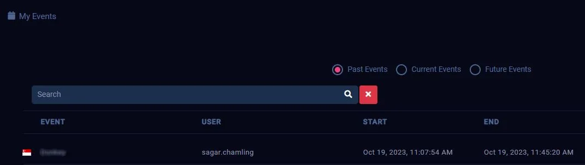
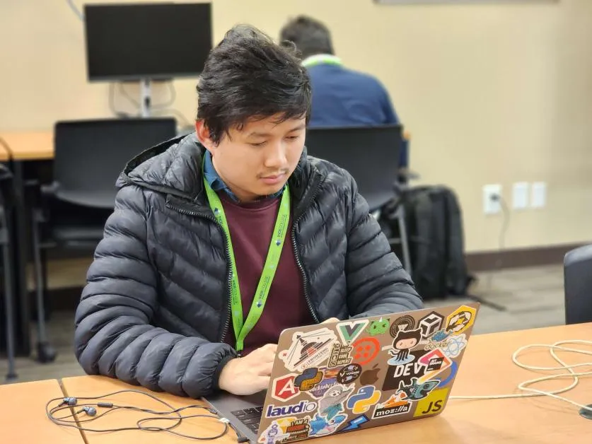
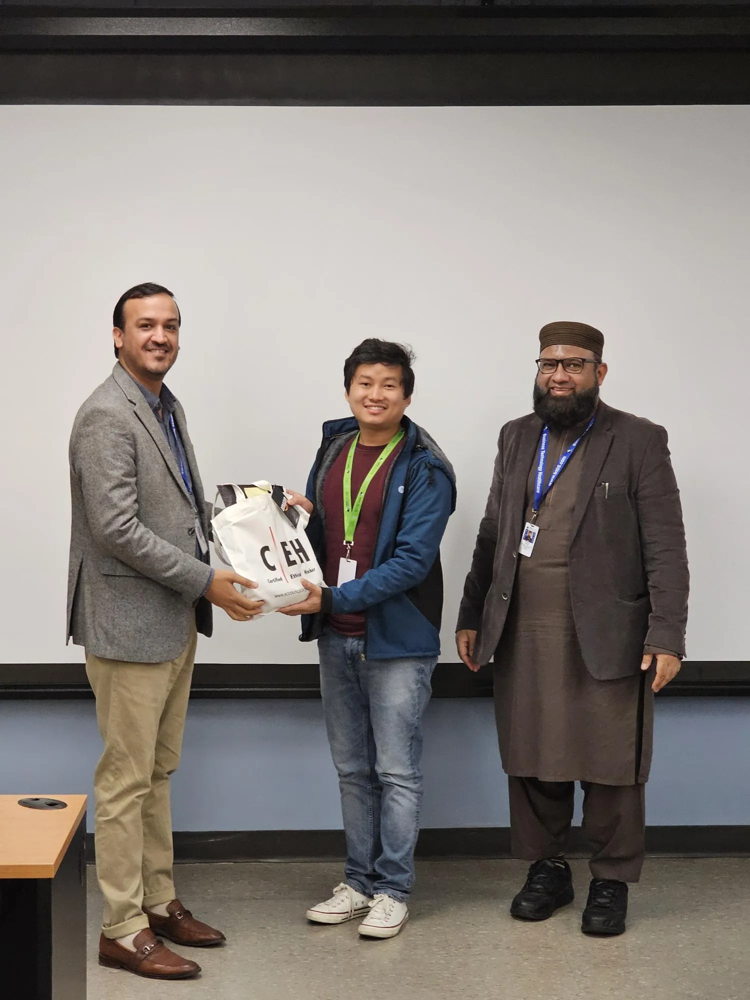
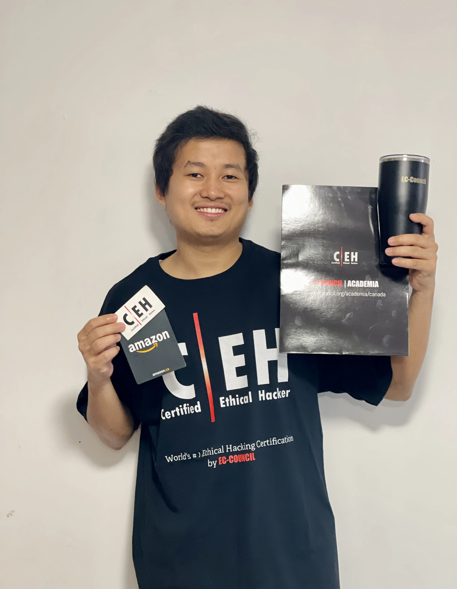

## Expressing Gratitude

I am thrilled and honoured to share that I have won the inter-college <abbr title="Capture The Flag">CTF</abbr> Competition sponsored by [**EC-Council**](https://www.eccouncil.org/), held at [**Sault College**](https://www.saultcollege.ca/), TSW and BSW Campuses. This journey, filled with challenges, tested my skills and knowledge in ethical hacking within cybersecurity domain. This experience has significantly boosted my confidence.

I am grateful for the recognition and awards that I received from EC-Council and Sault College, which were presented to me by the campus director, **Shamroz Masjidi**. The swag they sent me, including a T-shirt, a mug, stickers, gift card and a certificate, has added to my excitement. They are very cool and valuable.

A special mention must be made of my instructor, **Ali Nadeem** and program coordinator, **Muhammad Siddiqui**, who has consistently been a source of inspiration and played a key role in my achievement. Moreover, I'd love to share about my competition journey.

> I am looking forward to more of these type of competitions in the future.

## Journey

### Intro

The whole competition was performed on [CyberQ](https://www.cyberq.io/), a cloud-based platform that provides cyber targets for participants to capture the flag. Each participant had to complete a scenario-based challenge within _one hour_, with _three hints_ available at the cost of reduced score. The competition involved **red teaming**, which is the practice of simulating cyber attacks on target system on a target network. The **white team**, composed of EC-Council’s technical team, monitored and evaluated the performance of the participants.

### Preparation

When I first heard about the competition, I had never participated in such an event before. The announcement made me excited, and I was eager to dive in and learn more. My preparation journey led me to platforms like **Hack The Box**, **TryHackMe**, and **CyberQ**, which offered a free tier for Capture the Flag scenarios and challenges, it helped me get started.

I began solving problems and gradually familiarized myself with the landscape of ethical hacking. In few weeks, I learned about _port scanning_ and _network discovery_ for **enumeration** as part of the **Reconnaissance** process. I also discovered various _misconfigurations_ that could potentially _bypass authentication_ for different network ports. In addition, I explored various methods for _password cracking_ and _privilege escalation_. Understanding all the tools and techniques was challenging, so I began to compile reference notes. This not only helped me memorize a lot of information but also served as a handy guide.

> Refer to notes, I've prepared for CTF Competition. [Ethical Hacking Notes]().

### Cracking CTF

CTF challenges and competitions can vary based on different cloud platforms. Here are a few simple points to help you start building a mindset for cracking CTFs:

#### Enumeration

- Discover networks to find the IP address of active connections in the given network.
- Scan for open ports and look after each all possible service misconfigurations to bypass the authentication.
- Use a browser to explore the application or perform directory traversal to find unsecured hidden paths.

#### Exploitation

- If password locking is an issue, there are many ways to perform use dictionary or brute force attacks to crack the password. Depending on the situation and target platform, decide which tools will be most effective for cracking password.
- Familiarize with the concept of reverse shell and tools that can generate the reverse shell file. This file can be injected into and redirected to the target computer’s shell, granting remote access.
- Once attacker get into the target system, there's a likelihood of misconfigurations. These can allow attacker to perform privilege escalation, potentially granting elevated access to resources.

> **Important Note**: Always follow ethical guidelines. Never use these skills for illegal activities.

### Experience

#### About Challenge

The whole competition was on a CyberQ platform, which was similar to its trial skill pack challenges. We were given a scenario with instructions and vulnerable cloud system in CyberQ to understand the scenario. There were seven flags in total to capture, with the final one being the most challenging. Each flag was linked to the previous one, either directly or indirectly, and the seventh flag couldn’t be captured without finding the first six. I applied the same mindset that I had prepared mentioned in previous section. In this challenge, we had to demonstrate scanning network skills, password cracking skills, reverse shell and privilege escalation in a Linux based target system.

#### The Pain

Unfortunately, many of us faced difficulties as the virtual machine (VM) provided for the competition was hosted on a server in **Singapore**. Accessing it from **North America** resulted in a slow server response, _keyboard input lag_, and _key bouncing_. The competitive environment was intense, which led to panic and frustration. However, staying calm and being patient was crucial. After a series of actions, I managed to capture all the flags in 38 minutes.

> Pro Tips: To overcome the key bouncing issue, I typed commands in my system’s notepad and then copied them to the CyberQ VM using the **Paste Clipboard Text** button.

> Troubleshooting: **Reset** your VM, if you face black screen of death or any OS issue.

#### Flag Submission Tips

| Placeholder Pattern                | Description                                                        | Example                            |
| ---------------------------------- | ------------------------------------------------------------------ | ---------------------------------- |
| N, NN                              | Represents single or two digit numeric                             | 6, 22                              |
| aaaaaa                             | Represents all small alphabet of length 6                          | hannaa                             |
| aaaaaaaaaa-aaaaa-aaaaaa            | Represents small alphabets with exact length and hyphen in between | gracemedia-media-player            |
| NANNNNaaN.NaaNNaN-NNaNaNaNNNNNNNAN | Represents combination of alphabets and numbers                    | 1F6154fc2.7fa29a5-48c6a7b6902590E7 |

> Note: It is specific to CyberQ, even if you submit all your flags correctly, the time doesn't stop unless you **Ends/Terminates the running** by the VM using the **red power** button. Then, finish lab by clicking **Finish** button.

## Captured Moments

### Competition Begun

### Prizes Drawn

### Swags On



### Sticker Adorn

// TODO


