## About Activity

In this activity, I'll be showing how we can do security auditing and assessment using ScoutSuite, Pacu and Prowler. Along with that, I'll analyze the report and provide the recommendations.

> Note: The AWS `access_key_id`, `access_secret_key` used in the screenshot will not work and was only created only to for this activity. If you want to test it, please make sure you are authorized to perform the assessment in targeted cloud.

## Prerequisites

### Configure AWS

Amazon Web Services (AWS) offers reliable, scalable, and inexpensive cloud computing services. To perform this activity, I created free AWS account then I:

- Navigate to Identity Access Management (`IAM`) Service
- Go to **Users** > **Create user** to create a user named `kaliuser`
- Next, Go to **User groups** > **Create group** to create a user group `testing`.
  - Add the `kaliuser` in a group while creating.
  - Attach Policy **SecurityAudit** and **SecurityAudit** to providing permissions.
- Then, navigate to **User** > **kaliuser** > **Security credentials** > **Access keys** > **Create access key** > Select **Command Line Interface (CLI)** > **Next** > **Create access key**. This will generate programmatic access key and secret key.
- Finally, configure your shell running `aws configure`, enter the  `access_key_id` and `access_secret_key` in the terminal.

  ```bash
  $ aws configure
  AWS Access Key ID [****************TKIZ]:
  AWS Secret Access Key [****************/G0w]:
  Default region name [us-east-2]:
  Default output format [None]:
  ```

> Note: I will further configure additional Policy for `Pacu` in next section.

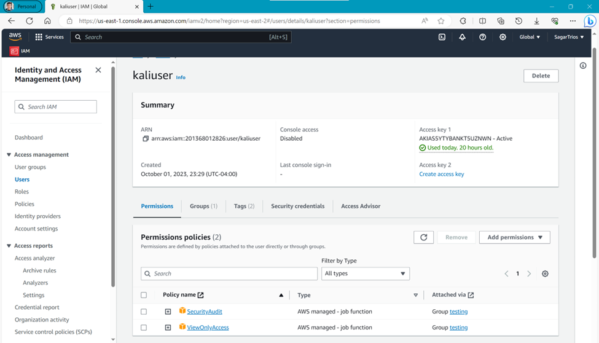

### ScoutSuite

`Scout Suite` is an open source multi-cloud security-auditing tool, which enables security posture assessment of cloud environments.

```bash
git clone git@github.com:nccgroup/ScoutSuite.git

virtualenv -p python3 venv # Create virtual environment
source venv/bin/activate   # Activate virtual environment in shell

cd ScoutSuite
pip install                # Install dependencies

python3 scout.py           # Start auditing using scout.py 
```

### Setup Pacu

`Pacu` is an open-source AWS exploitation framework, designed for offensive security testing against cloud environments

```bash
git clone git@github.com:RhinoSecurityLabs/pacu.git
source venv/bin/activate   # Activate virtual environment in shell

cd pacu
./install.sh               # Install Dependencies

./cli.sh                   # Start AWS exploitation.
```

### Setup Prowler

`Prowler` is an Open Source security tool to perform AWS, GCP and Azure security best practices assessments, audits, incident response, continuous monitoring, hardening and forensics readiness.

```bash
git clone git@github.com:prowler-cloud/prowler.git
source venv/bin/activate   # Activate virtual environment in shell

cd prowler 
pip install prowler # Install prowler and its dependencies

./prowler.py aws -f us-east-2 -s {s3,iam,cloudtrail,cloudwatch} # Running
```

## ScoutSuite Assessment

Running Scout Suite will take some minutes to complete.

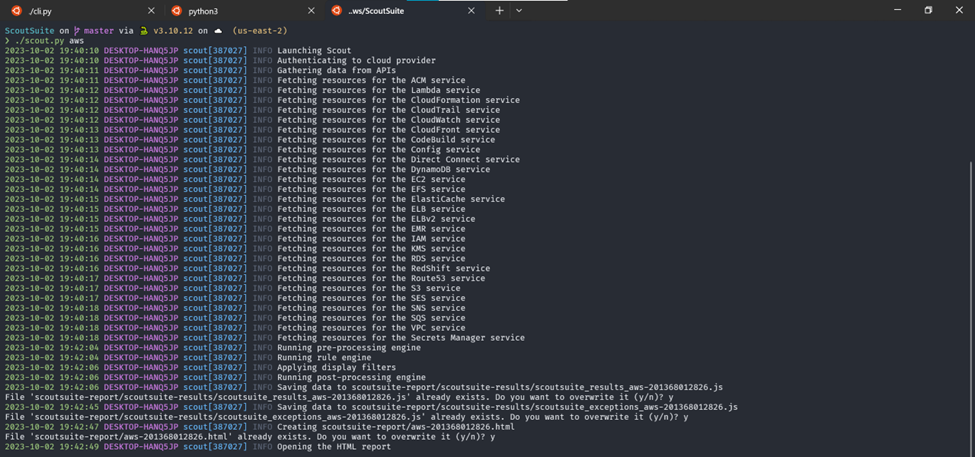
After completion, you'll see html file as an output stored inside **scoutsuite-report** folder. Go to the folder and open it in your browser.

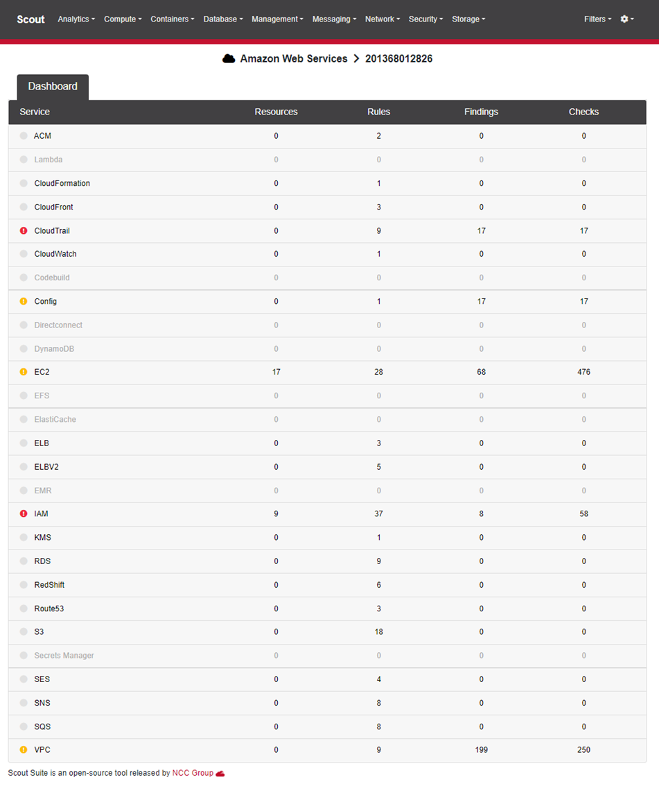

### Cloudwatch Recommendation

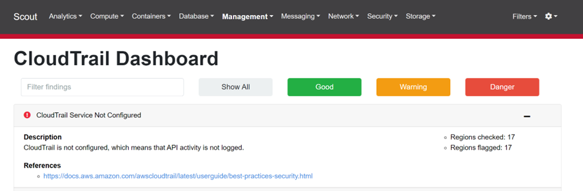

Here, `CloudTrail is not configured` in dashboard signifies it is a crucial issue and vulnerability as AWS CloudTrail plays a critical role in monitoring and auditing AWS resources and API activities. Without it being configured, we will lack visibility into actions taken within AWS environment, making it difficult to detect and investigate security incidents.

To address this, we should create a CloudTrail trail to log events in all AWS Regions. This trail should deliver log files to an `Amazon S3` bucket which is storage service of AWS. As per the best practices documentation, we also need to enable CloudTrail log file integrity and integrate it with `Amazon CloudWatch` Logs for monitoring to make sure the file is not changed. Additionally, it is considered good practice to use AWS Security Hub to monitor CloudTrail resources.

### IAM Recommendation

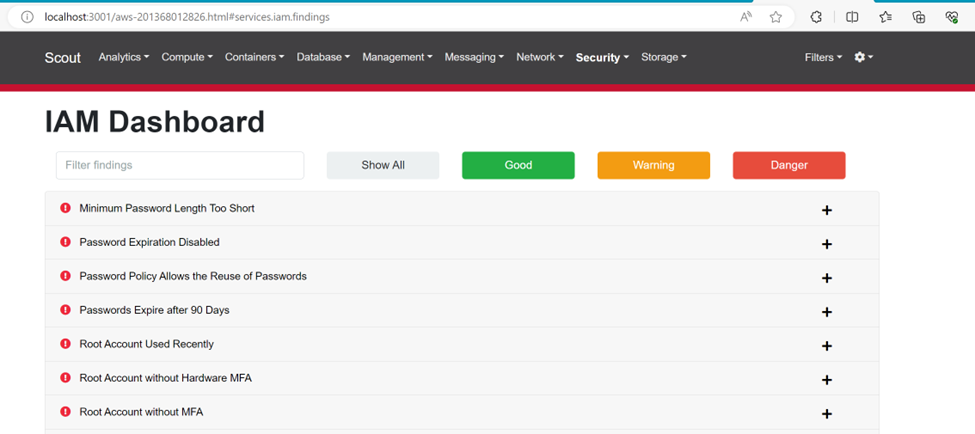

In general, it shows two different types of vulnerabilities:

- **Password Policies**: The vulnerabilities related to inadequate password length, expiration, and reuse signify a weak password policy in your AWS environment.

  **_To remediate these issues_**, we need to enforce stronger password policies that require longer passwords, implement regular password expiration intervals (e.g., 90 days), and disallow password reuse to enhance security.
- **Root Account Security**: The vulnerabilities regarding root account usage and the absence of `Multi-Factor Authentication (MFA)` highlight the need for securing the root AWS account.
  
  **_To address these issues_**, we need to ensure that IAM policies are attach only the users and groups, enable hardware-based MFA for the root account, and enforce MFA for all users accessing the AWS environment. Additionally, limit the use of the root account and establish individual IAM user accounts with appropriate permissions to reduce security risks associated with the root account.

## Pacu Exploitation

In Pacu, I will try to escalate the privilege by using the tool command. To do this, I have to add custom policy referred as misconfigured customer managed policy. Practically, it is possible someone can add hazardous policy without knowing the consequences and human error or misconfiguration can happen. To do this follow these steps:

### Adding custom policy

- Navigate to Identity Access Management (`IAM`) Service
- Go to **Policies** > **Create policy** > **JSON** to create new policy `PacuExploitPolicy`.
- Copy and paste following lines in **Policy Editor** > **Next** > **Create Policy**.

  ```json
  {
    "Version": "2012-10-17",
    "Statement": [
      {
      "Sid": "VisualEditor1",
      "Effect": "Allow",
      "Action": "s3:*",
      "Resource": "arn:aws:s3:::cybr-pacu-lab-example"
      },
      {
        "Sid": "Statement1",
        "Effect": "Allow",
        "Action": [
            "iam:Get*",
            "iam:List*",
            "iam:Put*",
            "iam:AttachRolePolicy",
            "iam:SimulateCustomPolicy",
            "iam:SimulatePrincipalPolicy"
        ],
        "Resource": "*"
        }
    ]
  }
  ```

- Next, attach the custom policy to the `testing` group or `kaliuser` user directly. I attached for user group.

> Note: In the custom policy, `iam:Put*` is risky attribute which allow to add new Policies leading to escalate the policy. You'll see how that can be achieved in the next section.

### Setting up AWS credentials

First, we need to setup the AWS keys using `set_keys` and `set_regions` command.

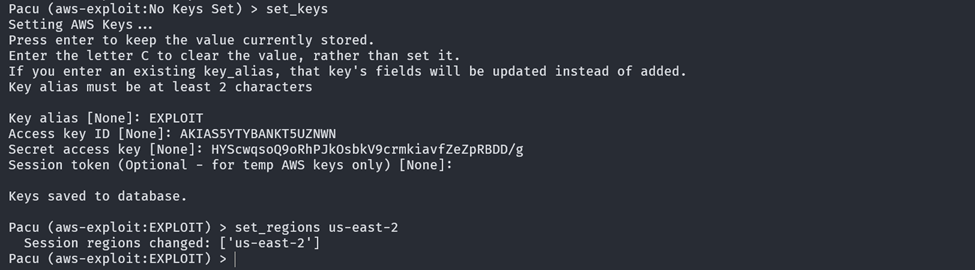

### Exploitation

Before beginning exploitation, you can enumerate the IAM permissions using command `run iam__enum_permissions`. Now, I run command `run iam__privesc_scan`, you'll see output something like this:

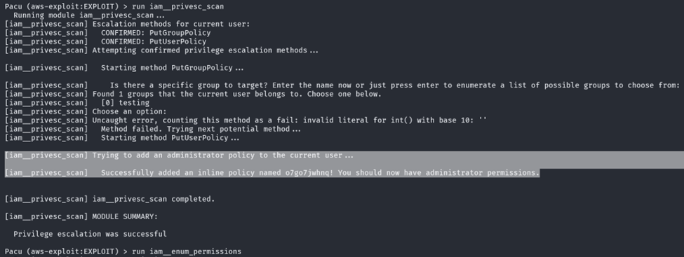

You can see escalation method `PutGroupPolicy` and `PutUserPolicy` is used to attempt the privilege escalation. In the highlighted section, new administrator policy to the current user has been added with policy named `o7go7jwhnq`.

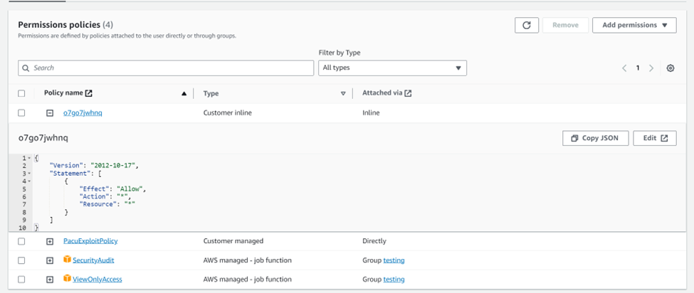

> You can verify by running `run iam__enum_permissions` command in `pacu` terminal where you'll notice, objects with escalated admin permissions.

### Takeaways

Pacu provides several commands for pen testers to enumerate, privilege escalate, reconnaissance, exfiltration, exploitation, and persistence on the given AWS account. In this activity, I used `iam__privesc_scan` which is a command designed to scan for and exploit privilege escalation vulnerabilities in AWS Identity and Access Management (IAM) policies. If the policy is weak or vulnerable, this command can look for multiple approach to escalate privilege to a current AWS user. This command can be used in penetration testing for following purposes:

- Identify Weak IAM Policies that can be potentially exploited for privilege escalation.
- Demonstrate impact of weak policies by creating, modifying, and deleting AWS resources.
- Assessing the Security Posture is a great advantage as it can help identify and highlight areas where IAM policies need to be improved.

## Prowler Assessment

Here, I used `prowler` to scan for specific services like `S3`, `IAM`, `Cloudtrail`, `Cloudwatch`.

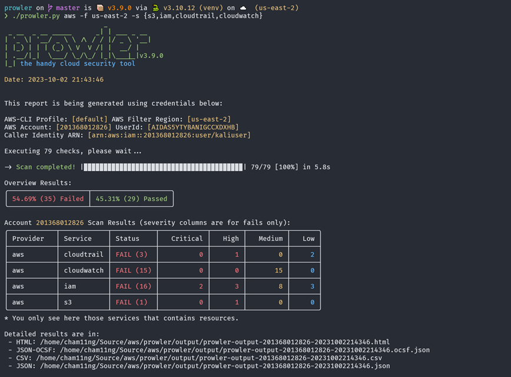

The output is summarized in the terminal or we can open the html file for detailed results in browser.

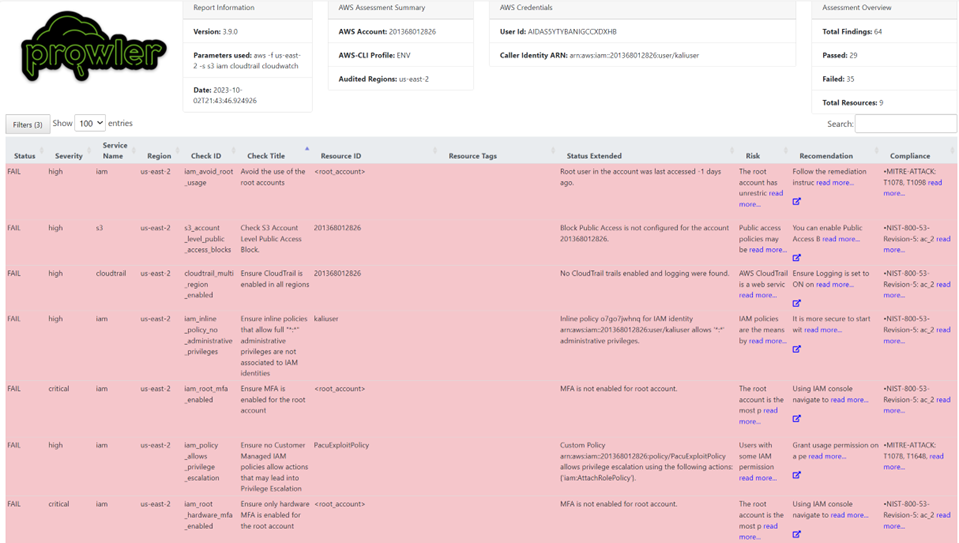

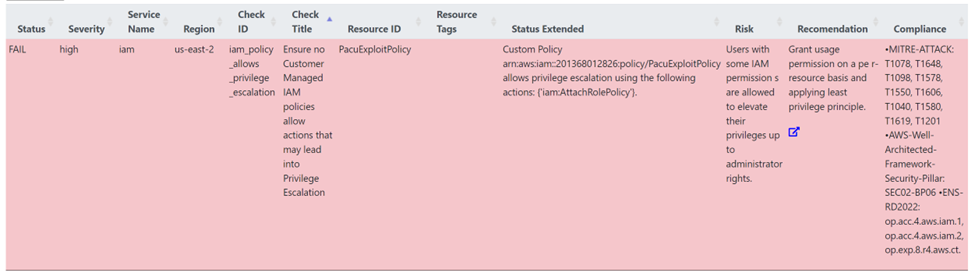

One of the vulnerability was my self-attached custom policy:

- _Severity:_ **High**
- _Service Name:_ **IAM** (Identity and Access Management)
- _Region:_ **us-east-2**
- _Check ID:_ **iam_policy_allows_privilege_escalation**
- _Check Title:_ Ensure no Customer Managed IAM policies allow actions that may lead to Privilege Escalation
- _Resource ID:_ Custom Policy arn:aws:iam::201368012826:policy/PacuExploitPolicy allows privilege escalation using the following actions: {'iam:AttachRolePolicy'}.
- _Status:_ **FAIL**
- _Risk:_ Users with some IAM permissions are allowed to elevate their privileges up to administrator rights.
- _Associated with:_ MITRE ATT&CK and AWS Well-Architected Framework (Security Pillar)
- _Recommendations:_
  - Granting usage permission on a per-resource basis
  - Applying the least privilege principle.
  - The best practice is to review and adjust the polices to remove the risky permissions.
  - Regular auditing and assessment of IAM policies is also important to figure out the security posture.

## Resources

- [AWS Pentesting (with pacu) by Cybr](https://www.youtube.com/watch?v=IbqjtqTeyr0)
