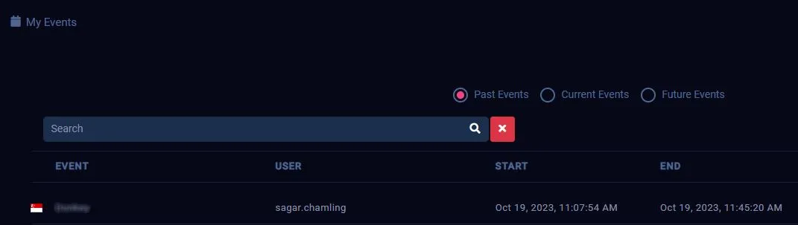

> **Important Note**: Always follow ethical guidelines. Never use these skills for illegal activities.

> You can find competition galleries [here]() 👈.

## Familiarization

The preparation journey led me to platforms like **Hack The Box**, **TryHackMe**, and **CyberQ**, all of which offered a free tier Capture the Flag resources and challenges, it helped me get started.

I began solving basic challenges and gradually familiarized with the platforms, gaining fundamental skills in _port scanning_ and _network discovery_ done for **enumeration** as part of the **reconnaissance** process. As I progressed, I gained knowledge about potential network port specific _misconfigurations_ that could potentially _bypass authentication_. In most challenges, _password cracking_, _directory traversal_, _reverse shell_ and _achieving privilege escalation_ were intermediate steps crucial for capturing the flags. I realized the importance of becoming proficient in these concepts in ethical hacking.

> Understanding all the concepts and tools was challenging, so I began to compile reference notes. This not only helped me memorize but also served as a handy guide. You can refer [here]() 👈.

## Building Mindset

CTF challenges and competitions can vary based on different cloud platforms. Here are the basic strategy to help you start building a mindset for cracking CTFs:

### Enumeration

- Discover networks to find the IP address of active hosts in the given network.
- Scan for operating system, open service ports with versions and look for common misconfigurations that could lead to bypass the authentication process.
- Use a browser to explore the application or perform directory traversal to find unsecured hidden paths.

### Exploitation

- If password locking is an issue, there are many ways to crack passwords using dictionary or brute force attacks. Depending on the situation and target platform, decide which tools will be most effective for cracking password.
- Familiarize with the concept of reverse shell and tools that can generate the reverse shell file. This file will help us redirect to the target computer's shell, granting remote access.
- This file can be injected either after connecting through open ports or from cracked password.
- Once attacker get into the target system, there's a likelihood of further more misconfigurations. These can allow attacker to perform privilege escalation, potentially granting elevated access to resources.

## Competition

### Context

We were given a scenario with instructions and vulnerable cloud system in EC-Council's CyberQ platform. There were seven flags in total to capture, with the final one being the most challenging. Each flag was linked to the previous one, either directly or indirectly, and the seventh flag couldn’t be captured without finding the first six. In this challenge, we had to demonstrate scanning network skills, password cracking skills, reverse shell and privilege escalation in a Linux based target system.

### The Pain

Unfortunately, many of us faced difficulties as the virtual machine (VM) provided for the competition was hosted on a server in **Singapore**. Accessing it from **North America** resulted in a slow server response, _keyboard input lag_, and _key bouncing_. Despite the intense competitive environment and the server frustration, I successfully captured all the flags in just 38 minutes.

### Answer Hint

| Pattern                            | Description                                                        | Example                            |
| ---------------------------------- | ------------------------------------------------------------------ | ---------------------------------- |
| N, NN                              | Represents single or two digit numeric                             | 6, 22                              |
| aaaaaa                             | Represents all small alphabet of length 6                          | hannaa                             |
| aaaaaaaaaa-aaaaa-aaaaaa            | Represents small alphabets with exact length and hyphen in between | gracemedia-media-player            |
| NANNNNaaN.NaaNNaN-NNaNaNaNNNNNNNAN | Represents combination of alphabets and numbers                    | 1F6154fc2.7fa29a5-48c6a7b6902590E7 |

### Tips

- **CyberQ Tip**: To overcome the key bouncing issue, I typed commands in my system’s notepad and then copied them to the CyberQ VM using the **Paste Clipboard Text** button.

- **Troubleshooting Tip**: **Reset** your VM, if you face black screen of death or any OS issue.

- **Submission Tip**: It is specific to CyberQ, even if you submit all your flags correctly, the time doesn't stop unless you **Ends/Terminates the running** by the VM using the **red power** button. Then, finish lab by clicking **Finish** button.
