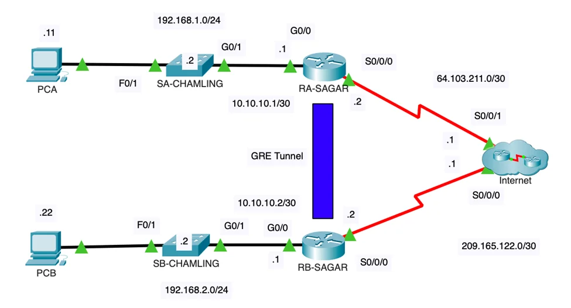
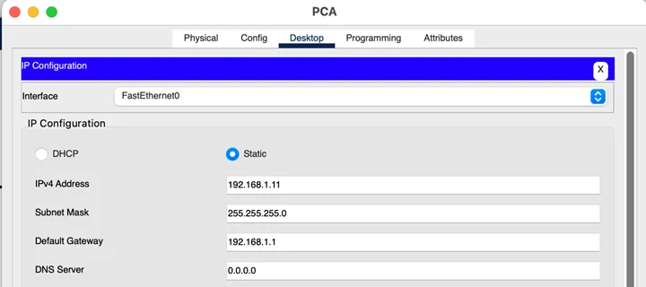
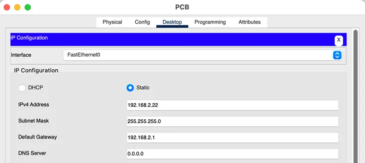
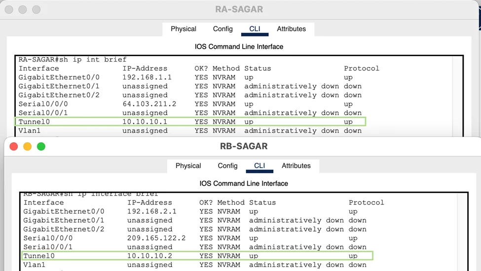
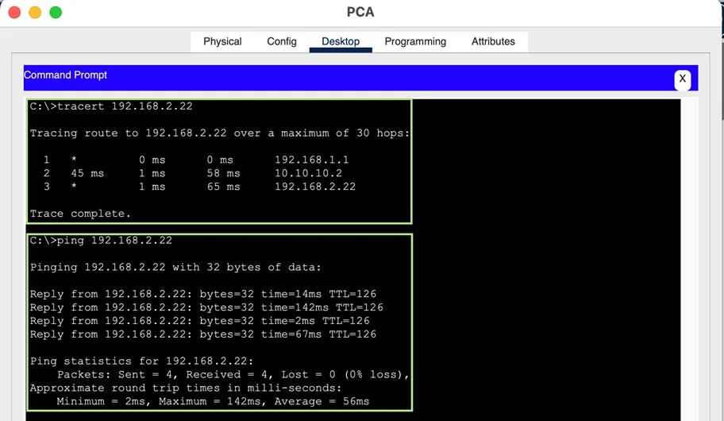
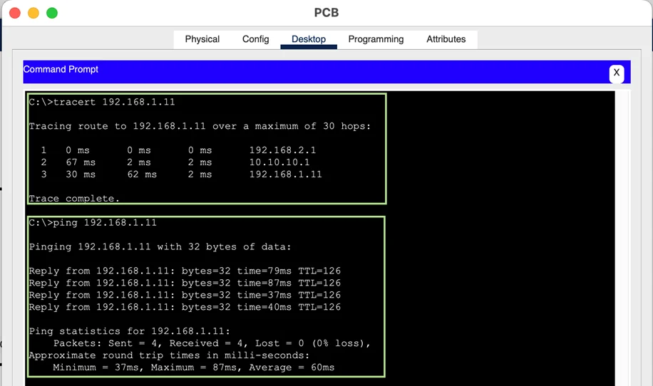

## About Lab

Cisco Generic Routing Encapsulation (GRE) is a tunneling protocol that provides a simple generic approach to transport packets of one protocol over another protocol by means of encapsulation. In this blog, I will demonstrate how to configure <abbr title="Graphics Interchange Format">GRE</abbr> tunnel using given topology and addressing scheme given below.

### Network Topology



### Addressing Scheme

| **Device**  | **Interface** | **IP Address** | **Subnet Mask** | **Default Gateway** |
| ----------- | ------------- | -------------- | --------------- | ------------------- |
| RA-SAGAR    | G0/0          | 192.168.1.1    | 255.255.255.0   | N/A                 |
|             | S0/0/0        | 64.103.211.2   | 255.255.255.252 | N/A                 |
|             | Tunnel 0      | 10.10.10.1     | 255.255.255.252 | N/A                 |
| RB-SAGAR    | G0/0          | 192.168.2.1    | 255.255.255.0   | N/A                 |
|             | S0/0/0        | 209.165.122.2  | 255.255.255.252 | N/A                 |
|             | Tunnel 0      | 10.10.10.2     | 255.255.255.252 | N/A                 |
| RC-SAGAR    | S0/0/0        | 64.103.211.1   | 255.255.255.252 | N/A                 |
|             | S0/0/1        | 209.165.122.1  | 255.255.255.252 | N/A                 |
| SA-CHAMLING | VLAN 1        | 192.168.1.2    | 255.255.255.0   | 192.168.1.1         |
| SB-CHAMLING | VLAN 1        | 192.168.2.2    | 255.255.255.0   | 192.168.2.1         |
| PC-A        | NIC           | 192.168.1.11   | 255.255.255.0   | 192.168.1.1         |
| PC-C        | NIC           | 192.168.2.22   | 255.255.255.0   | 192.168.2.1         |

## Implementation

### Required Resources

- 2 Switches (Cisco 2960)
- 3 Routers (Cisco 1941)
- 2 PCs (Windows with Terminal Emulation Program)
- Cables:
  - Console cables to configure the Cisco IOS devices through the console port
  - Ethernet cables as shown in the topology

### Configuring Switches

Configuring with sets of commands in Switch `SA`

```bash
Switch> en
Switch# config t
Switch(config)# hostname SA-CHAMLING
SA-CHAMLING(config)# hostname SA-CHAMLING
SA-CHAMLING(config)# no ip domain-lookup
SA-CHAMLING(config)# banner motd #Unauthorized access is strictly prohibited.#
SA-CHAMLING(config)# int vlan 1
SA-CHAMLING(config-if)# ip address 192.168.1.2 255.255.255.0
SA-CHAMLING(config-if)# no shut
SA-CHAMLING(config-if)# exit
SA-CHAMLING(config)# ip default-gateway 192.168.1.1
SA-CHAMLING(config)# end
SA-CHAMLING#copy run start
```

Configuring with sets of commands in Switch `SB`

```bash
Switch> en
Switch# config t
Switch(config)# hostname SB-CHAMLING
SA-CHAMLING(config)# no ip domain-lookup
SA-CHAMLING(config)# banner motd #Unauthorized access is strictly prohibited.#
SA-CHAMLING(config)# int vlan 1
SA-CHAMLING(config-if)# ip address 192.168.2.2 255.255.255.0
SA-CHAMLING(config-if)# no shut
SA-CHAMLING(config-if)# exit
SA-CHAMLING(config)# ip default-gateway 192.168.2.1
SA-CHAMLING(config)# end
SA-CHAMLING# copy run start
```

### Configuring Routers

Configuring with sets of commands in Router `RA`

```bash
en
config t
hostname RA-SAGAR
no ip domain-lookup
banner motd #Unauthorized access is strictly prohibited.#
interface g0/0
ip address 192.168.1.1 255.255.255.0
no shut
interface s0/0/0
ip address 64.103.211.2 255.255.255.252
no shut
end
copy run start
```

Configuring with sets of commands in Router `RB`

```bash
en
config t
hostname RB-SAGAR
no ip domain-lookup
banner motd #Unauthorized access is strictly prohibited.#
interface g0/0
ip address 192.168.2.1 255.255.255.0
no shut
interface s0/0/0
ip address 209.165.122.2 255.255.255.252
no shut
end
copy run start
```

Configuring with sets of commands in Router `RC`

```bash
en
config t
hostname RC-SAGAR
no ip domain-lookup
banner motd #Unauthorized access is strictly prohibited.#
interface s0/0/0
ip address 64.103.211.1 255.255.255.252
clock rate 2000000
no shut
interface s0/0/1
ip address 209.165.122.1 255.255.255.252
clock rate 2000000
no shut
end
copy run start
```

#### Configuring Static Route

Since, the routers (`RA` and `RB`) is connected with `R3`, it needs to know how to reach to the users connected to the other end router. So, we need to configure static route.

```bash
RA-SAGAR# config t
RA-SAGAR(config)# ip route 192.168.2.0 255.255.255.0 10.10.10.2
```

```bash
RB-SAGAR# config t
RB-SAGAR(config)# ip route 192.168.1.0 255.255.255.0 10.10.10.1
```

#### Configuring GRE Tunnel

Configuring tunnel mode gre in router `RA`

```bash
interface tunnel 0
ip address 10.10.10.1 255.255.255.252
tunnel source s0/0/0
tunnel destination 209.165.122.2
tunnel mode gre ip
no shutdown
end
copy run start
```

Configuring tunnel mode gre in router `RB`

```bash
interface tunnel 0
ip address 10.10.10.2 255.255.255.252
tunnel source s0/0/0
tunnel destination 64.103.211.2
tunnel mode gre ip
no shutdown
end
copy run start
```

### Configuring PCs

Configuring PCA


Configuring PCB


## Testing

Verifying tunnel interfaces in Router RA and RB.


Successful ping and tracert from PCA to PCB.


Successful ping and tracert from PCA to PCB


<p align="center">
  <a href="gre-tunnel.pkt" download>Download .PKT file</a>
</p>
