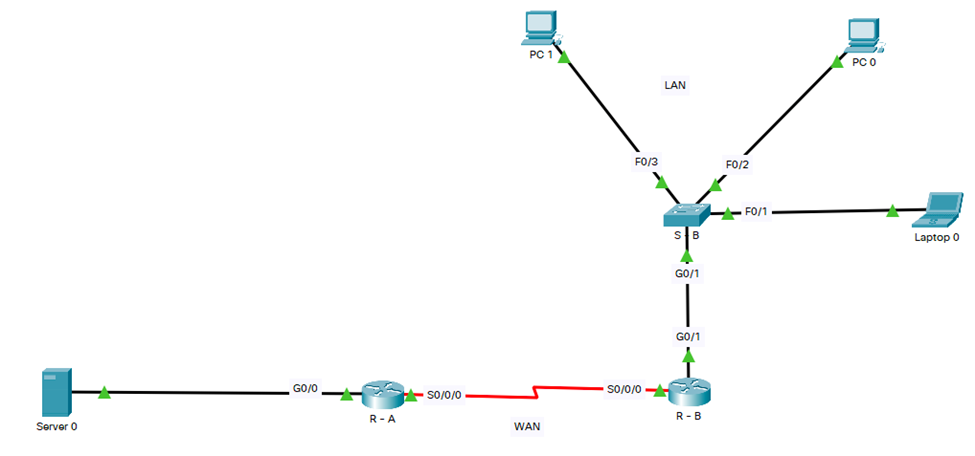
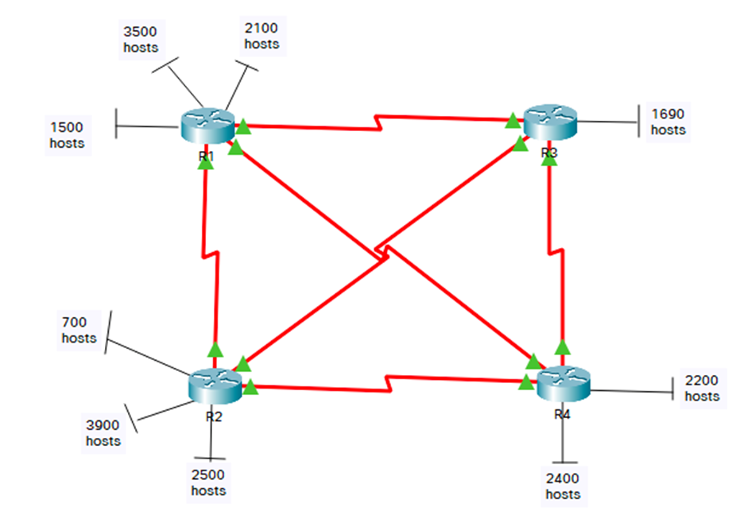

## Scenario 1

`192.168.1.0/24` network address is assigned to do subnetting for the topology seen below.
Please provide the answers to questions - for example, numbers of sub-networks needed along with
appropriate design of IPv4 addressing scheme.

### Explanation 1

Total required networks include:

- `2` LANs individually connected with the highest number of connected hosts, that is `2`.
- `1` WAN between routers
- Given network address is `192.168.1.0/24` which belongs to `Class C` with default subnet
mask `255.255.255.0`
- If we subnet with `/26` i.e., `255.255.255.192`, then block size is: `256 – 192 = 64`
- Subnetwork: <code>22 = 4</code>
- Valid Hosts per subnetwork `26 - 2 = 62`

### Answer 1

1. How many subnetworks can be seen as requirements in the figure above? **_3_**
2. How many maximum hosts are required in any subnetwork? **_64_**
3. How many bits will be borrowed from hosts portion in order to accommodate the required
number of subnets? **_2_**
4. How many subnetworks will be created by borrowing the bits as mentioned above? <strong><i>22 = 4</i></strong>
5. How many subnetworks will remain unused for future use? **_4 – 3 = 1_**
6. How many valid host addresses will be available per subnetwork? <strong><i>26 - 2 = 62</i></strong>
7. After changing the length/CIDR of original network, what is the new subnet mask? **_/26_**
8. Fill in the following table with the subnetwork’s information.

| Subnetwork # | Subnetwork Address | First Valid Host | Last Valid Host | Broadcast Address |
| ------------ | ------------------ | ---------------- | --------------- | ----------------- |
| 1            | 192.168.1.0        | 192.168.1.1      | 192.168.1.62    | 192.168.1.63      |
| 2            | 192.168.1.64       | 192.168.1.65     | 192.168.1.126   | 192.168.1.127     |
| 3            | 192.168.1.128      | 192.168.1.129    | 192.168.1.190   | 192.168.1.191     |
| 4            | 192.168.1.192      | 192.168.1.193    | 192.168.1.254   | 192.168.1.255     |

## Scenario 2

192.168.20.0/24 network address is assigned to you to do subnetting for the topology seen below.
Please answer questions A-G and complete the table in H.

### Explanation 2

Total required networks include:

- 4 LANs individually connected with the highest number of connected hosts, that is 3.
- 3 WAN between routers
- Given network address is 192.168.20.0/24 which belongs to Class C with default subnet
mask 255.255.255.0
- If we subnet with /27 i.e., 255.255.255.192, then block size: 256 – 192 = 64
- Subnetwork: 2 3 = 8
- Valid Hosts per subnetwork 25 - 2 = 30

### Answer 2

1. How many subnetworks can be seen as requirements in the figure seen above? 7
2. How many maximum hosts are required in any subnetwork? 32
3. How many bits will be borrowed from hosts portion in order to accommodate the required number of subnets? 3
4. How many subnetworks will be created by borrowing the bits as mentioned above? 2 3 = 8
5. How many subnetworks will remain unused for future use? 8 – 7 = 1
6. How many valid host addresses will be available per subnetwork? 2 5 - 2 = 30
7. After changing the length/CIDR of original network, what is the new subnet mask? /27
8. Fill in the following table with the subnetwork’s information.

| Subnetwork # | Subnetwork Address | First Valid Host | Last Valid Host | Broadcast Address |
| ------------ | ------------------ | ---------------- | --------------- | ----------------- |
| 1            | 192.168.20.0       | 192.168.20.1     | 192.168.20.30   | 192.168.20.31     |
| 2            | 192.168.20.32      | 192.168.20.33    | 192.168.20.62   | 192.168.20.63     |
| 3            | 192.168.20.64      | 192.168.20.65    | 192.168.20.94   | 192.168.20.95     |
| 4            | 192.168.20.96      | 192.168.20.97    | 192.168.20.126  | 192.168.20.127    |
| 5            | 192.168.20.128     | 192.168.20.129   | 192.168.20.158  | 192.168.20.159    |
| 6            | 192.168.20.160     | 192.168.20.161   | 192.168.20.190  | 192.168.20.191    |
| 7            | 192.168.20.192     | 192.168.20.193   | 192.168.20.222  | 192.168.20.223    |
| 8            | 192.168.20.224     | 192.168.20.225   | 192.168.20.254  | 192.168.20.255    |

## Scenario 3

`172.16.0.0/16` network address is assigned to you to do subnetting for the topology seen below.
Please answer the questions and complete the chart.

### Explanation 3

Total required networks include:

- 9 LANs individually connected with the highest number of connected hosts, that is 3900.
- 6 WANs between routers. 4
- Given network address is `172.16.0.0/16` which belongs to Class B with default subnet mask `255.255.0.0`
- If we subnet with /20 i.e., 255.255.240.0, then the block size: 256 – 240 = 16
- Subnetwork: 2 4 = 16
- Valid hosts per subnetwork 2 12 - 2 = 4094

### Answer 3

1. How many subnetworks can be seen as requirements in the figure seen above? 15
2. How many maximum hosts are required in any subnetwork? 4096
3. How many bits will be borrowed from the host portion in order to accommodate the required number of subnets? 4
4. How many subnetworks will be created by borrowing the bits as mentioned above? 2 4 = 16
5. How many subnetworks will remain unused for future use? 16 – 15 = 1
6. How many valid host addresses will be available per subnetwork? 2 12 - 2 = 4094
7. After changing the length/CIDR of original network, what is the new subnet mask? /20
8. Fill in the following table with the subnetwork’s information.

| Subnetwork # | Subnetwork Address | First Valid Host | Last Valid Host | Broadcast Address |
| ------------ | ------------------ | ---------------- | --------------- | ----------------- |
| 1            | 172.16.0.0         | 172.16.0.1       | 172.16.15.254   | 172.16.15.255     |
| 2            | 172.16.16.0        | 172.16.16.1      | 172.16.31.254   | 172.16.31.255     |
| 3            | 172.16.32.0        | 172.16.32.1      | 172.16.47.254   | 172.16.47.255     |
| 4            | 172.16.48.0        | 172.16.48.1      | 172.16.63.254   | 172.16.63.255     |
| 5            | 172.16.64.0        | 172.16.64.1      | 172.16.79.254   | 172.16.79.255     |
| 6            | 172.16.80.0        | 172.16.80.1      | 172.16.95.254   | 172.16.95.255     |
| 7            | 172.16.96.0        | 172.16.96.1      | 172.16.111.254  | 172.16.111.255    |
| 8            | 172.16.112.0       | 172.16.112.1     | 172.16.127.254  | 172.16.127.255    |
| 9            | 172.16.128.0       | 172.16.128.1     | 172.16.143.254  | 172.16.143.255    |
| 10           | 172.16.144.0       | 172.16.144.1     | 172.16.159.254  | 172.16.159.255    |
| 11           | 172.16.160.0       | 172.16.160.1     | 172.16.175.254  | 172.16.175.255    |
| 12           | 172.16.176.0       | 172.16.176.1     | 172.16.191.254  | 172.16.191.255    |
| 13           | 172.16.192.0       | 172.16.192.1     | 172.16.207.254  | 172.16.207.255    |
| 14           | 172.16.208.0       | 172.16.208.1     | 172.16.223.254  | 172.16.223.255    |
| 15           | 172.16.224.0       | 172.16.224.1     | 172.16.239.254  | 172.16.239.255    |
| 16           | 172.16.240.0       | 172.16.240.1     | 172.16.255.254  | 172.16.255.255    |
