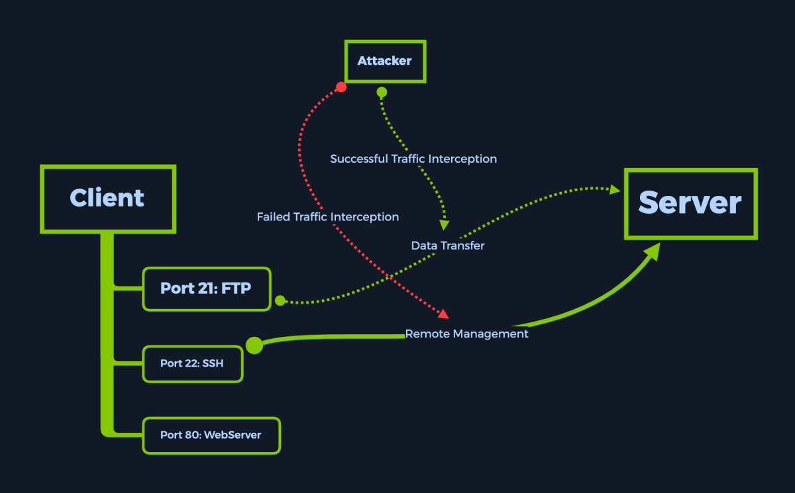
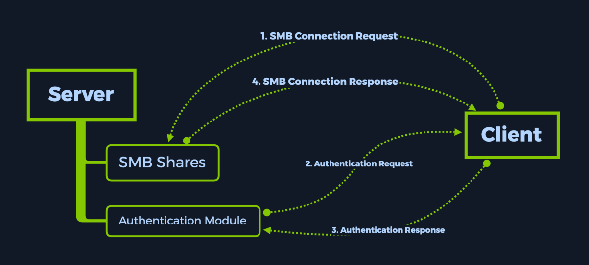

## Basics

When first starting a penetration test or any security evaluation on a target, a primary step is known as **Enumeration** which involves scanning of the open ports.

### Tools

#### `ping` - Packet Internet or InterNet Groper

```bash
ping <target-ip-addr> -c 4
```

#### `nmap` - Network Mapper

```bash
sudo nmap -p- <target-ip-addr> # Scan all ports, takes longer.
sudo nmap -sV <target-ip-addr> # Name and description of identified services.
```

#### Port numbers

| **Number** | **Assignment**                                                     |
| ---------- | ------------------------------------------------------------------ |
| 20         | File Transfer Protocol (FTP) Data Transfer                         |
| 21         | File Transfer Protocol (FTP) Command Control                       |
| 22         | Secure Shell (SSH) Secure Login                                    |
| 23         | Telnet remote login service, unencrypted text messages             |
| 25         | Simple Mail Transfer Protocol (SMTP) email delivery                |
| 53         | Domain Name System (DNS) service                                   |
| 67, 68     | Dynamic Host Configuration Protocol (DHCP)                         |
| 80         | Hypertext Transfer Protocol (HTTP) used in the World Wide Web      |
| 110        | Post Office Protocol (POP3)                                        |
| 119        | Network News Transfer Protocol (NNTP)                              |
| 123        | Network Time Protocol (NTP)                                        |
| 143        | Internet Message Access Protocol (IMAP) Management of digital mail |
| 161        | Simple Network Management Protocol (SNMP)                          |
| 194        | Internet Relay Chat (IRC)                                          |
| 443        | HTTP Secure (HTTPS) HTTP over TLS/SSL                              |
| 546, 547   | DHCPv6 IPv6 version of DHCP                                        |
| 6379       | Redis                                                              |

## Challenges

### Meow - telnet(port 23/tcp Linux telnetd)

Telnet is an old service used for remote management of other hosts on the network. Usually, connection requests through telnet are configured with username/password combinations for increased security.

> Note: Due to configuration mistakes, some important accounts can be left with blank passwords for the sake of accessibility. Some typical important accounts have self-explanatory names, such as: `admin`, `administrator` and `root` leaving open to simple brute-forcing attacks.

```bash
$ telnet {target-ip-addr}

Meow login: root

cat flag.txt
```

### Fawn - FTP(port 21/tcp vsftpd 3.0.3)

File transfer services that may have high chances to be poorly configured, it can be easily misconfigured if not correctly understood. For secure transmission that protects the username and password and encrypts the content, FTP is often secured with SSL/TLS (FTPS) or replaced with SSH File Transfer Protocol (SFTP).



> Note: FTP users may authenticate themselves with a clear-text sign-in protocol, generally in the form of a username and password. A typical misconfiguration for running FTP services allows the `anonymous` username, followed by any password whatsoever since the service will disregard the password for this specific account.

```bash
$ ftp {target-ip-addr}
Name: anonymous
331 Please specify the password.
Password: anon123
ftp> ls
200 : PORT command successful. Consider using PASV.
150 : Here comes the directory listing.

226 : Directory send OK.

> get flag.txt # Download the file to the same directory.
226 : Transfer complete.

> bye
421 Timeout
```

### Dancing SMB(445/tcp microsoft-ds?)

SMB (Server Message Block) is communication protocol provides shared access to files, printers, and serial ports between endpoints on a network. We mostly see SMB services running on Windows machines. SMB runs at the Application or Presentation layers of the OSI model. Due to this, it
relies on lower-level protocols for transport. The Transport layer protocol that Microsoft SMB Protocol is most often used with is NetBIOS over TCP/IP (NBT).



> Note. An SMB-enabled storage on the network is called a share . SMB clients are required to provide a username/password combination to see or interact with the contents of the SMB share. A network administrator can sometimes make mistakes and accidentally allow logins without any valid credentials or using either `guest_accounts` or `anonymous` log-ons.

Four separate shares:

- `ADMIN$` - Administrative shares are hidden network shares created by the Windows NT family of operating systems that allow system administrators to have remote access to every disk volume on a network-connected system. These shares may not be permanently deleted but may be disabled.
- `C$` - Administrative share for the C:\ disk volume. This is where the operating system is hosted.
- `IPC$` - The inter-process communication share. Used for inter-process communication via named pipes and is not part of the file system.
- `WorkShares` - Custom share.

```bash
$ smbclient -L {target-ip-addr}

$ smbclient \\\\{target-ip-addr}\\ADMIN$
    or
$ smbclient \\\\{target-ip-addr}\\C$
NT_STATUS_ACCESS_DENIED

$ smbclient \\\\{target-ip-addr}\\WorkShares # Seems to be human made, prone to misconfiguration.
smb: \>
```

```
ls : listing contents of the directories within the share
cd : changing current directories within the share
get : downloading the contents of the directories within the share
exit : exiting the smb shell
```

### Redeemer Redis(6379/tcp key-value store 5.0.7)

Redis (**RE**mote **DI**ctionary **S**erver), which is an 'in-memory' database are the ones that rely essentially on the primary memory for data storage (meaning that the database is managed in the RAM of the system); in contrast to databases that store data on the disk or SSDs. Primary memory is significantly faster than the secondary memory, the data retrieval time in the case of 'in-memory' databases is very small, thus offering very efficient & minimal response times.

> Note: In-memory databases like Redis are typically used to cache data that is frequently requested for quick retrieval. The `Keyspace` section provides statistics on the main dictionary of each database. The statistics include the number of keys, and the number of keys with an expiration.

```bash
$ redis-cli -h {target-ip-addr}
> info
# Keyspace
db0:keys=4

> select 0 # Select Redis logical database followed by index number.

> keys * # List all the keys present.

> get flag
```

## Reference

- [Hack The Box](https://www.hackthebox.com/)
