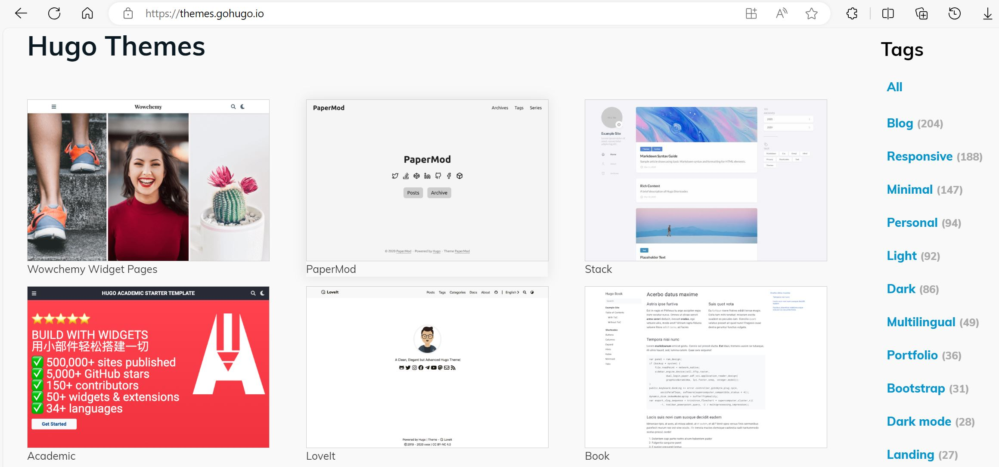
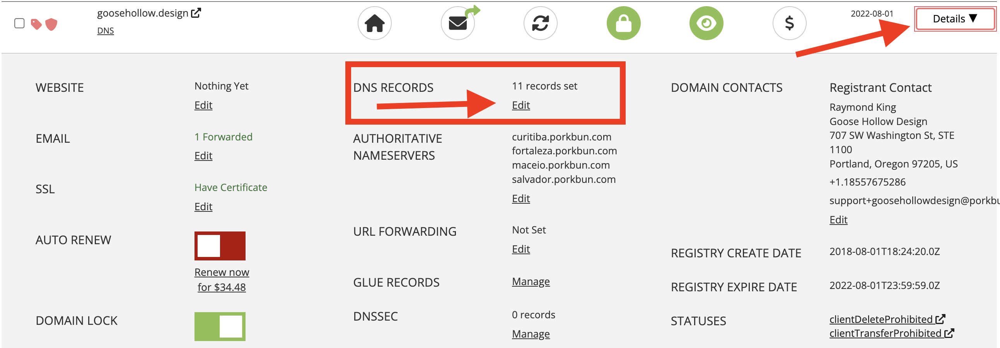
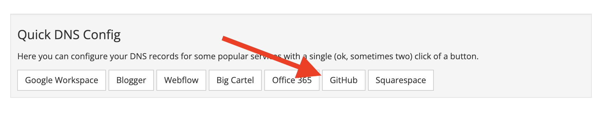
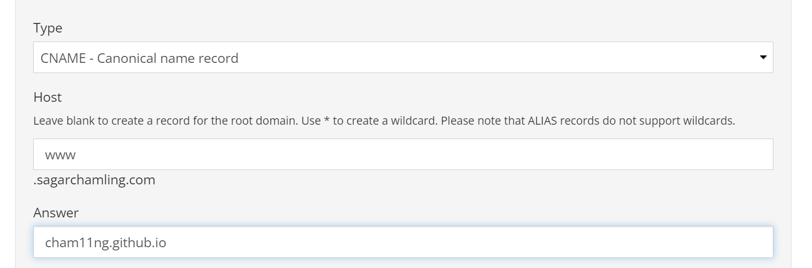
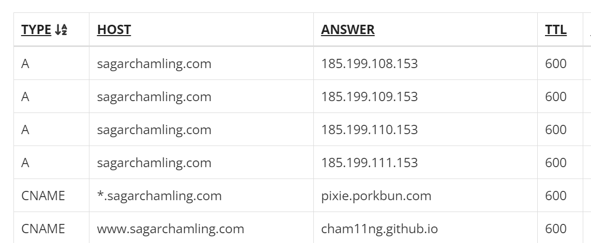
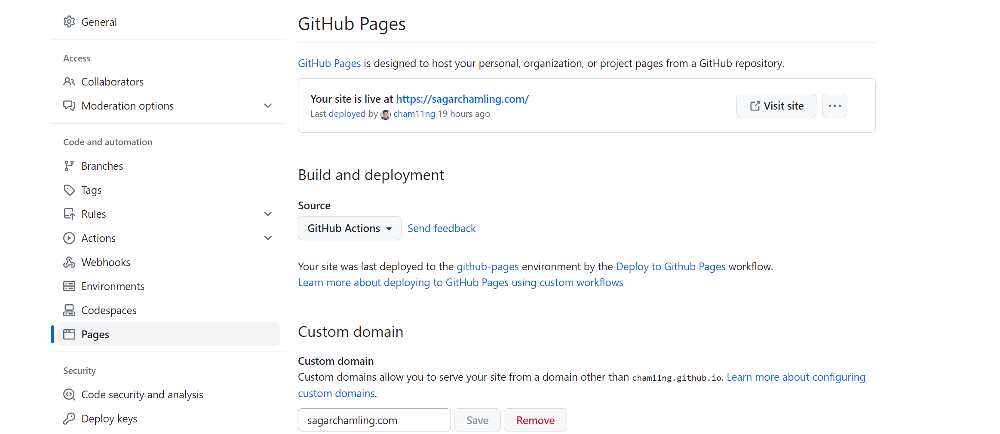

In this step-by-step guide, I'll walk you through the process of setting up your personal blog site using Hugo, a popular static site generator written in Go, and the PaperMod theme.

Along with that, I'll also show you how I configured my domain and hosting for this site. By the end of this tutorial, you'll have your blog up and running and ready to share your thoughts with the world.

---

## Step 0: Identify Purpose

I opted for a static website generator because I wanted a website that's incredibly easy to maintain and configure. Additionally, it had to be fast and secure. My primary goal is to have a personal site where I can centralize all my writing content and showcase my work, all in one place. I had straightforward requirements, which led me to choose a static site generator.

## Step 1: Static Site Generator with `hugo`

Comparing Gatsby vs Hugo, JS vs Go, "Generated websites are super fast" vs "Lightning fast". According to my personal website idea, it doesn't require a dynamic contents or any user interactions which is purely based on static architecture. I selected hugo over Gatsby.

### Install Go, Hugo

The first step is to install Go and Hugo on your local machine. You can follow the installation instructions for your specific operating system [here](https://gohugo.io/getting-started/installing/).

> Please refer to the relevant documentation for installation instructions:
>
> - Git
> - Go
> - Dart Sass

### Create a New Hugo Site

Once Hugo is installed, create a new Hugo site using the following command:

```sh
hugo new site sagarchamling.com
```

Replace `sagarchamling.com` with the desired name of your blog.

## Step 2: Choosing Theme

Hugo offers a wide range of themes. Find your choice and make sure you give them a credit.



### Install the PaperMod Theme

For my blog, I'll use the PaperMod theme. To install it, navigate to your theme's github page [here](https://github.com/adityatelange/hugo-PaperMod/wiki/Installation) and run:

```sh
git init # Initialize your git repository

git submodule add --depth=1 https://github.com/adityatelange/hugo-PaperMod.git themes/PaperMod
```

Next, open your blog's `config.toml` file and set the `theme` parameter to `"PaperMod"`.
or
You can take a reference of [exampleSite](https://github.com/adityatelange/hugo-PaperMod/tree/exampleSite) to begin with.

## Step 3: Customize Your Site

### Customizing theme css

```sh
.(site root)
├── content/
├── theme/PaperMod/
└── assets/
    └── css/
        └── extended/         <---
            ├── custom.css    <---
            └── any_name.css  <---

```

### Customizing header and footer partials

```sh
.(site root)
├── config.yml
├── content/
├── theme/hugo-PaperMod/
└── layouts
    ├── partials
    │   ├── extend_footer.html <---
    │   └── extend_head.html   <---
    └── robots.txt

```

### Create Content

Create your blog posts in the `content` directory. You can use Markdown to format your posts. For example, to create a new post, run:

```sh
hugo new blogs/my-first-post.md
```

Edit the Markdown file to write your content.

## Step 4: Deploy in Github Pages

### Create a `.gitignore` file

Create a `.gitignore` file to exclude unnecessary files from version control. Here's a sample `.gitignore` for Hugo sites:

```sh
/resources/
/public/
```

### Commit and Push to GitHub

Commit your changes and push your blog to a GitHub repository:

```sh
git add .
git commit -m "Initial commit"
git remote add origin git@github.com/cham11ng/sagarchamling.com
git push -u origin main
```

## Step 5: Select Domain Name

I considered using a domain registrar like [Porkbun](https://porkbun.com) because of easy setup and cheaper price. Search for available domain names, and once you find one that suits your blog, register it.

## Step 6: Configure and Publish Site

### Configure Domain

In your domain registrar's dashboard (`Porkbun` in this case), configure your domain's DNS settings. This typically involves setting up a CNAME record with the GitHub Pages URL provided earlier.


Go to the DNS Records section and select "Edit."


In the Quick DNS Config section, select the "Github" button to quickly configure domain's DNS settings to point Github Pages.


You'll also need to create your subdomain CNAME record. In the Host field, enter the subdomain you want. It can be "www" or whatever you wish it to be.


You should now see your DNS records successfully updated to the Github Pages DNS under Current Records.

### Configure GitHub Pages

In your GitHub repository, go to the `Settings` tab and scroll down to the `Pages` section. Provide the custom domain with a URL for your published site. It may take some time for DNS changes to propagate. Once it's done, your blog will be accessible through your custom domain.



Congratulations! You've successfully set up your personal blog site using Hugo, customized it with the PaperMod theme, and published it with your own domain name. Now, you're ready to start sharing your thoughts and ideas with the world. Happy blogging!
