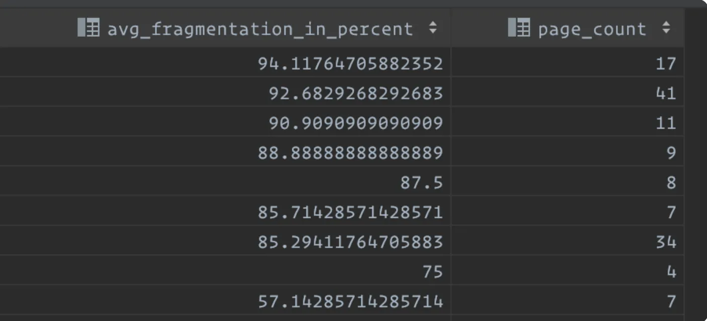

## Index Fragmentation

- Index Fragmentation percentage varies when the logical page orders don’t coordinate with the physical page order in the page allocation of an index.
- With the data modification in the table, information can be resized on the data page.
- Users can observe the disturbing page order with the massive delete operation on the table.
- Along with the update and delete operations, the data page won’t be a top-full or empty page. Therefore, non-utilized free space raises the order mismatch between logical page and physical page with increasing the fragmentation, and that can cause worst query performance and consumes more server resources as well.
- There can be a number of indexes created on a single table with the combination of various columns, and each index can have a different fragmentation percentage.

### Fragmentation Status using the inbuilt T-SQL statement

```sql
SELECT
  S.name AS 'Schema',
  T.name AS 'Table',
  I.name AS 'Index',
  DDIPS.avg_fragmentation_in_percent,
  DDIPS.page_count
FROM sys.dm_db_index_physical_stats(DB_ID(), NULL, NULL, NULL, NULL) AS DDIPS
INNER JOIN sys.tables T ON T.object_id = DDIPS.object_id
INNER JOIN sys.schemas S ON T.schema_id = S.schema_id
INNER JOIN sys.indexes I ON I.object_id = DDIPS.object_id
  AND DDIPS.index_id = I.index_id
WHERE DDIPS.database_id = DB_ID()
  AND I.name IS NOT NULL
  AND DDIPS.avg_fragmentation_in_percent > 0
ORDER BY DDIPS.avg_fragmentation_in_percent DESC
```

### Output



Here, we can see the maximum fragmentation percentage is 94% in the local database right after loading
dummy data. To reduce this fragmentation, either of these can be performed in the database:

### REBUILD INDEX

The INDEX REBUILD always drops the index and reproduces it with new index pages which runs with the ALTER INDEX command. This activity can be run in parallel using an online option which does not affect the running requests and tasks of a similar table. In the case of REBUILD INDEX offline, then the object resource of the
index won’t be accessible till the end of the REBUILD process completion.

```sql
--Basic Rebuild Command
ALTER INDEX Index_Name ON Table_Name REBUILD

--REBUILD Index with ONLINE OPTION
ALTER INDEX Index_Name ON Table_Name REBUILD WITH (ONLINE = ON)
```

### REORGANIZE INDEX

The REORGANIZE INDEX command reorders the index page by expelling the free or unused space on the page. Ideally, index pages are reordered physically in the data file. REORGANIZE does not drop and create the index but simply restructures the information on the page. REORGANIZE does not have any offline choice, and REORGANIZE does not affect the statistics compared to the REBUILD option. REORGANIZE performs online always.

```sql
ALTER INDEX Index_Name ON Table_Name REORGANIZE
```

### SQL Server Index and Statistics Maintenance

Link to Maintenance Solution: https://ola.hallengren.com/sql-server-index-and-statistics-maintenance.html

IndexOptimize is the SQL Server Maintenance Solution’s stored procedure for rebuilding and reorganizing indexes and updating statistics. IndexOptimize is supported on SQL Server 2008, SQL Server 2008 R2, SQL Server 2012, SQL Server 2014, SQL Server 2016, SQL Server 2017, SQL Server 2019, Azure SQL Database, and Azure SQL Database Managed Instance.

Download [MaintenanceSolution.sql](https://ola.hallengren.com/downloads.html). This script creates all the objects and jobs that you need. You can also download the objects as separate scripts. The SQL Server Maintenance Solution is available on GitHub.

```sql
-- Rebuild or reorganize all indexes with fragmentation on database1
-- database2 and index more than 5% will be REORGANIZED and REBUILT
-- whereas index more than 30% will only be REBUILT, update modified
-- statistics and log the results to a table.
EXECUTE dbo.IndexOptimize
  @Databases = 'database1, database2',
  @FragmentationLow = NULL,
  @FragmentationMedium = 'INDEX_REORGANIZE,INDEX_REBUILD_ONLINE,INDEX_REBUILD_OFFLINE',
  @FragmentationHigh = 'INDEX_REBUILD_ONLINE,INDEX_REBUILD_OFFLINE',
  @FragmentationLevel1 = 5,
  @FragmentationLevel2 = 30,
  @MinNumberOfPages = 1,
  @UpdateStatistics = 'ALL',
  @SortInTempdb = 'Y',
  @MaxDOP = 0,
  @LogToTable = 'Y'
```

#### Databases

Select databases. The hyphen character (-) is used to exclude databases, and the percent character (%) is
used for wildcard selection. All of these operations can be combined by using the comma (,).

| Value                                        | Description                                            |
| -------------------------------------------- | ------------------------------------------------------ |
| SYSTEM_DATABASES                             | All system databases (master, msdb, and model)         |
| USER_DATABASES                               | All user databases                                     |
| ALL_DATABASES                                | All databases                                          |
| AVAILABILITY_GROUP_DATABASES                 | All databases in availability groups                   |
| USER_DATABASES, AVAILABILITY_GROUP_DATABASES | All user databases that are not in availability groups |
| Db1                                          | The database Db1                                       |
| Db1, Db2                                     | The databases Db1 and Db2                              |
| USER_DATABASES, -Db1                         | All user databases, except Db1                         |
| %Db%                                         | All databases that have “Db” in the name               |
| %Db%, -Db1                                   | All databases that have “Db” in the name, except Db1   |
| ALL_DATABASES, -%Db%                         | All databases that do not have “Db” in the name        |

#### FragmentationLow / FragmentationMedium / FragmentationHigh

Specify index maintenance operations to be performed on a low/medium/high-fragmented index. An online index rebuild or an index reorganization is not always possible. Because of this, you can specify multiple index-maintenance operations for each fragmentation group. These operations are prioritized from left to right: If the first operation is supported for the index, then that operation is used; if the first operation is not supported, then the second operation is used (if supported), and so on. If none of the specified operations are supported for an index, then that index is not maintained.

| Value                                                         | Description                                                                                                                                                                    |
| ------------------------------------------------------------- | ------------------------------------------------------------------------------------------------------------------------------------------------------------------------------ |
| INDEX_REBUILD_ONLINE                                          | Rebuild index online.                                                                                                                                                          |
| INDEX_REBUILD_OFFLINE                                         | Rebuild index offline.                                                                                                                                                         |
| INDEX_REORGANIZE                                              | Reorganize index.                                                                                                                                                              |
| INDEX_REBUILD_ONLINE, INDEX_REBUILD_OFFLINE                   | Rebuild index online. Rebuild index offline if online rebuilding is not supported on an index.                                                                                 |
| INDEX_REBUILD_ONLINE, INDEX_REORGANIZE                        | Rebuild index online. Reorganize index if online rebuilding is not supported on an index.                                                                                      |
| INDEX_REORGANIZE, INDEX_REBUILD_ONLINE, INDEX_REBUILD_OFFLINE | Reorganize index. Rebuild index online if reorganizing is not supported on an index. Rebuild index offline if reorganizing and online rebuilding are not supported on an index |

#### FragmentationLevel1 / FragmentationLevel2

Set the lower limit, as a percentage, for medium fragmentation. The default is 5 percent.

Set the lower limit, as a percentage, for high fragmentation. The default is 30 percent.

This is based on Microsoft’s recommendation in Books Online. IndexOptimize checks avg_fragmentation_in_percent in sys.dm_db_index_physical_stats to determine the fragmentation.

#### MinNumberOfPages / MaxNumberOfPages

Set a size, in pages; indexes with fewer pages are skipped for index maintenance. The default is 1000 pages. This is based on Microsoft’s recommendation.

Set a size, in pages; indexes with a greater number of pages are skipped for index maintenance. The default is no limitation.

IndexOptimize checks page_count in sys.dm_db_index_physical_stats to determine the size of the index.

#### UpdateStatistics

| Value   | Description                                                 |
| ------- | ----------------------------------------------------------- |
| ALL     | Update index and column statistics.                         |
| INDEX   | Update index statistics.                                    |
| COLUMNS | Update column statistics.                                   |
| NULL    | Do not perform statistics maintenance. This is the default. |

#### SortInTempdb

Use tempdb for sort operations when rebuilding indexes. The SortInTempdb option in IndexOptimize uses the SORT_IN_TEMPDB option in the SQL Server ALTER INDEX command. Values: Y and N (default N ).

#### MaxDOP

Specify the number of CPUs to use when rebuilding indexes. If this number is not specified, the global maximum degree of parallelism is used.

The MaxDOP option in IndexOptimize uses the MAXDOP option in the SQL Server ALTER INDEX command.

#### LogToTable

Log commands to the table dbo.CommandLog . Values: Y and N (default N ).

```sql
SELECT
  CONCAT(DatabaseName, '.', SchemaName, '.', ObjectName) AS DatabaseSchemaObjectName,
  CASE
    WHEN ObjectType = 'U' THEN 'USER_TABLE'
    WHEN ObjectType = 'V' THEN 'VIEW'
  END AS ObjectType, IndexName,
  CASE
    WHEN IndexType = 1 THEN 'CLUSTERED'
    WHEN IndexType = 2 THEN 'NONCLUSTERED'
    WHEN IndexType = 3 THEN 'XML'
    WHEN IndexType = 4 THEN 'SPATIAL'
  END AS IndexType,
  ExtendedInfo.value('(ExtendedInfo/PageCount)[1]', 'int') AS [PageCount],
  ExtendedInfo.value('(ExtendedInfo/Fragmentation)[1]', 'float') AS Fragmentation,
  PartitionNumber,
  CommandType,
  Command,
  StartTime,
  EndTime,
  IIF(
    DATEDIFF(SS, StartTime, EndTime) / (24 * 3600) > 0,
    CAST(DATEDIFF(SS, StartTime, EndTime) / (24 * 3600) AS NVARCHAR) + '.',
    ''
  ) + LEFT(CAST(DATEADD(MS, DATEDIFF(MS, StartTime, EndTime), 0) AS TIME), 12) AS Duration,
  ErrorNumber,
  ErrorMessage
FROM dbo.CommandLog
WHERE CommandType = 'ALTER_INDEX'
ORDER BY DatabaseName;
```

## Reference

- https://www.sqlshack.com/how-to-identify-and-resolve-sql-server-index-fragmentation/
- https://ola.hallengren.com/sql-server-index-and-statistics-maintenance.html
