## Objective

Amazon VPC is web service that allows us to create a private network in the cloud. In this lab,

- Part 1: Deploy VPC with public subnets
- Part 2: Deploy an EC2 instance into VPC

## Lab Begins

### Part 1: Exploration

#### VPC

Amazon Virtual Private Cloud is a virtual network that is dedicated to your AWS account

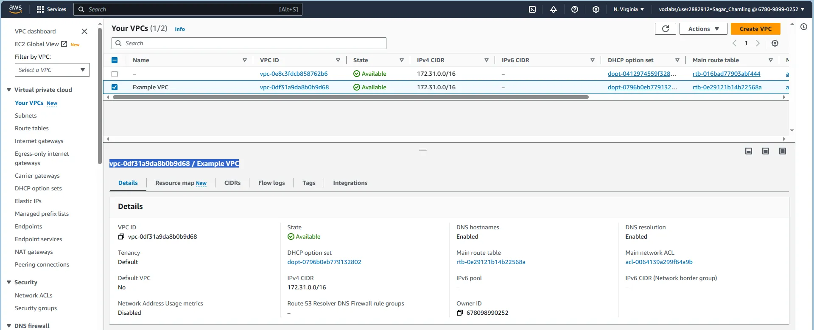

> Note: The VPC IPv4 CIDR is `172.31.0.0/16`

#### Subnets

A subnet is a sub-range of IP addresses in the VPC.

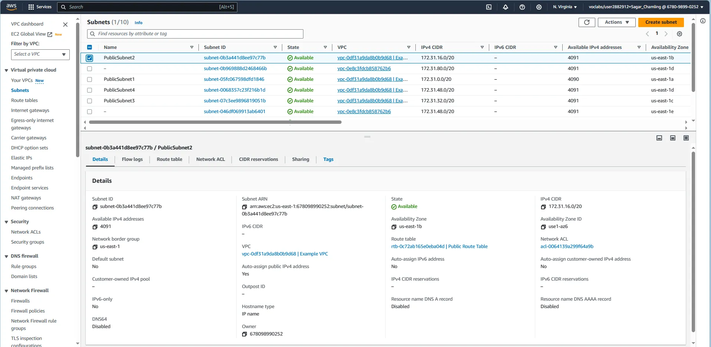

> Note: Auto-assign public IPv4 address is **Yes**. The Subnet IPv4 CIDR is `172.31.0.0/20`. Since, AWS reserves **five** addresses in each subnet for it's own purpose such that only `4091` address are available out of `4096`.

#### Internet Gateway

An internet gateway allows communication between the resources in a VPC and the internet.

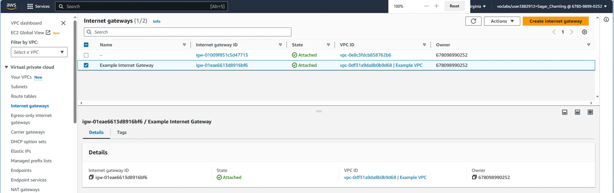

#### Route Table

A route table contains a set of rules, called routes, that are used to determine where network traffic is directed.

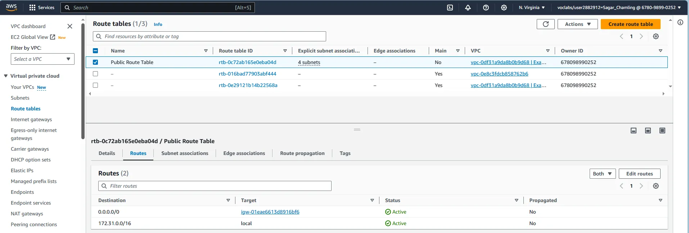

> Note: `172.31.0.0/16` is routed locally, allowing all subnets in a VPC to communicate with each other and all public traffic (`0.0.0.0/0`) is routed to the internet gateway.

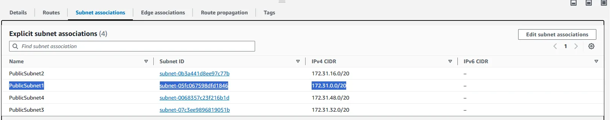

#### Security Group

A security group acts as a virtual firewall for instances to control inbound and outbound traffic.

##### Inbound Rules

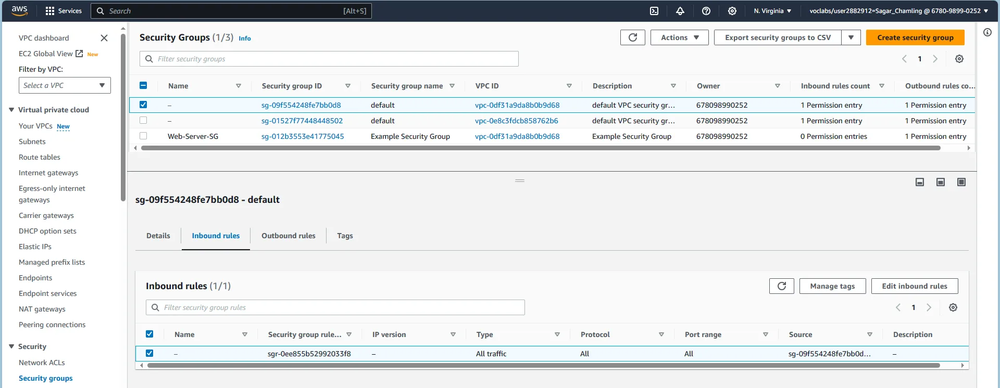

##### Outbound Rules

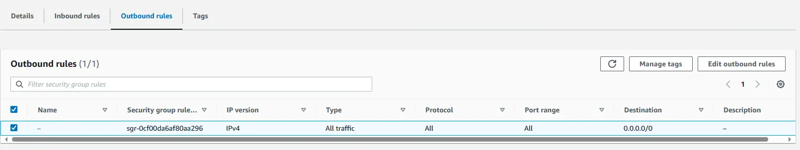

##### Custom Security Group Inbound Rules

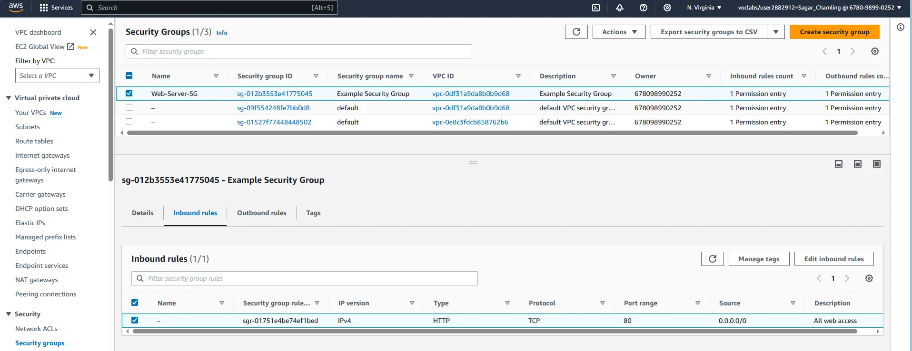

#### EC2 instance's VPC and Subnet

##### Exploring EC2 Instance

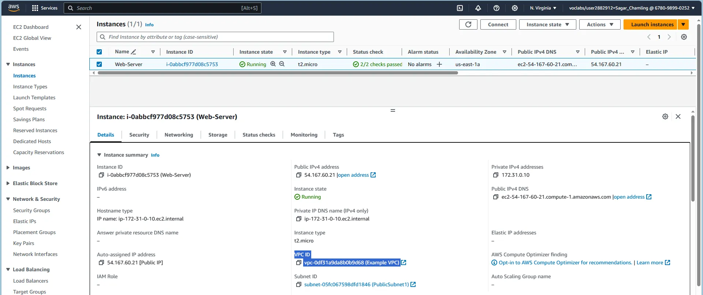

##### Navigating Public IP

### Part 2: Creation

#### Custom VPC

##### VPC CIDR

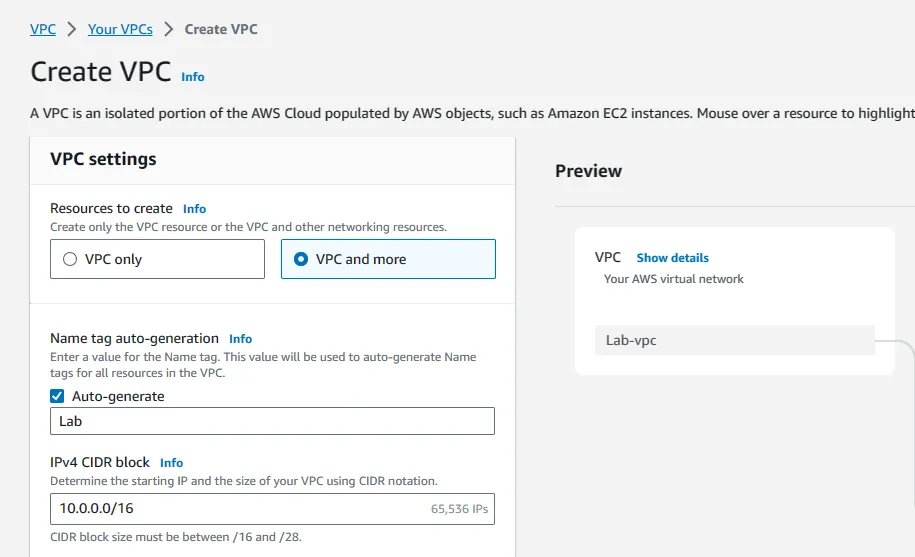

##### VPC Subnets

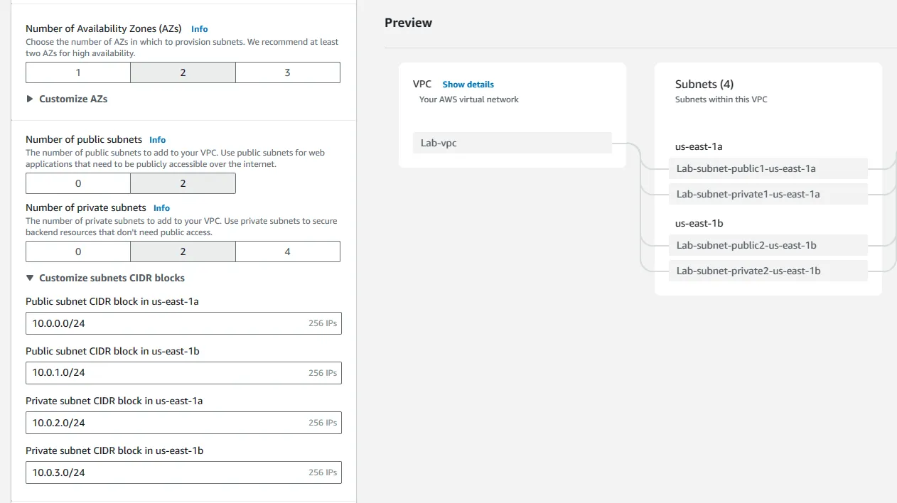

##### VPC Preview

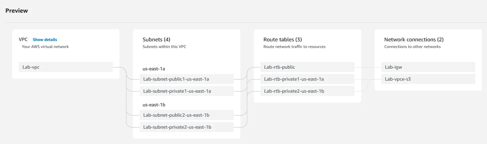

##### VPC Create

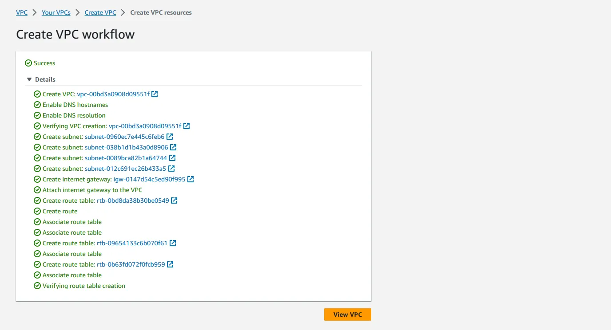

##### VPC Page Navigate

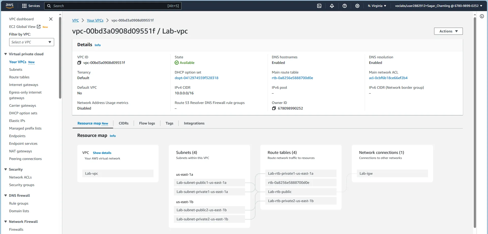

#### Custom Security Group

##### Security Group Create

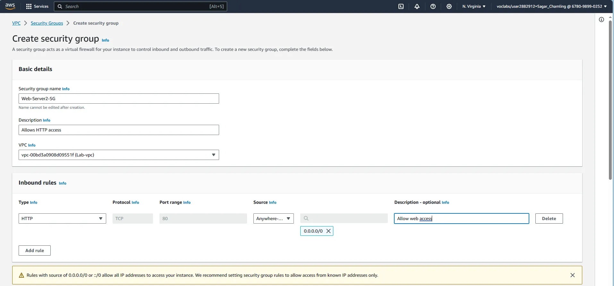

##### Security Group Page Navigate

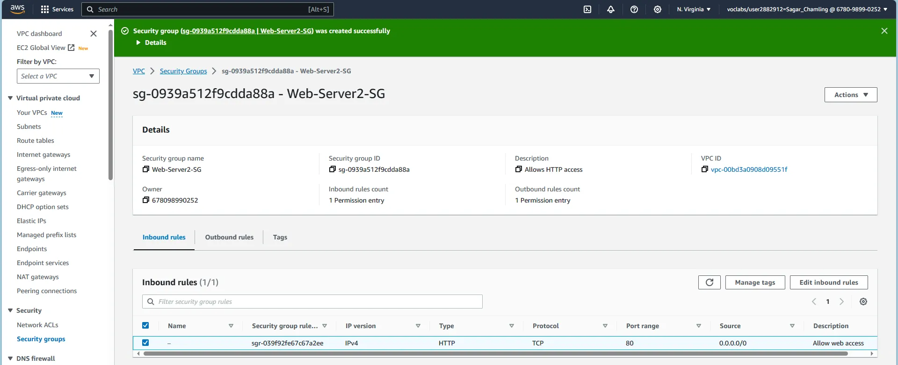

#### EC2 Instance in Custom VPC

##### EC2 AMI

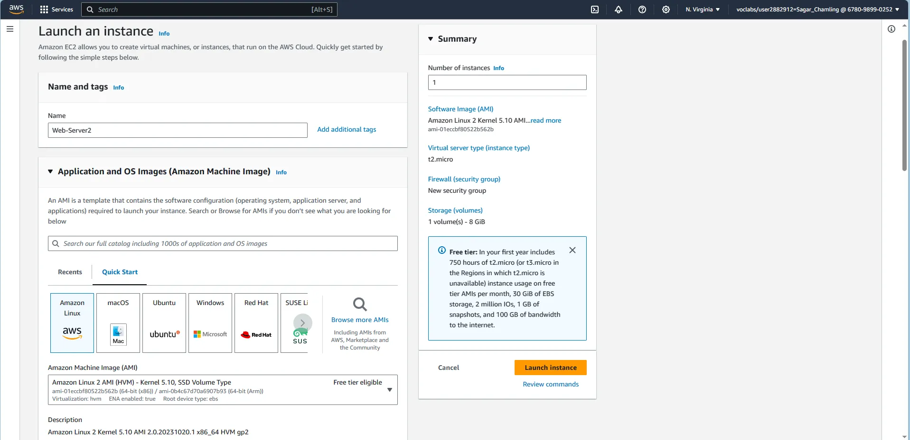

##### EC2 Network Setting

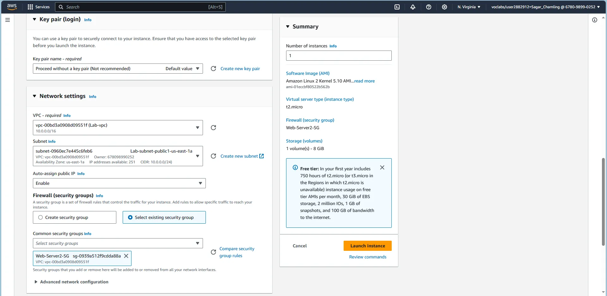

##### EC2 User Data

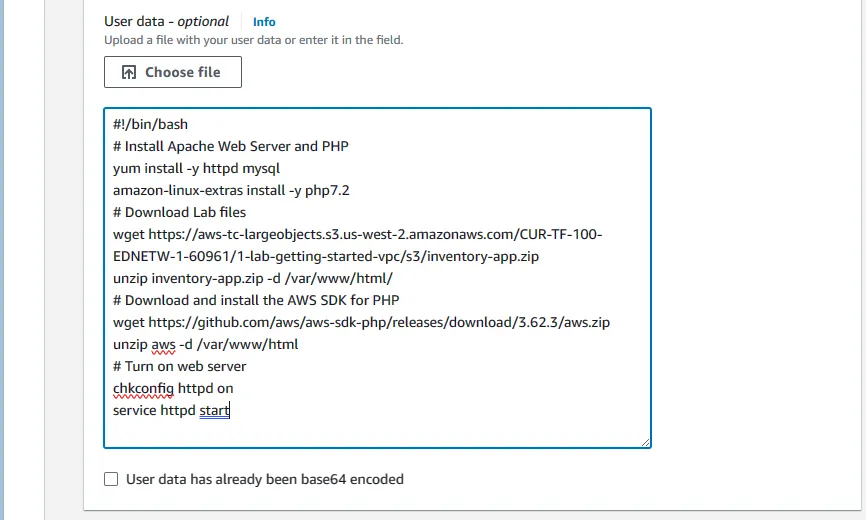

The End
