## Join Community

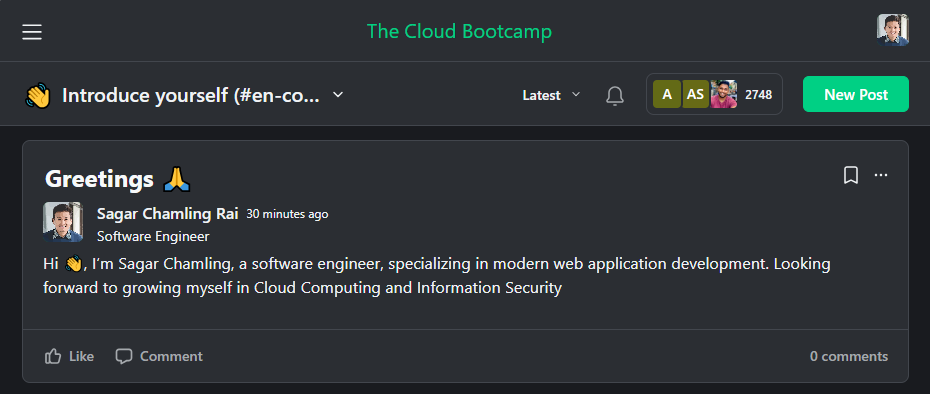

## AWS and Google Cloud Account Setup

### AWS

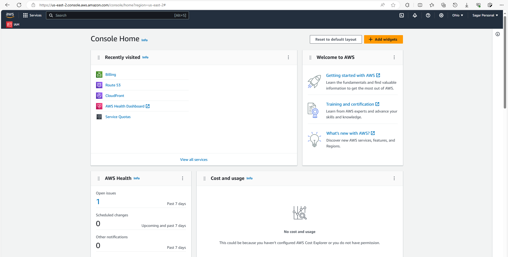

### Google Cloud

#### Free Trail

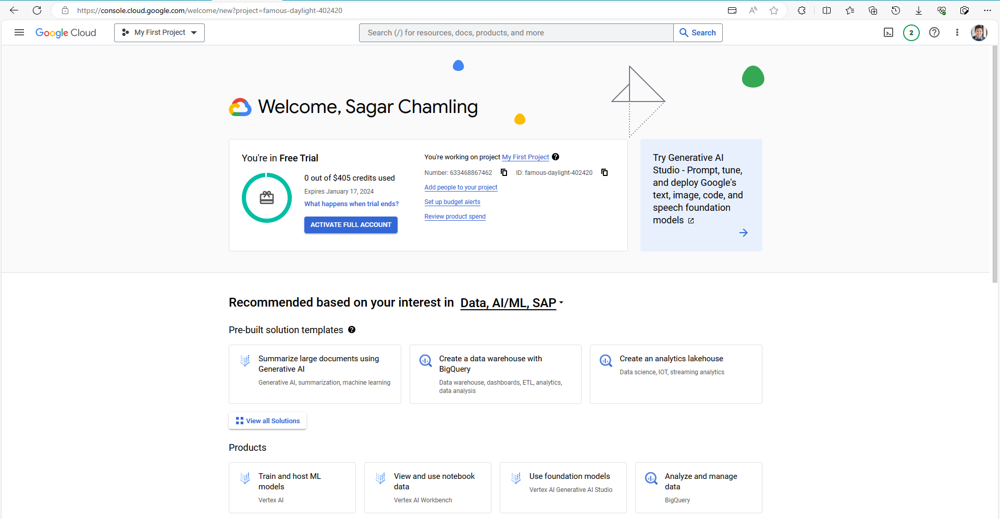

## Begin Hands-on Project

### Setting up Terraform user in AWS IAM

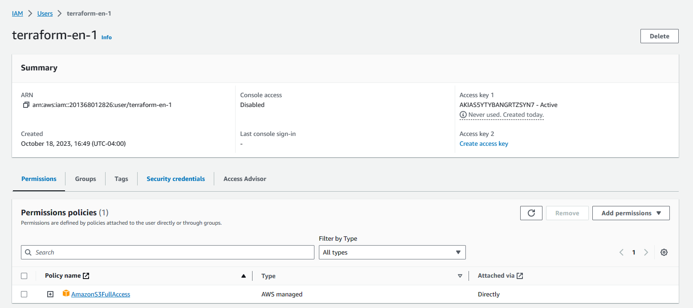

### Running commands in Google CloudShell

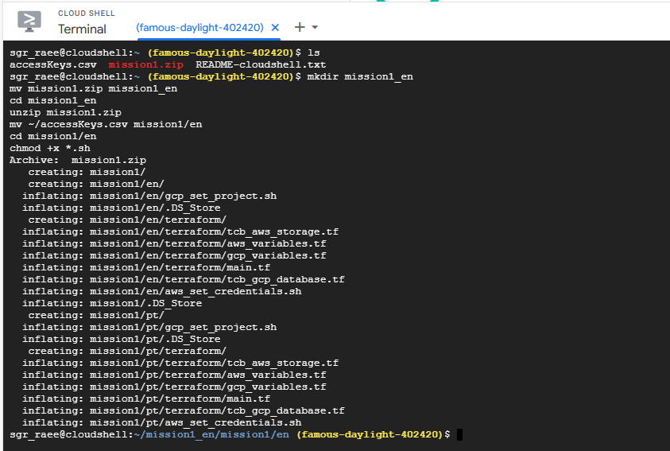

### Initializing Terraform

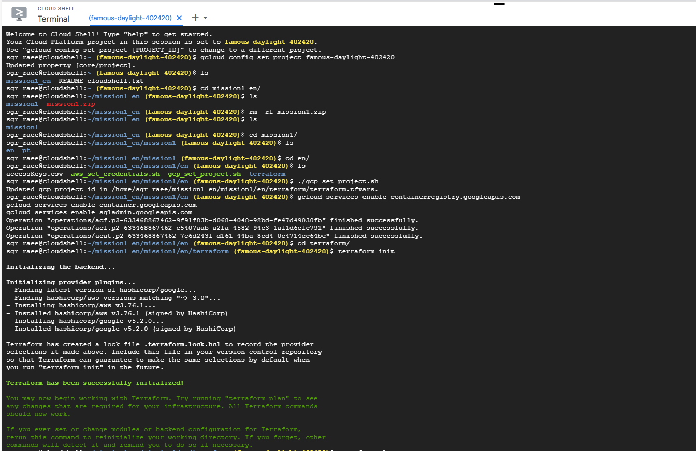

### AWS S3 Bucket Setup via. Terraform

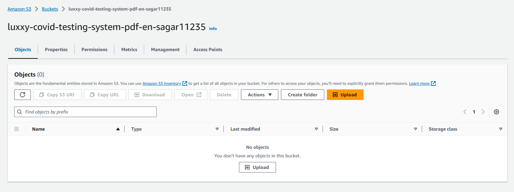

### Google SQL and Kubernetes Cluster Setup via. Terraform

#### SQL

#### Kubernetes Cluster

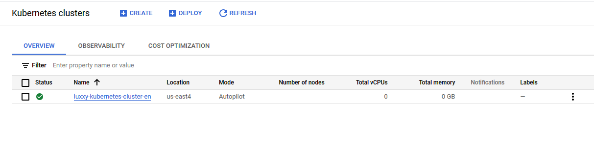

### SQL Network Configuration

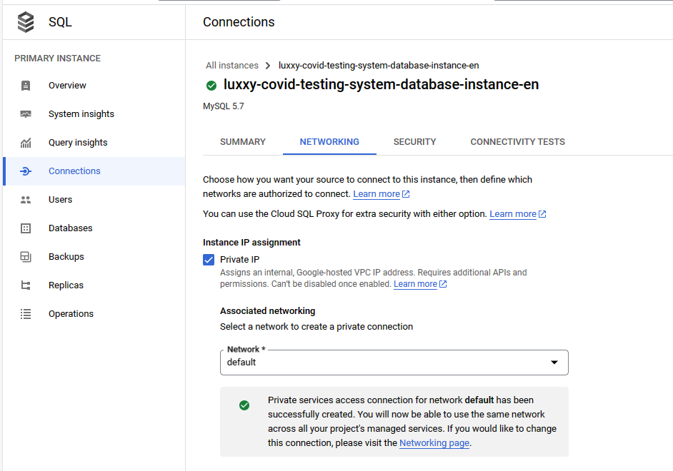

## Mission Accomplished

### SQL Instance

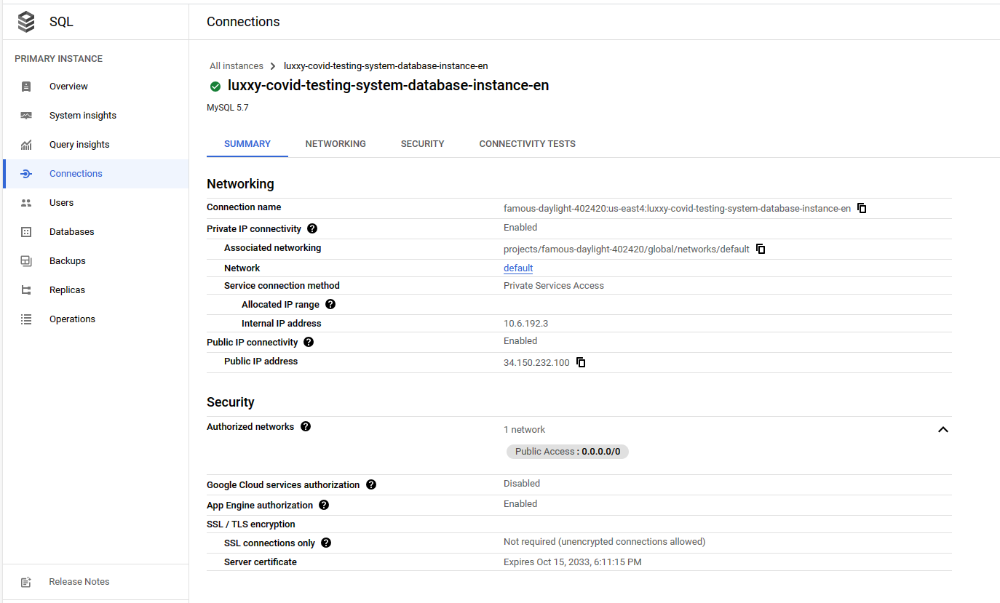

### Kubernetes

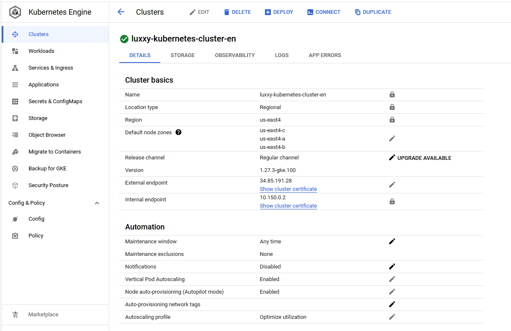

## LinkedIn Post
