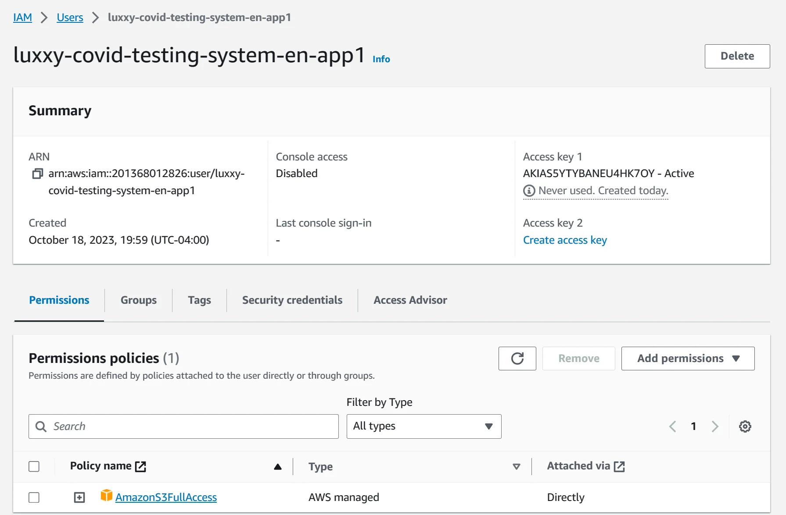
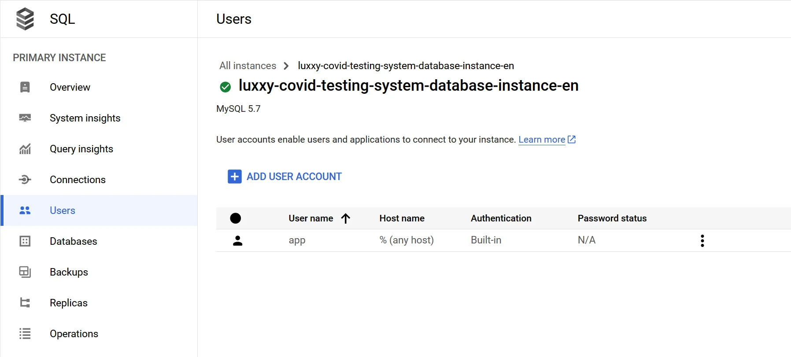
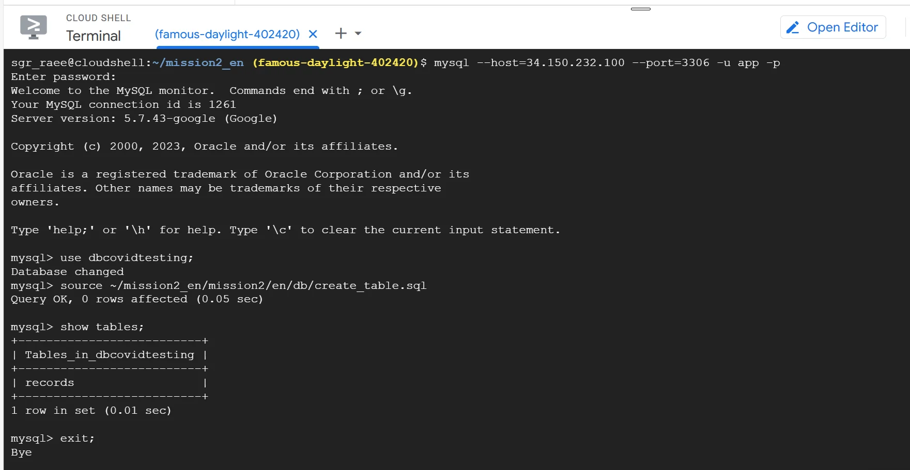
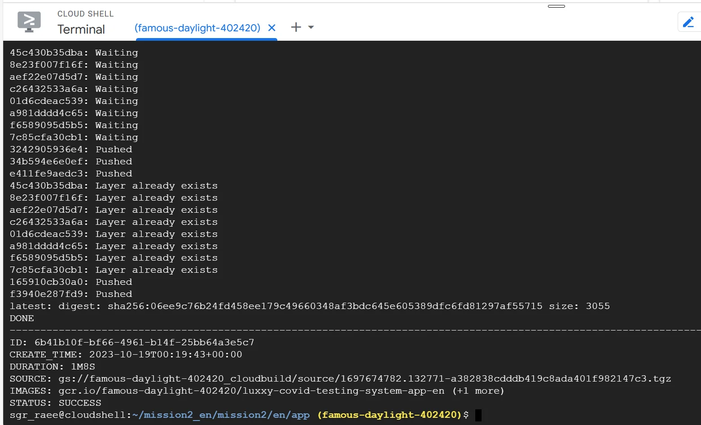
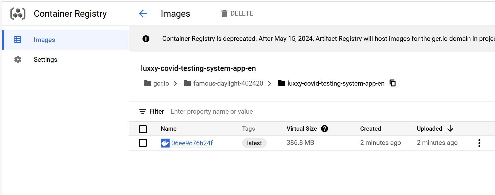
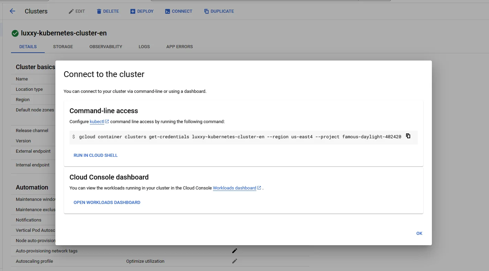
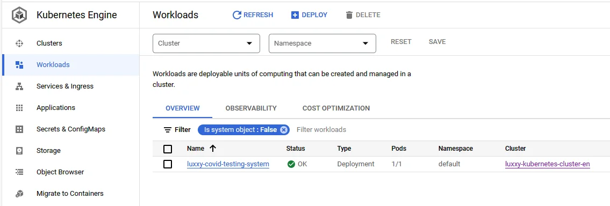
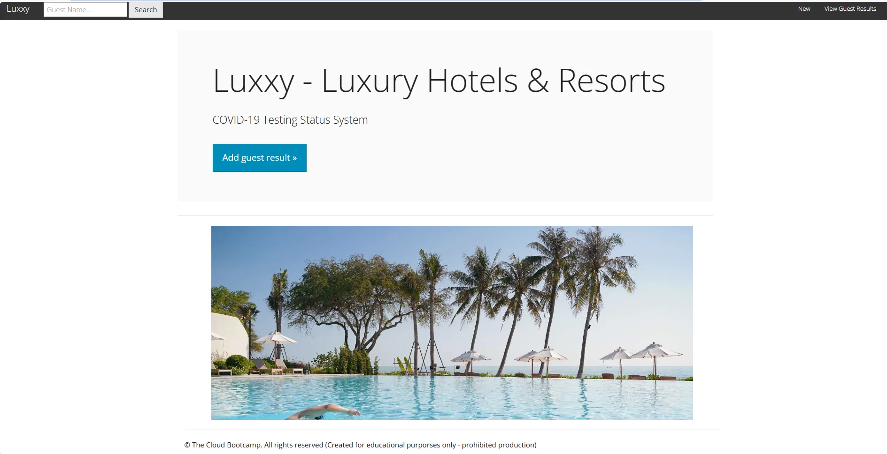

## Begin Hands-on Project

### User creation for Kubernetes cluster app to connect S3

### Create user to access SQL Instance

### Create table in mysql database

### Build Docker image and push it to GCR

### Container Registry of App

### Connect to GKE cluster

## Mission Accomplished

### Deployed application in Cluster as Workload

### Browsing the application

## Invite to The Cloud Bootcamp

- https://e.thecloudbootcamp.com/d8z5zO
