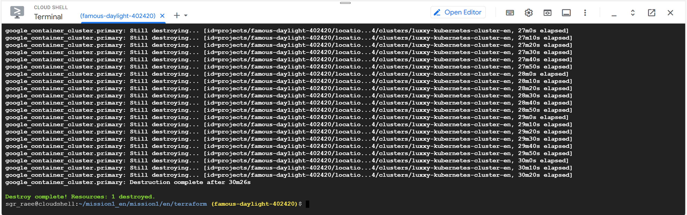

## Begin Hands-on Project

### Database migration to Google Cloud SQL using MySQL dump

### PDF Files Migration to S3 Bucket using AWS CloudShell

### Uploaded files in AWS S3 Bucket

## Mission Accomplished

### Navigating records in Application

### Accessing the file from Application

## Cleanup

### Disabling deletion protection in Terraform file

### Disabling deletion protection in tfstate

### Deleted resources

## Invite to The Cloud Bootcamp

- https://e.thecloudbootcamp.com/d8z5zO
