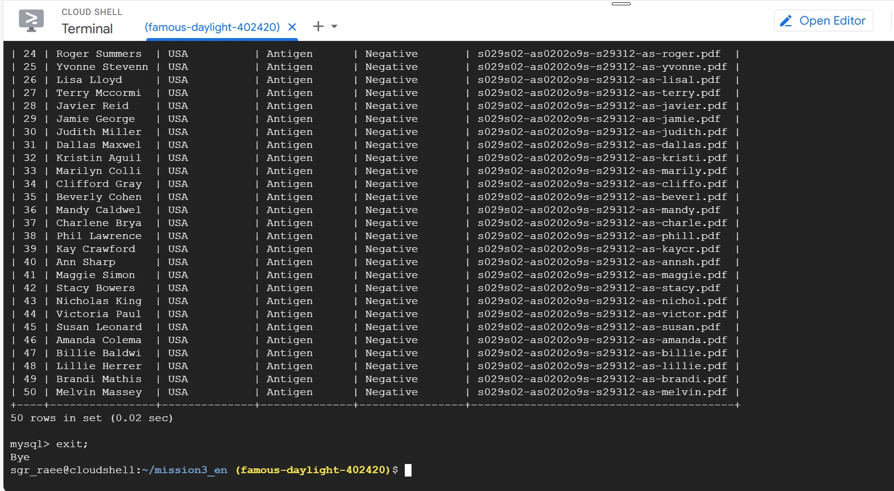
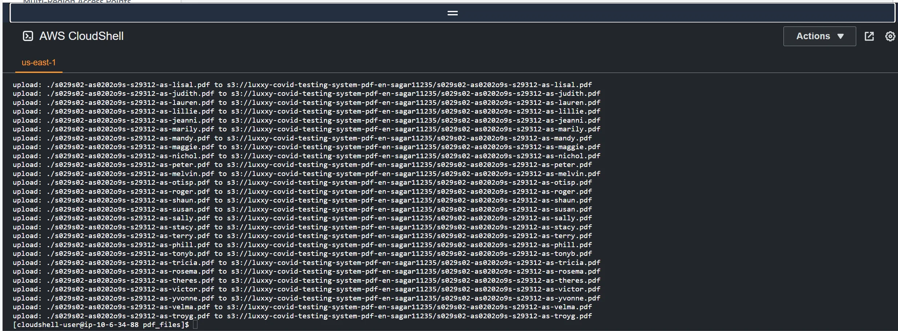
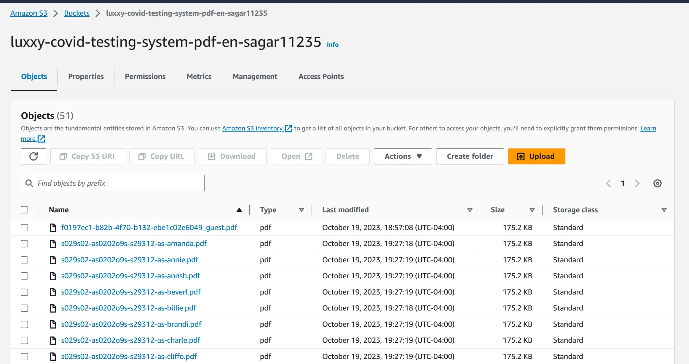
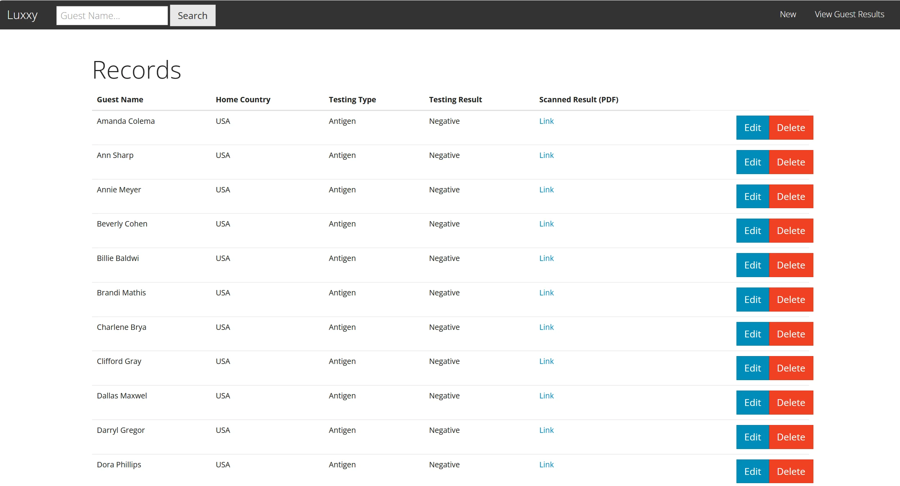
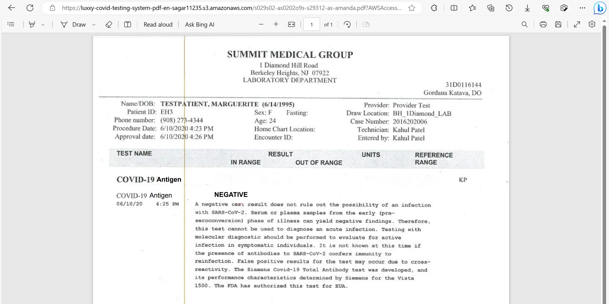
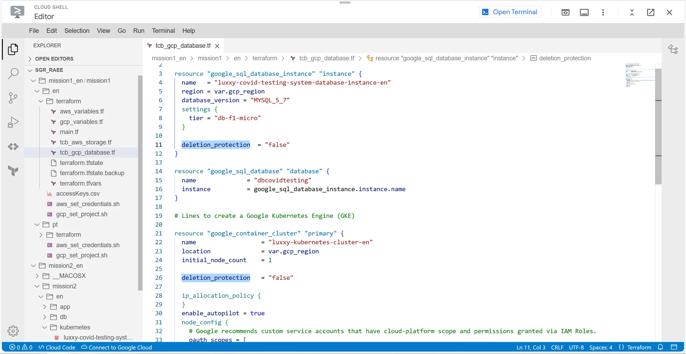
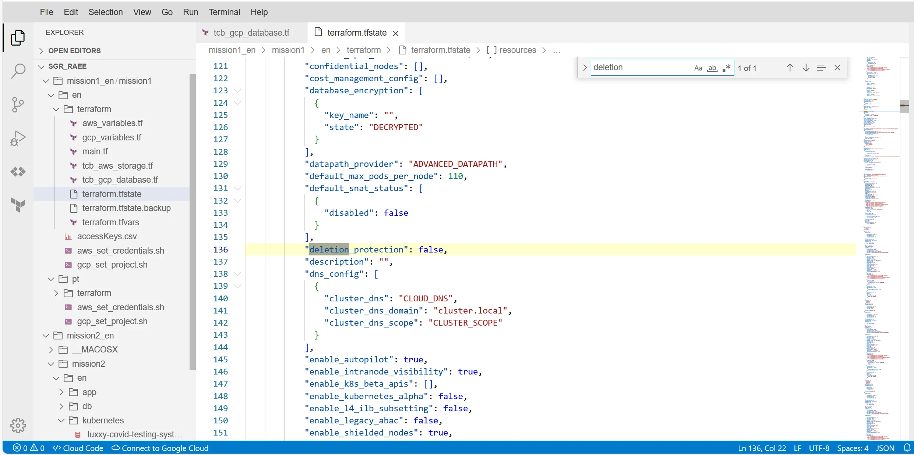

## Mission Introduction

In this mission, we'll perform the database migration and files migration in Google Cloud SQL and AWS S3 respectively. After the migration process is done, we successfully finished all the mission from the trainings. Then we start to deprovision and delete all the resources to avoid charges in Cloud Services.

### Inside

- We migrate the SQL dump file data to Google Cloud SQL using Google Cloud Shell.
- Then, we migrate the PDF files to S3 Bucket using AWS CloudShell.
- Deprovision and delete all resource using Terraform.

## Begin Hands-on Project

### Database migration to Google Cloud SQL using MySQL dump

### PDF Files Migration to S3 Bucket using AWS CloudShell

### Uploaded files in AWS S3 Bucket

## Mission Accomplished

### Navigating records in Application

### Accessing the file from Application

## Cleanup

### Disabling deletion protection in Terraform file

### Disabling deletion protection in tfstate

### Deleted resources

## Invite to The Cloud Bootcamp

- https://e.thecloudbootcamp.com/d8z5zO
