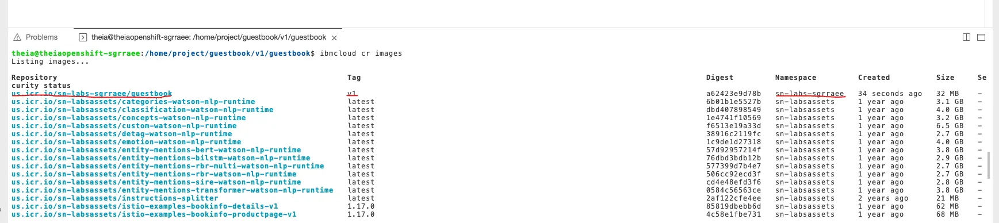
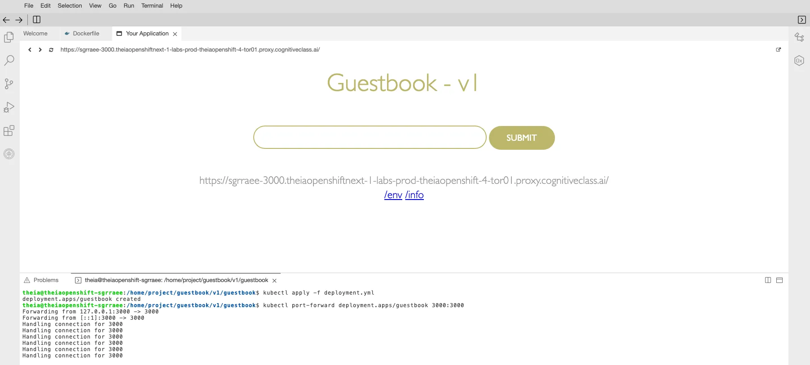
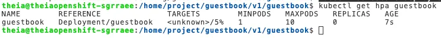
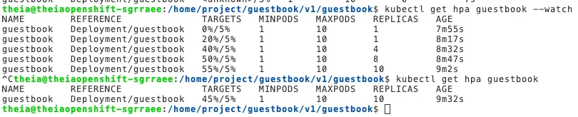
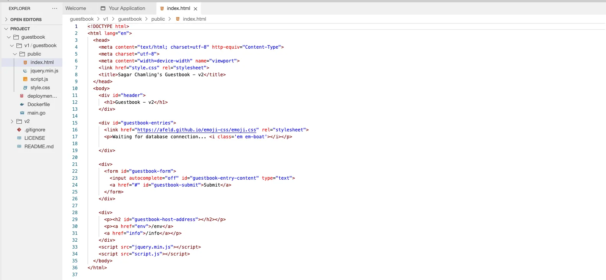
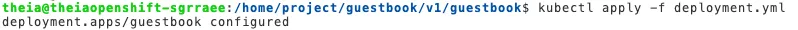
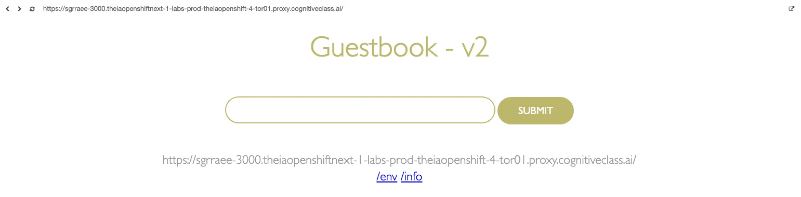
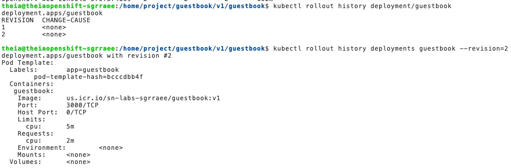
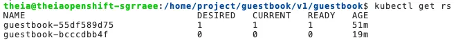

## Objective

In this final project, I will build and deploy a simple guestbook application. The application consists of a web front end which will have a text input where you can enter any text and submit. For all of these I will create Kubernetes Deployments and Pods. Then I will apply Horizontal Pod Scaling to the Guestbook application and finally work on Rolling Updates and Rollbacks.

```bash
# clone final project and modify it.
$ git clone https://github.com/ibm-developer-skills-network/guestbook
```

## Lab Begins

### Review Criteria

#### Task 1: Updation of the Dockerfile. (5 points)

Hint:

- FROM instruction initializes a new build stage and specifies the base image that subsequent instructions will build upon.
- COPY command enables us to copy files to our image.
- ADD command is used to copy files/directories into a Docker image.
- RUN instruction executes commands.
- EXPOSE instruction exposes a particular port with a specified protocol inside a Docker Container.
- CMD instruction provides a default for executing a container, or in other words, an executable that should run in your container.

```Dockerfile
# Updated Dockerfile
FROM golang:1.15 as builder
RUN go get github.com/codegangsta/negroni
RUN go get github.com/gorilla/mux
RUN go get github.com/xyproto/simpleredis/v2
COPY main.go .
RUN go build main.go

FROM ubuntu:18.04

COPY --from=builder /go//main /app/guestbook

ADD public/index.html /app/public/index.html
ADD public/script.js /app/public/script.js
ADD public/style.css /app/public/style.css
ADD public/jquery.min.js /app/public/jquery.min.js

WORKDIR /app
CMD ["./guestbook"]
EXPOSE 3000
```

#### Task 2: The guestbook image being pushed to IBM Cloud Container Registry correctly. (1 point)

```bash
# export for subsequent command.
$ export MY_NAMESPACE=sn-labs-sgrraee

# building guestbook app v1
$ docker build . -t us.icr.io/$MY_NAMESPACE/guestbook:v1

# pushing guestbook app to ICR
$ docker push us.icr.io/$MY_NAMESPACE/guestbook:v1

# verify the image pushed successfully
$ ibmcloud cr images
```



#### Task 3: Index page of the deployed Guestbook – v1 application. (2 points)

```yaml
apiVersion: apps/v1
kind: Deployment
metadata:
  name: guestbook
  labels:
    app: guestbook
spec:
  replicas: 1
  selector:
    matchLabels:
      app: guestbook
  strategy:
    rollingUpdate:
      maxSurge: 25%
      maxUnavailable: 25%
    type: RollingUpdate
  template:
    metadata:
      labels:
        app: guestbook
    spec:
      containers:
        - image: us.icr.io/sn-labs-sgrraee/guestbook:v1
          imagePullPolicy: Always
          name: guestbook
          ports:
            - containerPort: 3000
              name: http
          resources:
            limits:
              cpu: 50m
            requests:
              cpu: 20m
```

```bash
# apply deployment
$ kubectl apply -f deployment.yml
  deployment.apps/guestbook created

## port forward to view application
kubectl port-forward deployment.apps/guestbook 3000:3000
  Forwarding from 127.0.0.1:3000 -> 3000
  Forwarding from [::1]:3000 -> 3000
```



#### Task 4: Horizontal Pod Autoscaler creation. (1 point)

```bash
# autoscale guestbook deployment
$ kubectl autoscale deployment guestbook --cpu-percent=5 --min=1 --max=10
  horizontalpodautoscaler.autoscaling/guestbook autoscaled

# check the status of newly-made HorizontalPodAutoscaler
$ kubectl get hpa guestbook
```



#### Task 5: The replicas in the Horizontal Pod Autoscaler being scaled correctly. (2 points)

```bash
# generate load in new terminal
$ kubectl run -i --tty load-generator --rm --image=busybox:1.36.0 --restart=Never -- /bin/sh -c "while sleep 0.01; do wget -q -O- <your app URL>; done"
$ kubectl run -i --tty load-generator --rm --image=busybox:1.36.0 --restart=Never -- /bin/sh -c "while sleep 0.01; do wget -q -O- https://sgrraee-3000.theiaopenshiftnext-1-labs-prod-theiaopenshift-4-tor01.proxy.cognitiveclass.ai/; done"
```



#### Task 6: The Docker build and push commmands for updating the guestbook. (2 points)



```bash
# build and push
$ docker build . -t us.icr.io/$MY_NAMESPACE/guestbook:v1
$ docker push us.icr.io/$MY_NAMESPACE/guestbook:v1
```

#### Task 7: Deployment configuration for autoscaling. (1 point)

```yaml
# update container resources
resources:
  limits:
    cpu: 5m
  requests:
    cpu: 2m
```



```bash
# apply the deployment changes
$ kubectl apply -f deployment.yml
  deployment.apps/guestbook configured

# port-forward
$ kubectl port-forward deployment.apps/guestbook 3000:3000

# get the replicaset
$ kubectl get rs
NAME                               DESIRED   CURRENT   READY   AGE
guestbook-55df589d75               0         0         0       35m
guestbook-bcccdbb4f                1         1         1       2m54s
```

#### Task 8: Updated index page of the deployed Guestbook – v2 application after rollout of the deployment. (2 points)



#### Task 9: The revision history for the deployment after rollout of the deployment. (2 points)

```bash
# see history of deployment rollouts
$ kubectl rollout history deployment/guestbook

# see the details of deployment rollout
$ kubectl rollout history deployments guestbook --revision=2
```



rev.webp

#### Task 10: The updated deployment after Rollback of the update. (2 points)

```bash
# get the replica sets and observe the deployment which is being used
$ kubectl get rs
  NAME                               DESIRED   CURRENT   READY   AGE
  guestbook-55df589d75               0         0         0       50m
  guestbook-bcccdbb4f                1         1         1       17m

# rollout to revision 1
$ kubectl rollout undo deployment/guestbook --to-revision=1
  deployment.apps/guestbook rolled back

# get the replica sets after the rollout
$ kubectl get rs
```



## Reference

- <https://www.coursera.org/learn/ibm-containers-docker-kubernetes-openshift>
