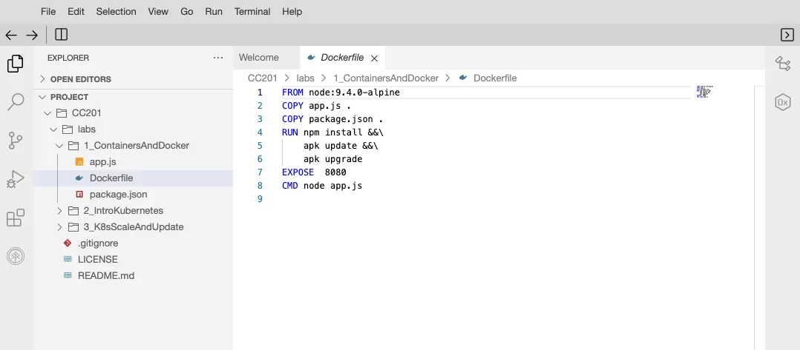
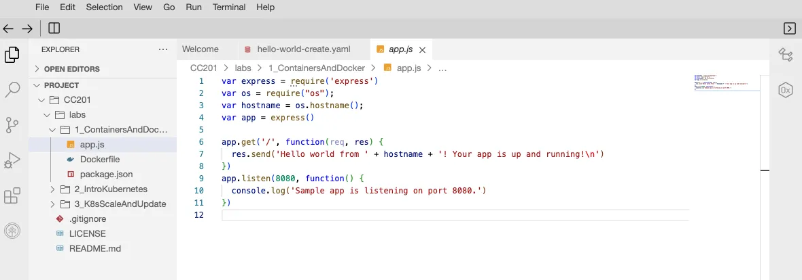

## Objectives

In this lab, you will:

- Pull an image from Docker Hub
- Run an image as a container using docker
- Build an image using a Dockerfile
- Push an image to IBM Cloud Container Registry

## Verify Environment and Command line tools

```bash
$ docker --version
Docker version 24.0.7, build afdd53b

$ ibmcloud version
ibmcloud version 2.20.0+f382323-2023-09-19T20:06:39+00:00

$ [ ! -d 'CC201' ] && git clone \
  https://github.com/ibm-developer-skills-network/CC201.git

$ cd CC201/labs/1_ContainersAndDocker/
$ ls
Dockerfile  app.js  package.json
```

## Pulling an image from Docker Hub and running as a container

```bash
# listing images, initially empty
$ docker images
REPOSITORY   TAG       IMAGE ID   CREATED   SIZE

# pull docker hello-world from Docker Hub
$ docker pull hello-world
Using default tag: latest
latest: Pulling from library/hello-world
c1ec31eb5944: Pull complete
Digest: sha256:encoded-code
Status: Downloaded newer image for hello-world:latest
docker.io/library/hello-world:latest

# listing images again
$ docker images
REPOSITORY    TAG       IMAGE ID       CREATED        SIZE
hello-world   latest    d2c94e258dcb   9 months ago   13.3kB

# running `hello-world` image as a container
$ docker run hello-world
Hello from Docker!

# list the containers to see it exited successfully
$ docker ps -a
CONTAINER ID IMAGE       COMMAND  CREATED STATUS   PORTS   NAMES
9c755c404f2c hello-world "/hello" 1 sec   Exited (0) 3 sec reverent_hoover

# remove container
$ docker container rm 9c755c404f2c
9c755c404f2c

# verify the container has been removed
$ docker ps -a
CONTAINER ID   IMAGE     COMMAND   CREATED   STATUS    PORTS     NAMES
```

## Build an image using Dockerfile



```bash
$ docker build . -t myimage:v1
=> => naming to docker.io/library/myimage:v1          0.0s
```

## Run the image as a container



```bash
# run container
docker run -dp 8080:8080 myimage:v1
349f19114bfcb01a40328092a687f0cd18da3c97e07c8bb6e99e87aaeb4c83d4

# ping the application
curl localhost:8080
Hello world from 349f19114bfc! Your app is up and running!

# stop the list of all running container
docker stop $(docker ps -q)
349f19114bfc

# check container has stopped or not
docker ps
CONTAINER ID   IMAGE     COMMAND   CREATED   STATUS    PORTS     NAMES
```

## Push the image to IBM Cloud Container Registry

```bash
# environment has already logged into IBM Cloud account
$ ibmcloud target
API endpoint:   https://cloud.ibm.com
Region:         us-south
User:           ServiceId-9917a3b5-23f8-4163-a5f6-463699167d84 (sn-labs-x)
Account:        QuickLabs - IBM Skills Network (xyz)
Resource group: No resource group targeted
CF API endpoint:
Org:
Space:

# environment has created ICR namespace for you
$ ibmcloud cr namespaces
Listing namespaces for account 'IBM Skills Network' in registry 'us.icr.io'.

Namespace
sn-labs-x
sn-labsassets
OK

# setting appropriate region where the namespace reside
$ ibmcloud cr region-set us-south
The region is set to 'us-south', the registry is 'us.icr.io'
OK

# login to local Docker daemon into IBM Cloud Registry
$ ibmcloud cr login
Logging 'docker' in to 'us.icr.io'...
Logged in to 'us.icr.io'.
OK

# export namespace as environment variable
$ export MY_NAMESPACE=sn-labs-$USERNAME

# tag image so that it can be pushed
$ docker tag myimage:v1 us.icr.io/$MY_NAMESPACE/hello-world:1

# push the newly tagged image to ICR
$ docker push us.icr.io/$MY_NAMESPACE/hello-world:1

# to only view images within a specific namespace
$ ibmcloud cr images --restrict $MY_NAMESPACE
ibmcloud cr images --restrict $MY_NAMESPACE
Listing images...
Repository                        Tag   Digest         Namespace   Created
us.icr.io/sn-labs-x/hello-world   1     b63783d1b808   sn-labs-x   z sec
OK
```

## Reference

- https://www.coursera.org/learn/ibm-containers-docker-kubernetes-openshift
