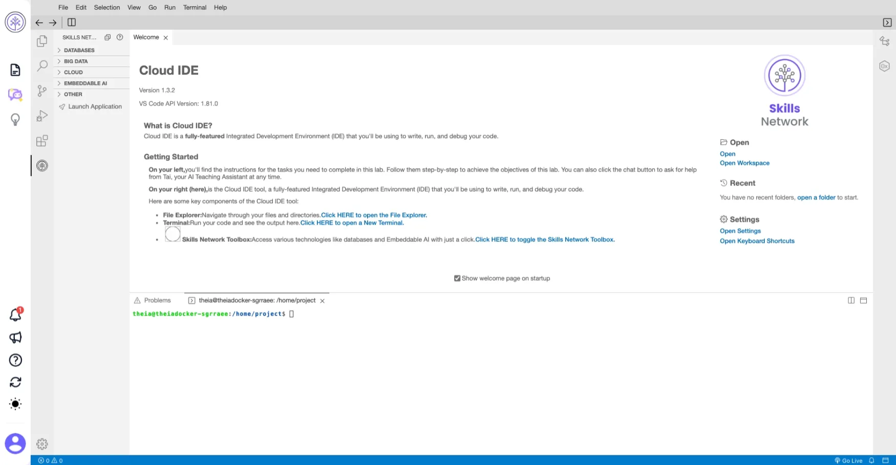

## Objectives

In this lab, you will:

- Use the `kubectl` CLI
- Create a Kubernetes Pod
- Create a Kubernetes Deployment
- Create a ReplicaSet that maintains a set number of replicas
- Witness Kubernetes load balancing in action

## Cloud IDE



## Verify the environment and command line tools

```bash
$ kubectl version
WARNING: This version information is deprecated and will be replaced
with the output from kubectl version --short.  Use --output=yaml|json
to get the full version.

Client Version: version.Info
{
  Major:"1",
  Minor:"27",
  GitVersion:"v1.27.6",
  GitCommit:"741c8db18a52787d734cbe4795f0b4ad860906d6",
  GitTreeState:"clean", BuildDate:"2023-09-13T09:21:34Z",
  GoVersion:"go1.20.8",
  Compiler:"gc", Platform:"linux/amd64"
}

Kustomize Version: v5.0.1
Server Version: version.Info
{
  Major:"1",
  Minor:"26",
  GitVersion:"v1.26.13+IKS",
  GitCommit:"fbfb72fd9f7d07c29a23849656a07ce69833b650",
  GitTreeState:"clean",
  BuildDate:"2024-01-18T18:12:58Z",
  GoVersion:"go1.20.13",
  Compiler:"gc",
  Platform:"linux/amd64"
}
```

```bash
$ [ ! -d 'CC201' ] && git clone \
  https://github.com/ibm-developer-skills-network/CC201.git

$ ls
Dockerfile  app.js  hello-world-apply.yaml
hello-world-create.yaml  package.json
```

## Using the `kubectl` CLI

Kubernetes namespaces enable to virtualize a cluster. We already have access to one namespace in a Kubernetes cluster, `kubectl` is already set to target that cluster and namespace.

```bash
# kubectl requires configuration so that it targets the appropriate cluster.
$ kubectl config get-clusters
NAME
labs-prod-kubernetes-sandbox/c8ana0

# kubectl  context is a group of access parameters, including a cluster,
# a user, and a namespace.
$ kubectl config get-contexts
CURRENT NAME       CLUSTER                              AUTHINFO   NAMESPACE
*       x-context  labs-prod-kubernetes-sandbox/c8ana0  x          sn-labs-x

# list all the pods in your namespace.
$ kubectl get pods
No resources found in sn-labs-x namespace.
```

## Create a Pod with an imperative command

We create a pod that run the `hello-world` image you built and push it to IBM Cloud Container Registry in the previous lab.

```bash
# exporting namespace as an environment variable so that
# it can be used in subsequent commands.
$ export MY_NAMESPACE=sn-labs-$USERNAME

# build and push the image
$ docker build -t us.icr.io/$MY_NAMESPACE/hello-world:1 . && docker push us.icr.io/$MY_NAMESPACE/hello-world:1

# run the hello-world image as a container in Kubernetes
$ kubectl run hello-world --image us.icr.io/$MY_NAMESPACE/hello-world:1 --overrides='{"spec":{"template":{"spec":{"imagePullSecrets":[{"name":"icr"}]}}}}'
  pod/hello-world created

# list the pods in your namespace
$ kubectl get pods
NAME          READY   STATUS    RESTARTS   AGE
hello-world   1/1     Running   0          11s

# the wide option for the output to get more details about the resource
$ kubectl get pods -o wide
NAME          READY   STATUS    RESTARTS   AGE     IP               NODE          NOMINATED NODE   READINESS GATES
hello-world   1/1     Running   0          2m31s   172.17.153.207   10.241.64.6   <none>           <none>

# describe the pod to get more details about it
$ kubectl describe pod hello-world

# delete the pod
$ kubectl delete pod hello-world

# list the pods to verify that none exist
$ kubectl get pods
```

## Create a Pod with imperative object configuration


```yaml
apiVersion: v1
kind: Pod
metadata:
  name: hello-world
spec:
  containers:
    - name: hello-world
      image: us.icr.io/sn-labs-sgrraee/hello-world:1
      ports:
        - containerPort: 8080
  imagePullSecrets:
    - name: icr
```

```bash
# imperative create a Pod using the provided configuration file
$ kubectl create -f hello-world-create.yaml
  pod/hello-world created

# list the pods in your namespace
$ kubectl get pods
NAME          READY   STATUS    RESTARTS   AGE
hello-world   1/1     Running   0          15s

# delete the pod
$ kubectl delete pod hello-world
pod "hello-world" deleted

# list the pods to verify that non exist
$ kubectl get pods
No resources found in sn-labs-x namespace.
```

## Create a Pod with declarative command


```yaml
apiVersion: apps/v1
kind: Deployment
metadata:
  generation: 1
  labels:
    run: hello-world
  name: hello-world
spec:
  replicas: 3
  selector:
    matchLabels:
      run: hello-world
  strategy:
    rollingUpdate:
      maxSurge: 1
      maxUnavailable: 1
    type: RollingUpdate
  template:
    metadata:
      labels:
        run: hello-world
    spec:
      containers:
        - image: us.icr.io/<my_namespace>/hello-world:1
          imagePullPolicy: Always
          name: hello-world
          ports:
            - containerPort: 8080
              protocol: TCP
          resources:
            limits:
              cpu: 2m
              memory: 30Mi
            requests:
              cpu: 1m
              memory: 10Mi
      imagePullSecrets:
        - name: icr
      dnsPolicy: ClusterFirst
      restartPolicy: Always
      securityContext: {}
      terminationGracePeriodSeconds: 30
```

```bash
# to set this configuration as the desired state in Kubernetes
$ kubectl apply -f hello-world-apply.yaml
deployment.apps/hello-world created

# get the deployments to ensure that the deployment was created
$ kubectl get deployments
NAME          READY   UP-TO-DATE   AVAILABLE   AGE
hello-world   3/3     3            3           56s

# list the pods to ensure that three replicas exist
$ kubectl get pods
NAME                           READY   STATUS    RESTARTS   AGE
hello-world-5d7cc94cb5-npdtg   1/1     Running   0          92s
hello-world-5d7cc94cb5-pskk6   1/1     Running   0          92s
hello-world-5d7cc94cb5-rks8g   1/1     Running   0          92s

# delete the pod and created a new one immediately
$ kubectl delete pod hello-world-5d7cc94cb5-npdtg && kubectl get pods
pod "hello-world-5d7cc94cb5-npdtg" deleted
NAME                           READY   STATUS    RESTARTS   AGE
hello-world-5d7cc94cb5-pskk6   1/1     Running   0          4m29s
hello-world-5d7cc94cb5-rks8g   1/1     Running   0          4m29s
hello-world-5d7cc94cb5-xn2tp   1/1     Running   0          34s
```

## Load balancing the application

```js
// app.js
var express = require('express');
var os = require('os');
var hostname = os.hostname();
var app = express();

app.get('/', function (req, res) {
  res.send('Hello world from ' + hostname + '! Your app is up and running!\n');
});
app.listen(8080, function () {
  console.log('Sample app is listening on port 8080.');
});
```

```Dockerfile
FROM node:9.4.0-alpine
COPY app.js .
COPY package.json .
RUN npm install &&\
    apk update &&\
    apk upgrade
EXPOSE  8080
CMD node app.js
```

```bash
# access the application, expose it to the internet using Kubernetes service
$ kubectl expose deployment/hello-world

# list service in order to see that this service was created.
$ kubectl get services
NAME          TYPE        CLUSTER-IP       EXTERNAL-IP   PORT(S)    AGE
hello-world   ClusterIP   172.21.142.190   <none>        8080/TCP   2m41s

# create a proxy to make it accessible outside of the cluster
$ kubectl proxy
Starting to serve on 127.0.0.1:8001

# ping the application to get a response
$ curl -L localhost:8001/api/v1/namespaces/sn-labs-$USERNAME/services/hello-world/proxy
Hello world from hello-world-5d7cc94cb5-xn2tp! Your app is up and running!

# run the command in loop, observe the Kubernetes load balancing the request
# across the three replicas, each request could hit a different instance
# of our application.
$ for i in `seq 10`; do curl -L localhost:8001/api/v1/namespaces/sn-labs-$USERNAME/services/hello-world/proxy; done
Hello world from hello-world-5d7cc94cb5-pskk6! Your app is up and running!
Hello world from hello-world-5d7cc94cb5-pskk6! Your app is up and running!
Hello world from hello-world-5d7cc94cb5-xn2tp! Your app is up and running!
Hello world from hello-world-5d7cc94cb5-pskk6! Your app is up and running!
Hello world from hello-world-5d7cc94cb5-xn2tp! Your app is up and running!
Hello world from hello-world-5d7cc94cb5-pskk6! Your app is up and running!
Hello world from hello-world-5d7cc94cb5-rks8g! Your app is up and running!
Hello world from hello-world-5d7cc94cb5-rks8g! Your app is up and running!
Hello world from hello-world-5d7cc94cb5-pskk6! Your app is up and running!
Hello world from hello-world-5d7cc94cb5-xn2tp! Your app is up and running!

# delete the deployment and service
$ kubectl delete deployment/hello-world service/hello-world
  deployment.apps "hello-world" deleted
  service "hello-world" deleted
```

## Reference

- <https://www.coursera.org/learn/ibm-containers-docker-kubernetes-openshift>
- <https://github.com/ibm-developer-skills-network/CC201>
