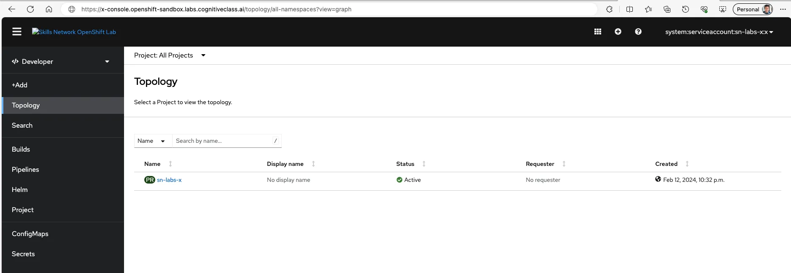
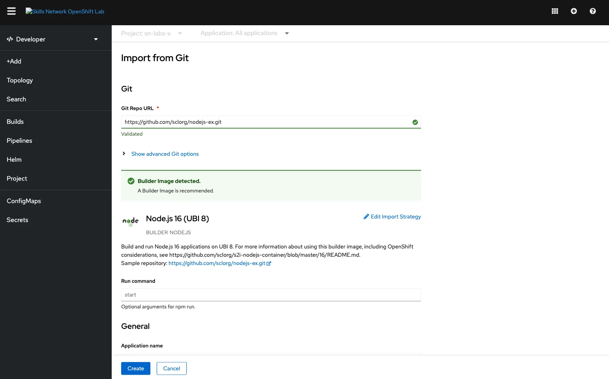
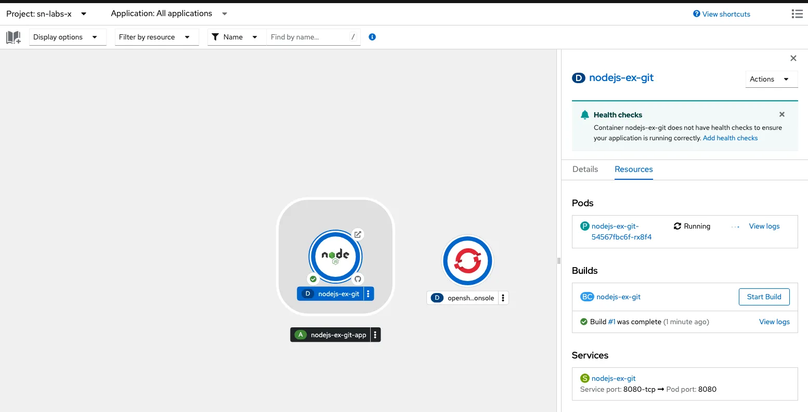
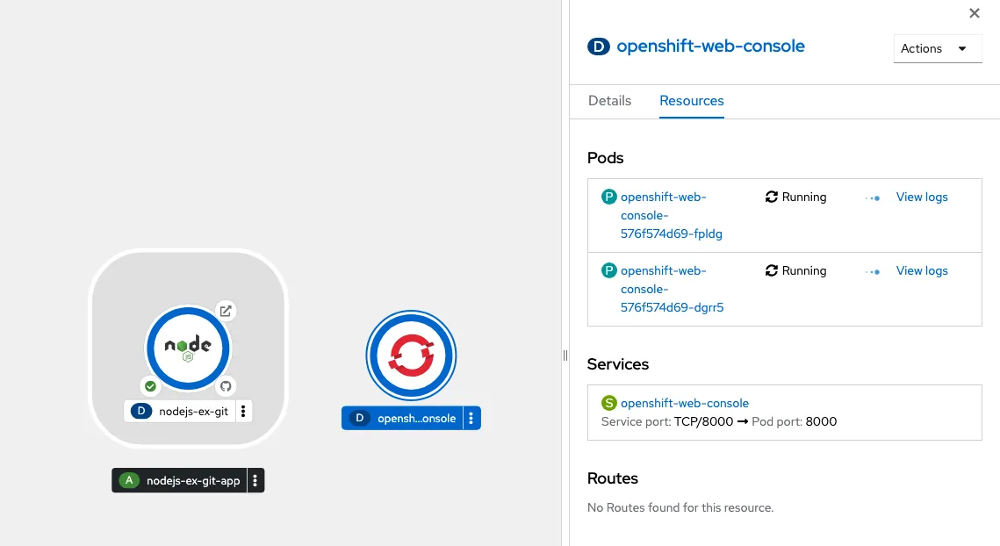
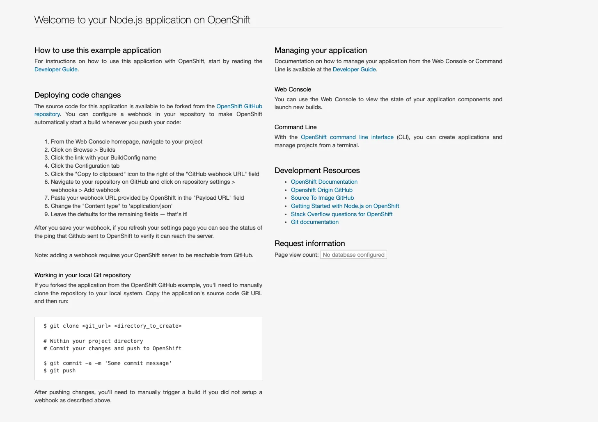
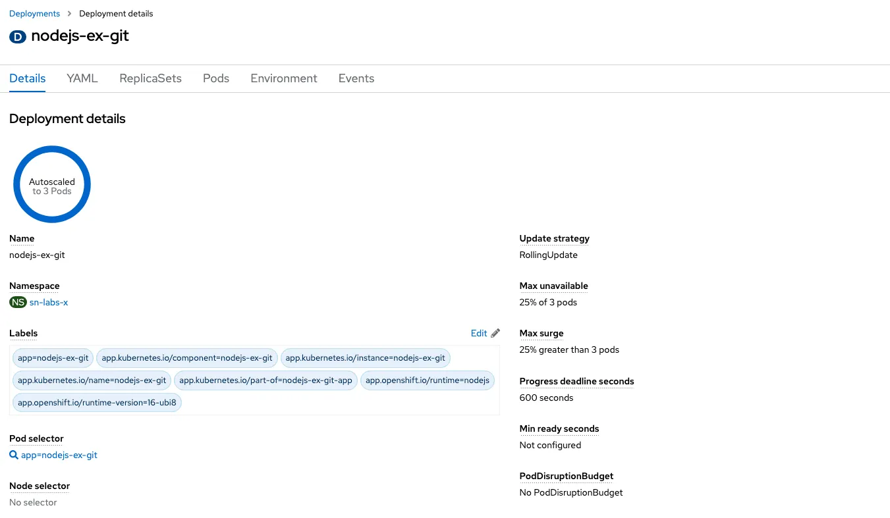

## Objectives

OpenShift projects are Kubernetes namespaces with additional administrative functions. Therefore, projects also provide isolation within an OpenShift cluster. You already have access to one project in an OpenShift cluster, and `oc` is already set to target that cluster and project. In this lab, I will:

- Use the oc CLI (OpenShift command line interface)
- Use the OpenShift web console
- Build and deploy an application using s2i (‘Source-to-image’ build strategy)
- Inspect a BuildConfig and an ImageStream
- Autoscale the application

## Verify the environment and command line tools

```bash
$ oc version
Client Version: 4.13.7
Kustomize Version: v4.5.7
Kubernetes Version: v1.26.11+4ad3e1b
```

## Use the `oc` CLI

```bash
# list the pods in the namespace
$ oc get pods
NAME                                     READY   STATUS    RESTARTS   AGE
openshift-web-console-576f574d69-dgrr5   2/2     Running   0          28m
openshift-web-console-576f574d69-fpldg   2/2     Running   0          28m

# additionally, get OpenShift specific options
# haven’t created a BuildConfig yet, this will not return any resources.
$ oc get buildconfigs
No resources found in sn-labs-x namespace.

# view the OpenShift project that is currently in use
$ oc project
Using project "sn-labs-x" from context named "x-context" on
server "https://c109-e.us-east.containers.cloud.ibm.com:30807".
```

> Note: This project is specific to me and provides isolation within the cluster so that I can deploy my own application.

## Use the OpenShift web console



## Deploy an application in the web console

### Creating Git Repo



### Browsing Application Topology



### Browsing OpenShift Console



## View application in the web console



```yaml
kind: BuildConfig
apiVersion: build.openshift.io/v1
metadata:
  annotations:
    app.openshift.io/vcs-ref: ''
    app.openshift.io/vcs-uri: 'https://github.com/sclorg/nodejs-ex.git'
    openshift.io/generated-by: OpenShiftWebConsole
  resourceVersion: '1283754444'
  name: nodejs-ex-git
  uid: 6eaa6e21-14ad-496c-a151-36ac8f1f7dbf
  creationTimestamp: '2024-02-13T04:26:19Z'
  generation: 2
  managedFields:
    - manager: Mozilla
      operation: Update
      apiVersion: build.openshift.io/v1
      time: '2024-02-13T04:26:19Z'
      fieldsType: FieldsV1
      fieldsV1:
        'f:metadata':
          'f:annotations':
            .: {}
            'f:app.openshift.io/vcs-ref': {}
            'f:app.openshift.io/vcs-uri': {}
            'f:openshift.io/generated-by': {}
          'f:labels':
            .: {}
            'f:app': {}
            'f:app.kubernetes.io/component': {}
            'f:app.kubernetes.io/instance': {}
            'f:app.kubernetes.io/name': {}
            'f:app.kubernetes.io/part-of': {}
            'f:app.openshift.io/runtime': {}
            'f:app.openshift.io/runtime-version': {}
        'f:spec':
          'f:output':
            'f:to': {}
          'f:runPolicy': {}
          'f:source':
            'f:contextDir': {}
            'f:git':
              .: {}
              'f:uri': {}
            'f:type': {}
          'f:strategy':
            'f:sourceStrategy':
              .: {}
              'f:from': {}
            'f:type': {}
          'f:triggers': {}
    - manager: openshift-apiserver
      operation: Update
      apiVersion: build.openshift.io/v1
      time: '2024-02-13T04:26:19Z'
      fieldsType: FieldsV1
      fieldsV1:
        'f:status':
          'f:imageChangeTriggers': {}
          'f:lastVersion': {}
  namespace: sn-labs-x
  labels:
    app: nodejs-ex-git
    app.kubernetes.io/component: nodejs-ex-git
    app.kubernetes.io/instance: nodejs-ex-git
    app.kubernetes.io/name: nodejs-ex-git
    app.kubernetes.io/part-of: nodejs-ex-git-app
    app.openshift.io/runtime: nodejs
    app.openshift.io/runtime-version: 16-ubi8
spec:
  nodeSelector: null
  output:
    to:
      kind: ImageStreamTag
      name: 'nodejs-ex-git:latest'
  resources: {}
  successfulBuildsHistoryLimit: 5
  failedBuildsHistoryLimit: 5
  strategy:
    type: Source
    sourceStrategy:
      from:
        kind: ImageStreamTag
        namespace: openshift
        name: 'nodejs:16-ubi8'
  postCommit: {}
  source:
    type: Git
    git:
      uri: 'https://github.com/sclorg/nodejs-ex.git'
    contextDir: /
  triggers:
    - type: Generic
      generic:
        secretReference:
          name: nodejs-ex-git-generic-webhook-secret
    - type: GitHub
      github:
        secretReference:
          name: nodejs-ex-git-github-webhook-secret
    - type: ImageChange
      imageChange: {}
    - type: ConfigChange
  runPolicy: Serial
status:
  lastVersion: 1
  imageChangeTriggers:
    - lastTriggeredImageID: >-
        image-registry.openshift-image-registry.svc:5000/openshift/nodejs@sha256:a192d3d1ff9933e9f0ebf1401c3c7f016705981c7bed1e18e1fb9cd9a049a3e6
      from:
        namespace: openshift
        name: 'nodejs:16-ubi8'
      lastTriggerTime: '2024-02-13T04:26:19Z'
```

```bash
# listing buildconfigs
$ oc get buildconfigs
NAME            TYPE     FROM   LATEST
nodejs-ex-git   Source   Git    1
```

## Autoscaling the `nodejs-ex-git` application

```yaml
# replacing resources: {} with following
resources:
  limits:
    cpu: 30m
    memory: 100Mi
  requests:
    cpu: 3m
    memory: 40Mi
```

```yaml
# create HorizontalPodAudoscaler
apiVersion: autoscaling/v2
kind: HorizontalPodAutoscaler
metadata:
  name: nodejs-ex-git-hpa
spec:
  scaleTargetRef:
    apiVersion: apps/v1
    kind: Deployment
    name: nodejs-ex-git
  minReplicas: 1
  maxReplicas: 3
  metrics:
    - type: Resource
      resource:
        name: cpu
        target:
          type: Utilization
          averageUtilization: 10
```

```bash
# Increasing the load.
$ for i in `seq 1000`; do curl -L https://nodejs-ex-git-sn-labs-x.labs-prod-openshift-san-a45631dc5778dc6371c67d206ba9ae5c-0000.us-east.containers.appdomain.cloud/; done
```



## Reference

- <https://www.coursera.org/learn/ibm-containers-docker-kubernetes-openshift>
