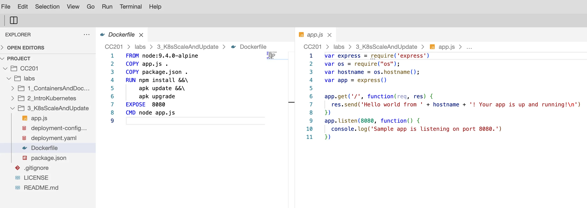

## Objectives

In this lab, I will:

- Scale an application with a ReplicaSet
- Apply rolling updates to an application
- Use a ConfigMap to store application configuration
- Autoscale the application using Horizontal Pod Autoscaler

## Verify the environment and command line tools



```bash
# browse to the given path
$ cd CC201/labs/3_K8sScaleAndUpdate/
```

## Build and push application image to IBM Cloud Container Registry

```bash
# export namespace to an environment variable to be used later
export MY_NAMESPACE=sn-labs-$USERNAME

# build and push the image to the IBM Cloud Container Registry
docker build -t us.icr.io/$MY_NAMESPACE/hello-world:1 .
docker push us.icr.io/$MY_NAMESPACE/hello-world:1
```

## Deploy the application to Kubernetes

```yaml
apiVersion: apps/v1
kind: Deployment
metadata:
  name: hello-world
spec:
  selector:
    matchLabels:
      run: hello-world
  template:
    metadata:
      labels:
        run: hello-world
    spec:
      containers:
        - name: hello-world
          image: us.icr.io/sn-labs-x/hello-world:1
          ports:
            - containerPort: 8080
          resources:
            limits:
              cpu: 2m
              memory: 30Mi
            requests:
              cpu: 1m
              memory: 10Mi

      imagePullSecrets:
        - name: icr
```

```bash
# Running image as a deployment
$ kubectl apply -f deployment.yaml
  deployment.apps/hello-world created

# Listing pods until the status is "Running"
$ kubectl get pods
  NAME                          READY   STATUS    RESTARTS   AGE
  hello-world-55f8cdd55-hn7v8   1/1     Running   0          17s

# to expose it to internet via a Kubernetes Service
# create a service of type ClusterIP
$ kubectl expose deployment/hello-world
  service/hello-world exposed

# to make this externally accessible
$ kubectl proxy
  Starting to serve on 127.0.0.1:8001

# ping the application to get a response
$ curl -L localhost:8001/api/v1/namespaces/sn-labs-$USERNAME/services/hello-world/proxy
  Hello world from hello-world-55f8cdd55-hn7v8! Your app is up and running!
```

## Scaling the application using a ReplicaSet

```bash
# to scale up Deployment
$ kubectl scale deployment hello-world --replicas=3
  deployment.apps/hello-world scaled

# to make sure the three pods created instead of just one
$ kubectl get pods
  NAME                          READY   STATUS    RESTARTS   AGE
  hello-world-55f8cdd55-hn7v8   1/1     Running   0          8m51s
  hello-world-55f8cdd55-l2dqr   1/1     Running   0          9s
  hello-world-55f8cdd55-n9rkd   1/1     Running   0          9s

# ping application multiple times to ensure load-balancing across replicas
$ for i in `seq 10`; do curl -L localhost:8001/api/v1/namespaces/sn-labs-$USERNAME/services/hello-world/proxy; done
Hello world from hello-world-55f8cdd55-l2dqr! Your app is up and running!
Hello world from hello-world-55f8cdd55-hn7v8! Your app is up and running!
Hello world from hello-world-55f8cdd55-n9rkd! Your app is up and running!
Hello world from hello-world-55f8cdd55-l2dqr! Your app is up and running!
Hello world from hello-world-55f8cdd55-l2dqr! Your app is up and running!
Hello world from hello-world-55f8cdd55-n9rkd! Your app is up and running!
Hello world from hello-world-55f8cdd55-l2dqr! Your app is up and running!
Hello world from hello-world-55f8cdd55-n9rkd! Your app is up and running!
Hello world from hello-world-55f8cdd55-l2dqr! Your app is up and running!
Hello world from hello-world-55f8cdd55-l2dqr! Your app is up and running!

# to scale down Deployment
$ kubectl scale deployment hello-world --replicas=1
  deployment.apps/hello-world scaled

# check the pods to see that two are deleted or being deleted
$ kubectl get pods
  NAME                          READY   STATUS        RESTARTS   AGE
  hello-world-55f8cdd55-hn7v8   1/1     Running       0          13m
  hello-world-55f8cdd55-pn4vr   1/1     Terminating   0          14s
  hello-world-55f8cdd55-rgvfp   1/1     Terminating   0          14s

# to ensure only one pod exists
$ kubectl get pods
  NAME                          READY   STATUS    RESTARTS   AGE
  hello-world-55f8cdd55-hn7v8   1/1     Running   0          13m
```

## Perform rolling updates

```js
// Change "Hello world from" to "Welcome to"
var express = require('express');
var os = require('os');
var hostname = os.hostname();
var app = express();

app.get('/', function (req, res) {
  res.send('Welcome from ' + hostname + '! Your app is up and running!\n');
});
app.listen(8080, function () {
  console.log('Sample app is listening on port 8080.');
});
```

```bash
# Rebuild the version 2 and push to ICR.
$ docker build -t us.icr.io/$MY_NAMESPACE/hello-world:2 . && docker push us.icr.io/$MY_NAMESPACE/hello-world:2

# List images in Container Registry that is pushed.
$ ibmcloud cr images
Listing images...

Repository                          Tag Digest      Namespace   Created         Size    Security status
us.icr.io/sn-labs-x/hello-world 1   5cf5e32e9f03    sn-labs-x   30 minutes ago  28 MB   -
us.icr.io/sn-labs-x/hello-world 2   2e591de8e071    sn-labs-x   1 minute ago    28 MB   -

# update the deployment to use the version instead
$ kubectl set image deployment/hello-world hello-world=us.icr.io/$MY_NAMESPACE/hello-world:2
  deployment.apps/hello-world image updated

# get a status of the rolling update by using the following command
$ kubectl rollout status deployment/hello-world

# get the deployment with the `wide` option to see the new tag used
$ kubectl get deployments -o wide
  NAME          READY   UP-TO-DATE   AVAILABLE   AGE   CONTAINERS    IMAGES                              SELECTOR
  hello-world   1/1     1            1           20m   hello-world   us.icr.io/sn-labs-x/hello-world:2   run=hello-world

# ping the application to ensure that the new welcome message is displayed
$ curl -L localhost:8001/api/v1/namespaces/sn-labs-$USERNAME/services/hello-world/proxy
  Welcome to hello-world-55df49f45b-zjjf8! Your app is up and running!

# can rollback the deployment
$ kubectl rollout undo deployment/hello-world
  deployment.apps/hello-world rolled back

# get a status of the rolling update
$ kubectl rollout status deployment/hello-world
  deployment "hello-world" successfully rolled out

# get the deployment with the `wide` option to see that the old tag is used
$ kubectl get deployments -o wide
  NAME          READY   UP-TO-DATE   AVAILABLE   AGE   CONTAINERS    IMAGES                              SELECTOR
  hello-world   1/1     1            1           31m   hello-world   us.icr.io/sn-labs-x/hello-world:1   run=hello-world

# ping application to ensure that the earlier "Hello World...app is running"
curl -L localhost:8001/api/v1/namespaces/sn-labs-$USERNAME/services/hello-world/proxy
  Hello world from hello-world-55f8cdd55-wslb7! Your app is up and running!
```

## Using a ConfigMap to store configuration

```yaml
apiVersion: apps/v1
kind: Deployment
metadata:
  name: hello-world
spec:
  selector:
    matchLabels:
      run: hello-world
  template:
    metadata:
      labels:
        run: hello-world
    spec:
      containers:
        - name: hello-world
          image: us.icr.io/sn-labs-x/hello-world:3
          ports:
            - containerPort: 8080
          envFrom:
            - configMapRef:
                name: app-config
      imagePullSecrets:
        - name: icr
```

```js
// app.js
var express = require('express');
var app = express();

app.get('/', function (req, res) {
  res.send(process.env.MESSAGE + '\n');
});
app.listen(8080, function () {
  console.log('Sample app is listening on port 8080.');
});
```

```bash
# create a ConfigMap that contains a new message.
$ kubectl create configmap app-config --from-literal=MESSAGE="This message came from a ConfigMap!"
  configmap/app-config created

# build version 3 and push a new image
$ docker build -t us.icr.io/$MY_NAMESPACE/hello-world:3 . && docker push us.icr.io/$MY_NAMESPACE/hello-world:3

# apply the new deployment
$ kubectl apply -f deployment-configmap-env-var.yaml
  deployment.apps/hello-world configured

# ping application, message should come from ConfigMap!
$ curl -L localhost:8001/api/v1/namespaces/sn-labs-$USERNAME/services/hello-world/proxy
  This message came from a ConfigMap!

# change message without rebuilding the image
$ kubectl delete configmap app-config
  configmap "app-config" deleted
$ kubectl create configmap app-config --from-literal=MESSAGE="This message is different, and you didn't have to rebuild the image!"
  configmap/app-config created

# restart the deployment so the container restart
$ kubectl rollout restart deployment hello-world
  deployment.apps/hello-world restarted

# ping application if the new message is from environment variable
$ curl -L localhost:8001/api/v1/namespaces/sn-labs-$USERNAME/services/hello-world/proxy
  This message is different, and you didn't have to rebuild the image!
```

## Autoscale the `hello-world` application using Horizontal Pod Autoscaler

```yaml
apiVersion: apps/v1
kind: Deployment
metadata:
  name: hello-world
spec:
  selector:
    matchLabels:
      run: hello-world
  template:
    metadata:
      labels:
        run: hello-world
    spec:
      containers:
        - name: hello-world
          image: us.icr.io/sn-labs-x/hello-world:1
          ports:
            - containerPort: 8080
              name: http
          resources:
            limits:
              cpu: 50m
            requests:
              cpu: 20m

      imagePullSecrets:
        - name: icr
```

```bash
# apply the deployment
$ kubectl apply -f deployment.yaml
  deployment.apps/hello-world configured

# autoscale `hello-world` deployment
$ kubectl autoscale deployment hello-world --cpu-percent=5 --min=1 --max=10
  horizontalpodautoscaler.autoscaling/hello-world autoscaled

# initial observation the replicas increase in accordance with the autoscaling
$ kubectl get hpa hello-world --watch
  NAME          REFERENCE                TARGETS   MINPODS   MAXPODS   REPLICAS   AGE
  hello-world   Deployment/hello-world   0%/5%     1         10        1          114s

# spam the app with multiple requests for increasing the load
# in separate command
$ for i in `seq 100000`; do curl -L localhost:8001/api/v1/namespaces/sn-labs-$USERNAME/services/hello-world/proxy; done
  Hello world from hello-world-6c59687774-l26sv! Your app is up and running!
  Hello world from hello-world-6c59687774-7t8kd! Your app is up and running!
  dial tcp 172.17.153.203:8080: connect: connection refusedHello world from hello-world-6c59687774-sd5px! Your app is up and running!
  Hello world from hello-world-6c59687774-4h4zr! Your app is up and running!
  Hello world from hello-world-6c59687774-hxhq8! Your app is up and running!

# observe again the replicas increase in accordance with the autoscaling
$ kubectl get hpa hello-world --watch
  NAME          REFERENCE                TARGETS   MINPODS   MAXPODS   REPLICAS   AGE
  hello-world   Deployment/hello-world   0%/5%     1         10        1          9m41s
  hello-world   Deployment/hello-world   0%/5%     1         10        1          10m
  hello-world   Deployment/hello-world   105%/5%   1         10        1          10m
  hello-world   Deployment/hello-world   105%/5%   1         10        4          11m
  hello-world   Deployment/hello-world   105%/5%   1         10        8          11m
  hello-world   Deployment/hello-world   30%/5%    1         10        10         11m

# observe the details of horizontal pod autoscaler
$ kubectl get hpa hello-world
  NAME          REFERENCE                TARGETS   MINPODS   MAXPODS   REPLICAS   AGE
  hello-world   Deployment/hello-world   4%/5%     1         10        10         14m

# delete the deployment
$ kubectl delete deployment hello-world
  deployment.apps "hello-world" deleted

# delete the service
$ kubectl delete service hello-world
  service "hello-world" deleted
```

## Reference

- <https://www.coursera.org/learn/ibm-containers-docker-kubernetes-openshift>
- <https://github.com/ibm-developer-skills-network/CC201>
