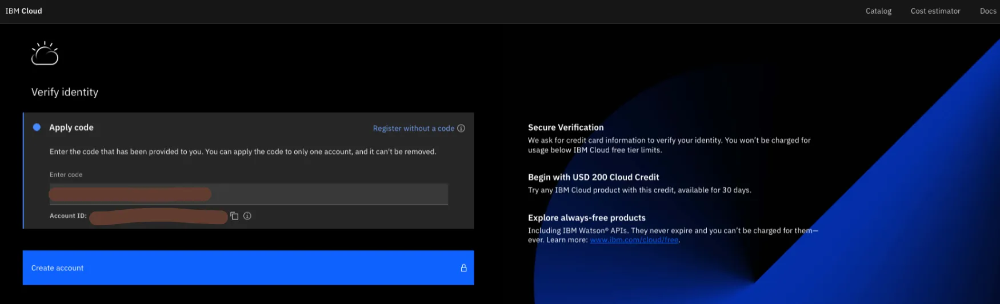
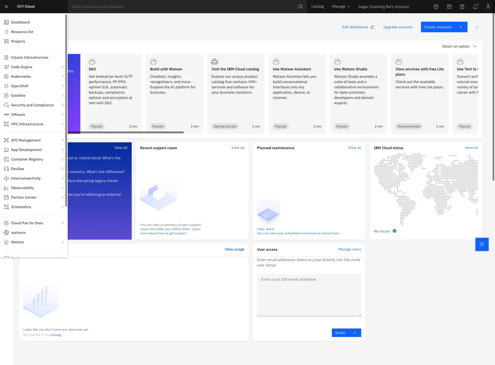
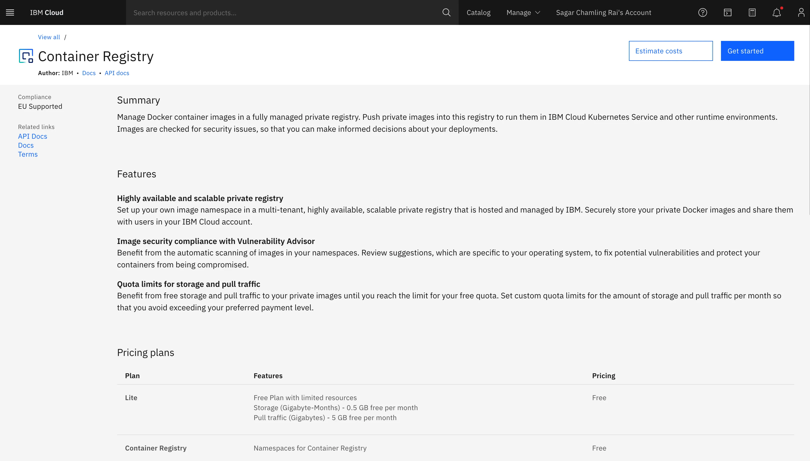
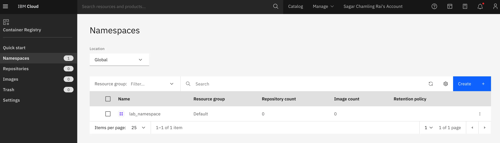
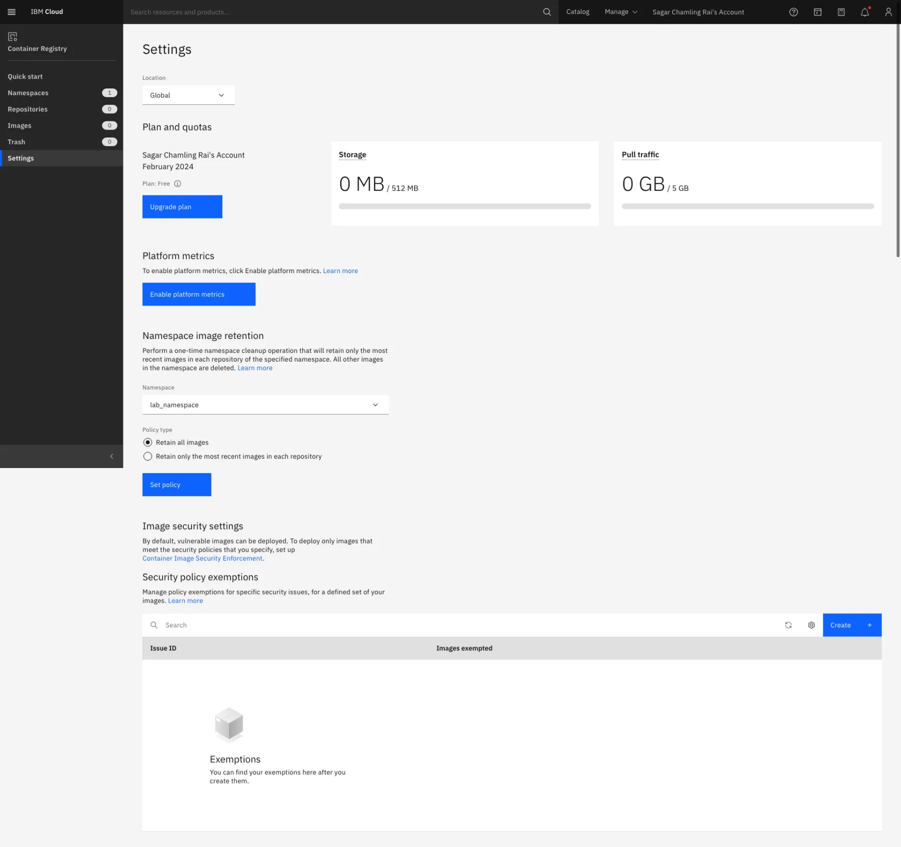

## Lab Overview

This lab is part of a course named **"Introduction to Containers w/ Docker, Kubernetes & OpenShift"**. In this lab will create an IBM Cloud Container Registry. After completing this lab, we will be able to:

- Describe the IBM Cloud Container Registry service
- Create a Container Registry namespace

To perform this lab, we need IBM Cloud which can be activated without the credit card detail instead with the feature code that's included in this course.

### Activate IBM Cloud using Feature Code

### Navigating IBM Cloud Dashboard

### Navigating to Container Registry

### Created Namespaces

### Browsing Namespace

## Reference

- <https://www.coursera.org/learn/ibm-containers-docker-kubernetes-openshift>
