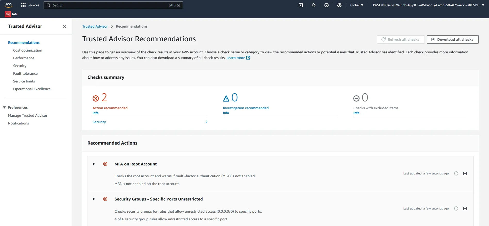
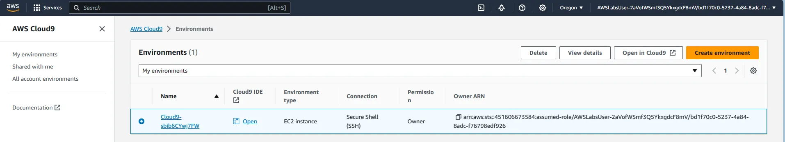

## Working with AWS CodeCommit (Fundamental)

### Overview

AWS CodeCommit is a highly scalable, managed source control service that hosts private Git repositories. CodeCommit stores your data in Amazon S3 and Amazon DynamoDB giving your repositories high scalability, availability, and durability. You simply create a repository to store your code.

This lab demonstrates how to:

- Create a code repository using AWS CodeCommit via the Amazon Management Console
- Create a local code repository on the Linux instance running in EC2 using git
- Synchronize a local repository with an AWS CodeCommit repository

### Lab Begins

#### Creating an AWS CodeCommit repository


#### Connecting to AWS EC2 Instance using AWS Session Manager


#### Visualizing the instance session in AWS Session Manager


#### Working on Linux local repository in Console Connection

Configuring the Git credential helper with AWS credential profile, which allows Git credential helper to send the path to repositories.

```bash
git config --global credential.helper '!aws codecommit credential-helper $@'
git config --global credential.UseHttpPath true

git clone https://git-codecommit.us-east-1.amazonaws.com/v1/repos/My-Repo.
```


#### Pushed Changes in AWS CodeCommit Repository


## Auditing Your Security with AWS Trusted Advisor (Intermediate)

### Overview

This lab guides you through the steps to audit your AWS resources to ensure your configuration complies with basic security best practices. This lab makes use of AWS Trusted Advisor as it applies to security. The topics covered include working with security groups, Multi-factor Authentication (MFA), and AWS Identity and Access Management (IAM).

> Note: AWS Security Model is **shared responsibility**, where both AWS and customers come together to achieve security objective. AWS provides controls that customer can use to secure cloud resources includes IAM, Amazon Virtual Private Clouds (VPCs), security groups, network ACLs and certificates.

You will be able to do the following:

- Use Trusted Advisor to perform a basic audit of your AWS resources
- Modify Amazon Elastic Compute Cloud (Amazon EC2) Security Groups to meet best practices
- Configure Multi-factor Authentication (MFA) (Optional, requiring installation of software on a mobile device)

### Lab Begins

#### Check Trusted Advisor Recommendations



#### Security Group with unrestricted ports


#### Editing inbound rules

##### Editing TCP inbound rules

The port (tcp/port 21) is unrestricted in the security group and is not currently needed and should be removed from the rules.


##### Modified FTP port inbound rule


##### Editing MySQL inbound rules

The rule is permitting incoming traffic to port `3306` from `0.0.0.0/0`, which means traffic will be permitted from **any computer on the Internet**.


##### Modified MySQL inbound rules

This rule now permits access to the RDS database only from members of the Web Security Group


#### Re-check Trusted Advisor Recommendations Result


> In some situations, you want to approve having ports open like `tcp/22` and `tcp/3389` this can be simple done by selecting **Exclude & Refresh**.


#### Setting MFA in AWS IAM user


## Automate Application Testing Using AWS CodeBuild (Advanced)

### Overview

Incorporating automated testing into your DevOps pipelines is crucial to increase speed and efficiency by ensuring that your application functions properly after every update.

This lab demonstrates how you can use AWS CodeBuild as a part of your Continuous Integration pipelines to test and build your code. You will be able to:

- Configure CodeBuild to perform application testing
- Troubleshoot and fix CI/CD pipeline failures
- Review CodeBuild reports and logs
- Apply common code testing strategies
- Describe the importance of robust test coverage

### Lab Begins

#### Explore application in AWS Cloud9

##### Browsing Cloud9



##### Cloud9 Development


##### Previewing Application in Cloud9


#### Automating Testing in CodeBuild

> The test result and failures will not be visible or easy to interpret, CodeBuild support to display test and coverage reports exported by framework in the reports section of `buildspec.yml`. CodeBuild supports the following formats: Cucumber JSON, JUnit XML, NUnit XML, NUnit3 XML, TestNG XML, and Visual Studio TRX. For code coverage reports, you can use the following formats: JaCoCo XML, SimpleCov JSON, Clover XML, and Cobertura XML.

##### Adding CI step and redirecting to reports


##### Pushing changes to CodeCommit


#### Review Build Pipeline

##### Failed CodePipeline of Web Application


##### Command Execution Error


##### Pushing the fix detected by Automated Tests


> Error: This build was not successful due to following error.

```bash
 /codebuild/output/src2610253420/src/react-app/node_modules/@adobe/
 css-tools/dist/index.cjs:118
  }, options?.source || "");
              ^
SyntaxError: Unexpected token '.'

at Runtime.createScriptFromCode (node_modules/jest-runtime/build/index.js:1350:14)
at Object.<anonymous> (node_modules/@testing-library/jest-dom/dist/utils.js:21:17)
```
