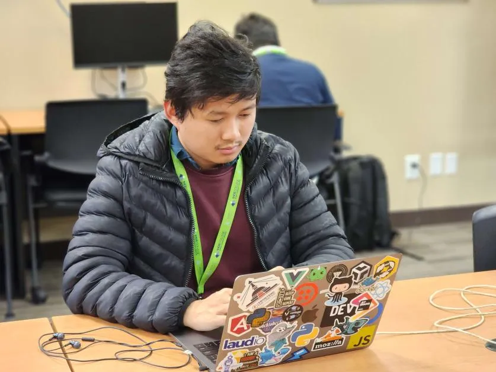
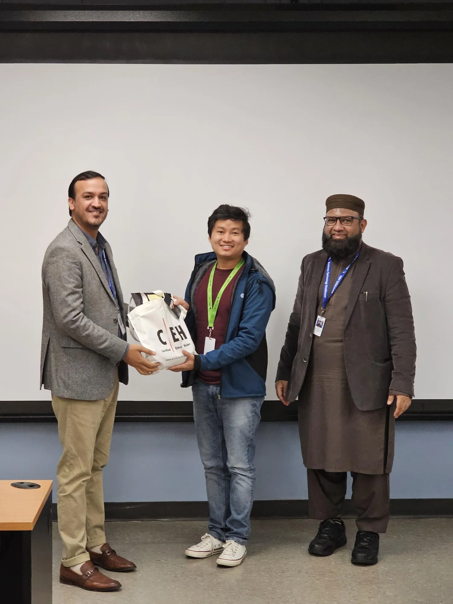
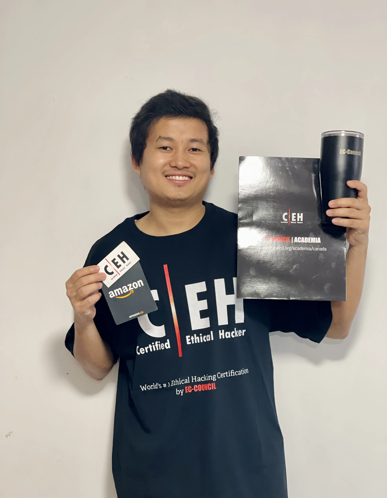

## Expressing Gratitude

I am thrilled and honored to share that I have won the inter-college <abbr title="Capture The Flag">CTF</abbr> Competition sponsored by [**EC-Council**](https://www.eccouncil.org/), held at [**Sault College**](https://www.saultcollege.ca/), TSW and BSW Campuses. I am grateful for the prize and recognition that I received from EC-Council, and were presented to me by the campus director of Sault College, Toronto South West.

A special mention must be made of my instructor and program coordinator, who has consistently been a source of inspiration and played a key role in my achievement.

## About Competition

The challenge was performed on [CyberQ](https://www.cyberq.io/), a cloud-based platform that provides cyber targets for participants to capture the flag. It was individual competition, where each participant had to complete a scenario-based challenge within _one hour_, with _three hints_ available in each flag at the cost of reduced score.

The competition involved **red teaming**, individual participants, who performed cyber attacks simulation on target system on a target network and the **white team**, EC-Council’s technical team, who monitored and evaluated the performance of the participants.

> I've written technical walkthrough explaining my preparation process, knowledge I gained and the strategy I employed to successfully capture all flags in just **38 minutes**. You can find it [here]() 👈.

## Captured Moments

### Competition Begun

### Prizes Drawn

### Swags On

### Stickers Adorn




