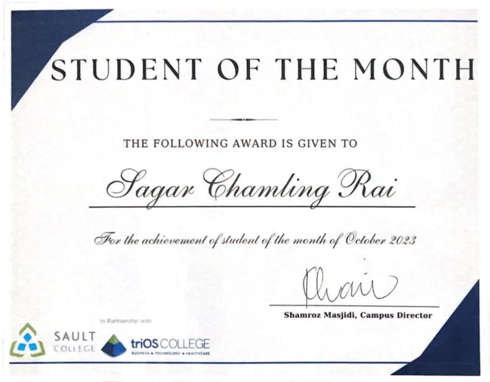

## Key Achievements

- **Event Excellence**: Achieved recognition through outstanding performance in events, cybersecurity awareness presentation and competitions.
- **Peer Mentor**: Respected by peers for knowledge sharing and creating a supportive learning environment.
- **Proactive Leader**: Known for driving positive change and continuous improvement.

## Gallery

### Announcement

### Rewarded

### Certificate




