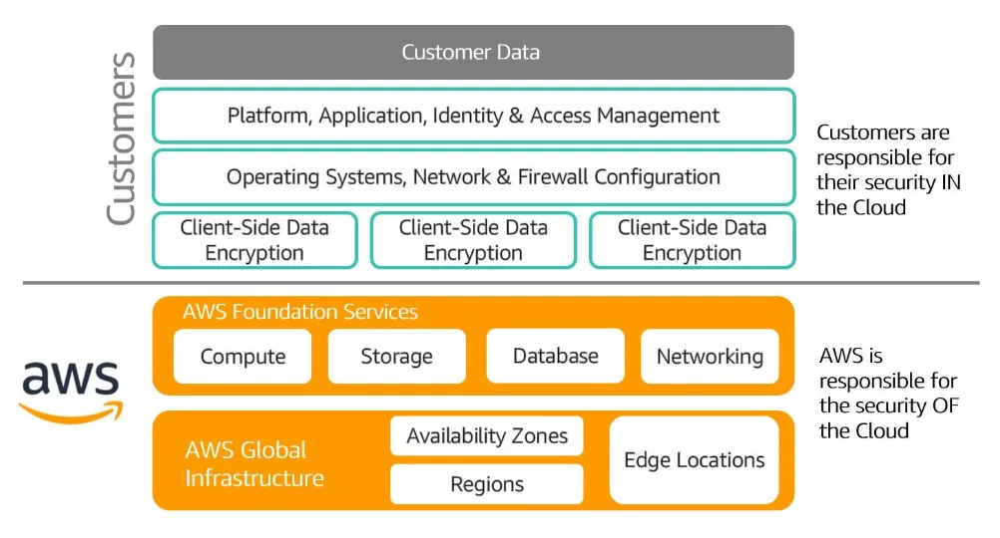
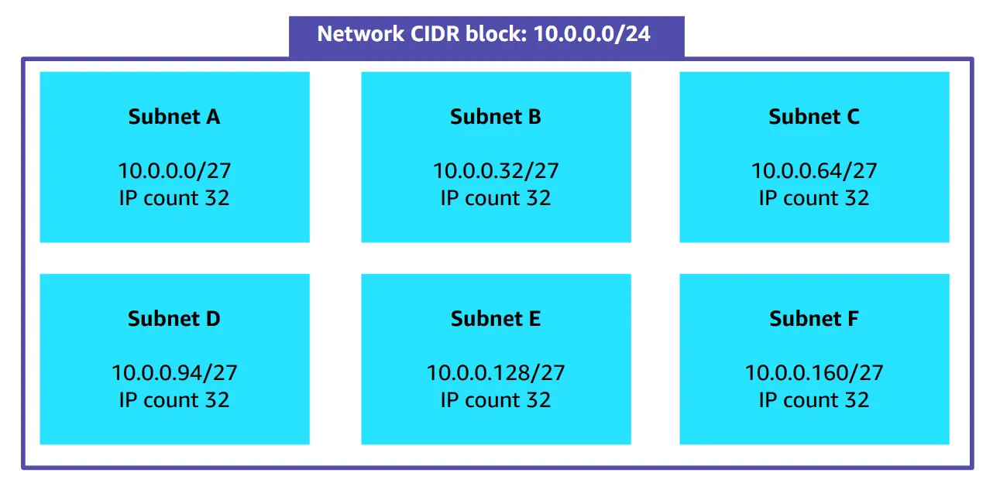
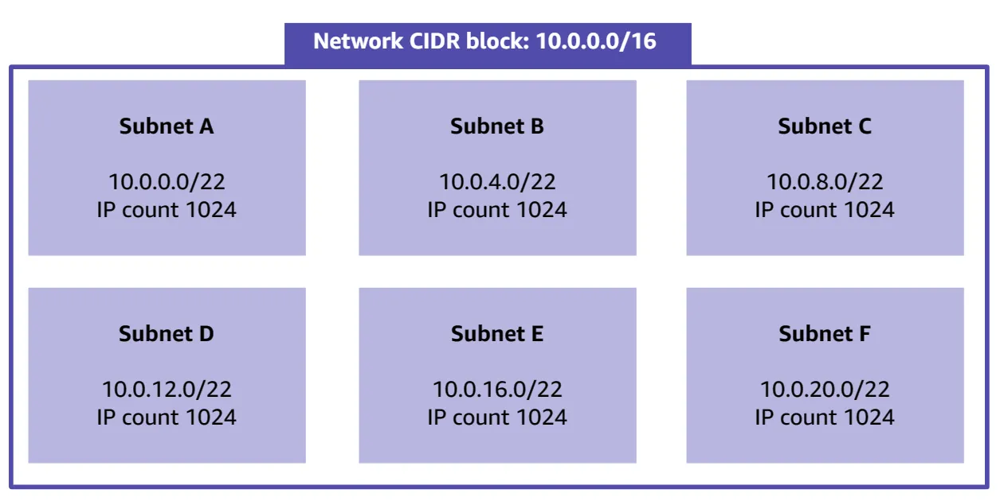
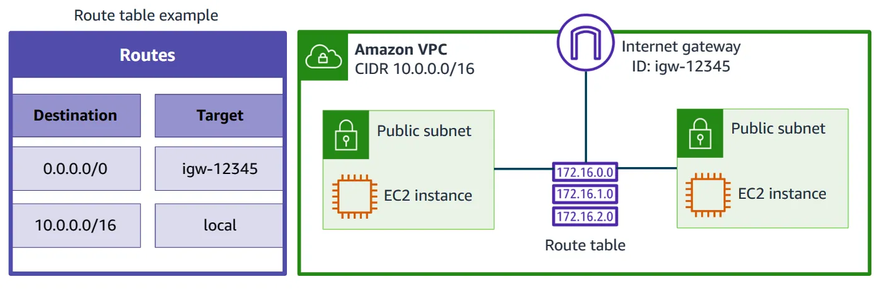
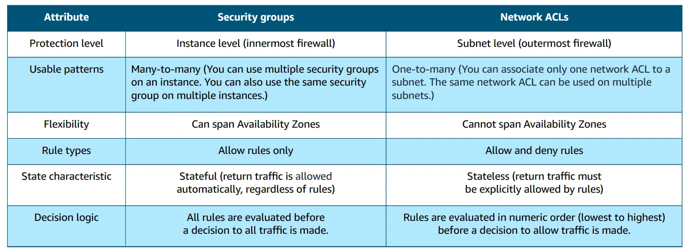
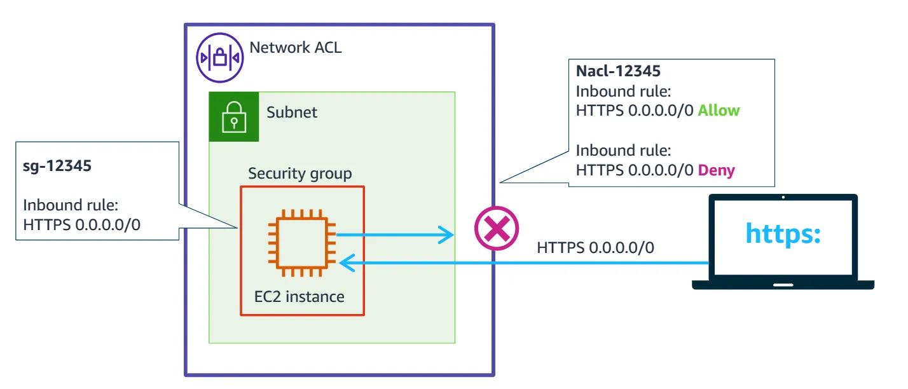
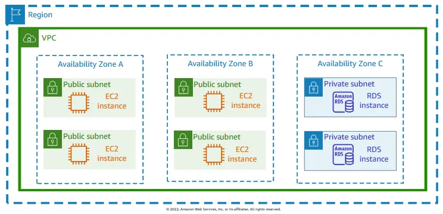
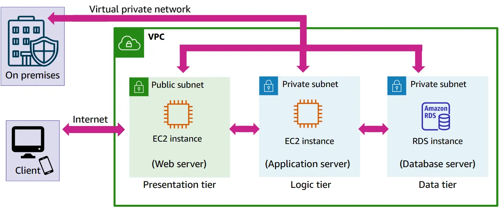
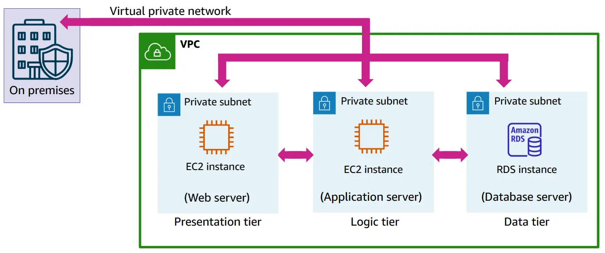
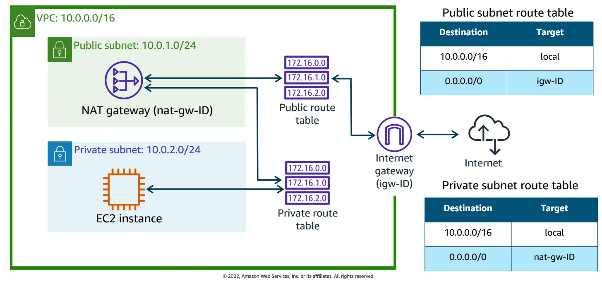

## Cloud Computing

### AWS Global Infrastructure

#### Region

Region is a physical location around the world where data centers are clustered together. Each AWS Region consists of multiple, isolated and physically separated Availability Zones within a geographic area.

#### Availability Zone

A group of logical data centers is called an availability zone. They are interconnected with high-bandwidth, low-latency networking, to provide low-latency networking between zones that is sufficient to accomplish synchronous replication (same time replication). Typically, 3 availability zone in one region.

#### Edge Location

Edge locations are connected to the AWS Regions through the AWS network across the globe. It cache copies of customer contents for faster delivery to users at any location.

### Planning for Failure

- **Storage** - File stored in AWS S3, is redundantly copied into every Availability Zone in that Region.
- **Compute** - It is a best practice to spread out computing resources across multiple Availability Zones to guarantee high availability.
- **Database** - Database can be configured for Multi-AZ deployment.

### Shared Responsibility

- Customer are responsible for the security of everything that they create and put **IN** the AWS cloud. (Security IN the cloud)
- AWS manages the security **OF** the cloud, specifically the physical infrastructure that hosts customer resources. (Security OF the cloud)



### AWS Well-Architected Framework

- **Operational Excellence** - run and monitor systems to deliver business value and continually improve supporting processes and procedures.
- **Security** - ability to protect information, systems, and assets while delivering business value through risk assessments and mitigation strategies.
- **Reliability** - ability to recover from disruptions, dynamically acquire on demand computing resources and mitigate disruptions.
- **Performance Efficiency** - ability to use computing resources efficiently to meet system requirements and to maintain that efficiency as demand changes and technologies evolve.
- **Cost Optimization** - ability to run systems to deliver business value at the lowest price point.

### Total Cost of Ownership (TCO)

It is a financial metric that is used to estimate and compare direct and indirect costs of a product or a service. It typically includes the actual costs of the procurement, management, maintenance and decommissioning of hardware resources.

### Instances

- **On-Demand** instance are ideally used for computing needs that are less than a year.
- **Spot instances** are used for computing needs that need to run for low costs and can be interrupted.
- **Lambda instances** do not exist. You can use AWS Lambda to process snippets of code, when a Lambda function is triggered.

## Networking

### Classless Inter-Domain Routing

**CIDR**, method to define a network's IP range contained in it. In below example, the netmask, 24, first 24 (left to right) cannot change. Remaining 8 bits are flexible and can go from 0 to 255 providing 256 IP addresses in the network.

```bash
192.0.2.0/24
```

- **Fixed IP address**: All 32 bits are fixed. Use case: Set up a firewall rule and give access to a specific host.
- **Internet CIDR block**: All 32 bits are flexible. Use case. Setup a firewall rules to allow internet traffic.

```bash
192.0.2.0/32 # Fixed IP address

0.0.0.0/0 # Internet CIDR block
```

### Subnet

Subnet or sub-network, is a network within a network. With this access control over subnets, we can decide which subnets in the networks can communicate with each other. With a subnet, it reduces the bandwidth on the routers and traffic can reach its destination in a shorter amount of time. IP address needs to travel through the router to reach IP in another subnet. Strategic placement of subnets and IPs within the subnet help to reduce network complexities and reduces network loads for more efficient traffic flow.

### Planning a subnet

> Note: IP addresses are required by load balancers, switches, routers, servers, workstations, printers, fax machines, mobile. Router and switches require multiple IP addresses.




- **Public Subnet**: Allows internet traffic that is routed through an internet gateway to reach the subnet.
- **Private Subnet**: Denies traffic to subnet that is routed from the public internet. Access to public internet from private subnet requires a NAT device.

### Amazon VPC

Amazon VPC is a virtual networking environment that gives you full control over your virtual networking environment, which includes resource placement, connectivity, and security. When you launch VPC, choose region, then launch subnets in availability zones.

VPC IDs, string of random numbers and letters to identify VPC and tags, more identifiable name, are used to associate VPC components to the correct VPC. e.g. `vpc-012kkadf232321234 (Development VPC)`

> Creating VPC, main route table, network ACL, and security group will be created automatically.

- **AWS Direct Connect** establish a dedicated, private network connection between your network and one of the Direct Connect locations to reduce network costs, increase bandwidth throughput, and provide a more consistent network experience than internet-based connections.
- **VPC Endpoints** provide connections between VPC and supported services.
  - **Interface Endpoints** AWS PrivateLink provides private connectivity between VPCs, AWS Services, and on-premises network without exposing traffic to the public internet.
  - **Gateway Endpoints** provide reliable connectivity to Amazon S3 and DynamoDB without requiring an internet gateway or a NAT device for VPC.
- **VPC Peering** is network connection between two VPCs that you can use to route traffic between them privately. Restriction: IP address ranges cannot overlap and transitive peering is not supported, must explicitly establish peering connection to be able to communicate.
- **AWS Transit Gateway** connects VPCs and on-premises networks through a central hub.

#### Route Table

Main Route Table directs traffic in VPC, each route specifies _a destination_, CIDR block or range of address where traffic is supposed to go and _a target_, the gateway, network interface, or connection through which to send the destination traffic. Each subnet in VPC must be associated with route table and follows many to one rules, many subnets can be associated with same route table.



#### Security Groups

Act as firewalls to allow only the traffic that you authorize and route the traffic to only the parts of your network that you permit. **Instance level firewall**, filters inbound and outbound traffic that is allowed to instances. Security groups are stateful.

By default, there is no inbound traffic rules but there's outbound rule that allows all outbound traffic.



#### Network ACLs

Provides an additional level of stateless granular-level security only if required. Network ACLs act at the **subnet level** and control traffic. Each subnet in VPC must be associated with network ACL. Network ACLs can be associated with multiple subnets. The network administrator would need to update the network ACLs before that return traffic could pass out of the subnet.



#### VPC Architecture

> Setting up AWS account, will automatically provide a default VPC in each AWS Region. Default VPCs have a public subnet with internet access for each Availability Zone in the Region such that EC2 instances can be immediately launched.

> Service quota: 5 VPCs per region per account. Can be increased by raising a ticket.



#### Public access to Presentation tier



#### Restricted access to Presentation tier



#### Reserved subnet IP addresses

> Note: Best practice to create larger subnets (256 IP addresses) instead of small subnets (65 IP addresses)

| Reserved IP address | Purpose                                   |
| ------------------- | ----------------------------------------- |
| First IP            | Network address                           |
| Second IP           | VPC local router (internal communication) |
| Third IP            | DNS resolution                            |
| Fourth IP           | Future use                                |
| Last IP             | Network broadcast address                 |

#### Network Gateway

A gateway that determines the traffic that will be given access to network is network gateway.

- **Internet Gateway** enables communication between VPC and the internet.
- **Virtual Private Gateway** enables to connect on-premise site to VPC also referred as site-to-site VPN connection.

### Elastic IP

Elastic IP address replaces the default public IP address, you can mask the failure of an instance or software by rapidly remapping the address to another instance in VPC. It operates in Region level, can be used in any VPC in the region where it was created.

### NAT Gateway

You can use a NAT gateway so that instances in a private subnet can connect to services outside your VPC but external services cannot initiate a connection with those instances.



## Source

- [Introduction to Cloud 101 - AWS Educate](https://awseducate.instructure.com/courses/891)
- [Getting Started with Networking (Lab) - AWS Educate](https://awseducate.instructure.com/courses/911)
