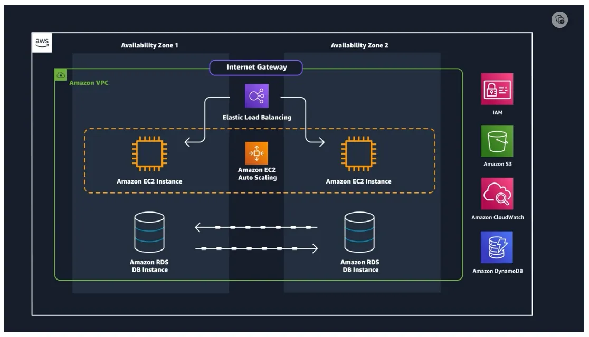
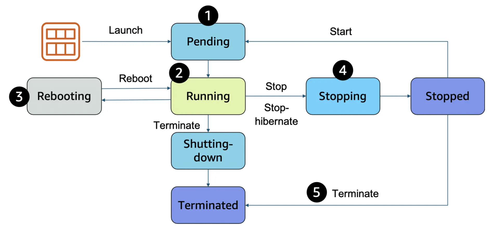

## Key Notes

- Every action that you make in AWS is an API call that is authenticated and authorized.
- Security and compliance are a shared responsibility between AWS and you.
- When you first access AWS, you begin with a single sign-in identity known as the root user.
- AWS Identity and Access Management (IAM) is an AWS service that helps you manage access to your AWS account and resources.
- Maintaining roles is more efficient than maintaining users, users have long-term credentials, whereas IAM dynamically provides temporary credentials that expire after a defined period of time. (15 minutes to 36 hours).
- Policies attached to Role, Role can be assigned and unassigned efficiently to User or AWS Services to perform specific task without modifying any other policies.
- AWS IAM Identity Center allows to manage federated users, then can be used to assign a role to a federated user when access is requested through an identity provider.
- Three types of compute options are available: virtual machines (VMs), container services, and serverless.
- When architecting any application for high availability, consider using at least two EC2 instances in two separate Availability Zones.

## Choosing the right AWS Region

AWS regions are independent from one another.

- **Latency** - application sensitive to latency (delay between a request for data and the response), choose a REgion that is close to your user base.
- **Pricing** - Due to the local economy and the physical nature of operating data centers, prices vary from one Region to another. AWS charges based on the financial factors specific to each Region.
- **Service Availability** - Some services might not be available in some regions.
- **Data Compliance** - Enterprise companies often must comply with regulations that require customer data to be stored in a specific geographic territory. (GDPR)

### Availability Zones

Availability Zones consist of one or more data centers with redundant power, networking and connectivity, connected using redundant high-speed and low-latency links. e.g. us-east-1a, sa-east-1b.

To keep application available, we have to maintain high availability resiliency. At minimum, should use two Availability Zones.

### Edge locations

Edge locations are global locations where content is cached. For example, if your media content is in London and you want to share video files with your customers in Sydney, you could have the videos cached in an edge location closest to Sydney. AWS has more than 400+ edge locations globally.

> Amazon CloudFront is a specific Content Delivery Network (CDN) service provided by Amazon Web Services (AWS). It uses a network of Edge Locations around the world to cache and serve content to users with low latency and high data transfer speeds.

## AWS Compute

The EC2 instance is the entity you interact with, where you can install your web server and serve your content to users. An AMI includes the operating system, storage mapping, architecture type, launch permissions, and any additional preinstalled software applications. In this case, the AMI is how you model and define your instance.

When you launch a new instance, AWS allocates a virtual machine that runs on a hypervisor. Then the AMI that you selected is copied to the root device volume, which contains the image that is used to boot the volume.

### Amazon EC2 instance types

For example, c5n.xlarge can be broken down as follows:

- First position c, indicates the instance family. This indicates that this instance belongs to the compute optimized family.
- Second position 5, indicates the generation of the instance. This instance belongs to the fifth generation of instances.
- Remaining letters before the period – In this case, n indicates additional attributes, such as local NVMe storage.
- After the period, xlarge indicates the instance size. In this example, it's xlarge.

### Difference between stop and stop-hibernate

When you stop an instance, it enters the stopping state until it reaches the stopped state. AWS does not charge usage or data transfer fees for your instance after you stop it. But storage for any Amazon EBS volumes is still charged. While your instance is in the stopped state, you can modify some attributes, like the instance type. When you stop your instance, the data from the instance memory (RAM) is lost.

When you stop-hibernate an instance, Amazon EC2 signals the operating system to perform hibernation (suspend-to-disk), which saves the contents from the instance memory (RAM) to the EBS root volume. You can hibernate an instance only if hibernation is turned on and the instance meets the hibernation prerequisites.

### Terminate

When you terminate an instance, the instance stores are erased, and you lose both the public IP address and private IP address of the machine

## Pricing

**On-Demand Instances** are recommended for the following use cases:

- Users who prefer the low cost and flexibility of Amazon EC2 without upfront payment or long-term commitments
- Applications with short-term, spiky, or unpredictable workloads that cannot be interrupted
- Applications being developed or tested on Amazon EC2 for the first time

**Spot Instances** are recommended for the following use cases:

- Applications that have flexible start and end times
- Applications that are only feasible at very low compute prices
- Users with fault-tolerant or stateless workloads

**Savings Plans** are recommended for the following use cases:

- Workloads with a consistent and steady-state usage
- Customers who want to use different instance types and compute solutions across different locations
- Customers who can make monetary commitment to use Amazon EC2 over a 1-year or 3-year term

With **Reserved Instances**, you can choose the type that best fits your applications needs.

- Standard Reserved Instances: These provide the most significant discount (up to 72 percent off On-Demand pricing) and are best suited for steady-state usage.
- Convertible Reserved Instances: These provide a discount (up to 54 percent off On-Demand pricing) and the capability to change the attributes of the Reserved Instance if the exchange results in the creation of Reserved Instances of equal or greater value. Like Standard Reserved Instances, Convertible Reserved Instances are best suited for steady-state usage.
- Scheduled Reserved Instances: These are available to launch within the time windows that you reserve. With this option, you can match your capacity reservation to a predictable recurring schedule that only requires a fraction of a day, a week, or a month.

**Dedicated Hosts** can help you reduce costs because you can use your existing server-bound software licenses, such as Windows Server, SQL Server, and Oracle licenses.

- Dedicated Hosts can be purchased on demand (hourly).
- Dedicated Hosts can be purchased as a Reservation for up to 70 percent off the On-Demand price.
