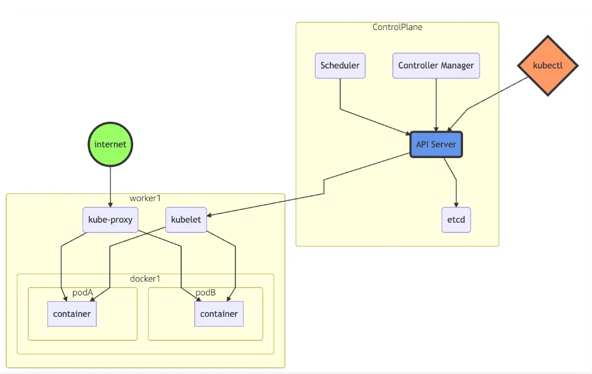
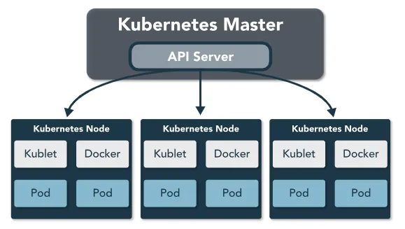

## Containers

### Under the Hood

Cgroups (control groups) are a kernel mechanism for limiting and measuring the total resources used by a group of processes running on a system. For example, you can restrict CPU, memory, network, or I/O quotas using cgroups.

Namespaces are a kernel mechanism for limiting the visibility that a group of processes has over the rest of a system. For example, you can limit visibility to certain process trees, network interfaces, user IDs, or filesystem mounts.

> cgroups limit how much of a resource you can use whereas namespaces limit which resources you can use.

### LXC Framework

LXC (Linux Containers) are an OS level virtualization method that allow running multiple isolated Linux containers on a host OS using a single Linux kernel. LXC (Linux Containers) uses the following kernel features to contain processes:

- LXC namespaces (IPC, Network, Mount, PID, User, UTS)

  > Kernel version 4.10, there are six kinds of namespaces, IPC, Network, Mount, PID, User, UTS

- LXC cgroups (control groups)

  > LXC cgroups framework provides Resource Limiting, Prioritization, Accounting, Control

- LXC security modules (AppArmor and SELinux profiles)

  > Two most accepted modules in Linux Kernel are AppArmor and SELinux.

### LXC Containers

- **Privileged containers** are defined as any container where the container UID 0 is mapped to the host’s UID 0.
- **Unprivileged containers** are safe by design. The container UID 0 is mapped to an unprivileged user outside of the container and only has extra rights on resources that it owns itself.

## Container Security

- Securing the container development pipeline and corresponding applications.
- Securing the container deployment environment(s) and corresponding infrastructure.
- Integrating with enterprise security tools and enhancing existing security policies and procedures.

### Challenges to DevOps

- **Code Phase** - use of third-party resources, GitHub repository is unavoidable
- **Build Phase** - Installing applications keeping default configuration, not implementing security safeguards or hardening controls.
- **Test Phase** - Deployed applications can be exploited through a variety of security testing methods.
- **Deploy Phase** - Exposing data in Docker files and embedded malware in container image.
- **Operate Phase** - Non-updated images, well-known vulnerability in dependencies, unrestricted admin access, unauthorized access.
- **Monitor Phase** - Hijacked repository, image registry and poisoned resources, exposed ports, Kubernetes/Docker API abuse

### Defense in Depth in Container

- **Cloud Provider** is first layer involving supporting infrastructure, typically hosted by main cloud providers.
- **Cluster** allows to manage the workloads of nodes within a management layer are responsible for running application.
- **Container** third layer, static analysis of vulnerability in application container, image signing and enforcement to mitigate man-in-the-middle attacks.
- **Code** security awareness for engineers and developers.

#### Securing Container Layer

- Docker Content Trust - builtin and integrates TUF using Notary, strong cryptographic guarantees over code.
- Portieris - Kubernetes admission controller for enforcing content trust.
- Project Calico - Open source networking and network security solution for containers, VMs, and native host-based workloads.

#### Securing Code Layer

- Awareness of common vulnerabilities affecting this technology and way to test them.
- Grant access to application over TLS only.
- Limit port ranges of communication.
- Don't hardcode secrets or passwords in source code and don't reuse.
- Store secrets in secure repositories. Unsecure repo includes shared storage, unencrypted files, version control systems, S3 etc.
- Use third party dependency security, e.g. GitHub security alerts scan and alert developers.
- Perform static code analysis - scan codebases for common security errors.
- Perform dynamic testing - using tools to exploit well-known attacks, OWASP Top Ten Project.
- Perform secure API development.

### Docker

Docker enables the organization to run, create, and manage containers on a single operating system.

### Kubernetes

Kubernetes is a container orchestration system for Docker containers, address container issues, provide scaling as needed.

#### Architecture

##### Control Plane

- One or More API Servers: Entry point for REST / **kubectl**
- **etcd**: Distributed key/value store
- **Controller-manager**: Always evaluating current vs desired state
- **Scheduler**: Schedules pods to worker nodes

##### Data Plane

- Made up of worker nodes
- **kubelet**: Acts as a conduit between the API server and the node
- **kube-proxy**: Manages IP translation and routing

#### Components of Cluster

- **Node** - common term for VMs and/or bare-metal servers that Kubernetes manages.
- **Pod** - basic unit of deployment in Kubernetes, collection of related Docker containers that need to coexist.

#### Securing the Components of the Cluster

- Use transport layer security (TLS) for all API traffic.
- Implement API authentication and authorization can be infrastructure, like nodes, proxies, the scheduler, and volume plugins.
- Limit resource usage on a cluster, resource quota, max/min size of resources like CPU, memory, or persistent disk a namespace can allocate.
- Employ user permissions hardening as most application workloads need limited access to host resources (UID 0).
- Restrict network access.
- Restrict metadata access, the cloud platforms exposes metadata contain cloud credentials services locally to instances so running Kubernetes on cloud platform, limit permissions given to instance credentials, use network policies to restrict pod access metadata api.
- Control which nodes, pods may access, use policies to separate workloads.
- Restrict access to etcd write access equivalent to gaining root on entire cluster and read access can escalate quickly.
- Enable audit logging of the cluster.
- Don't use alpha or beta features in production clusters.
- Rotate infrastructure credentials, shorter lifetime of secret, automate rotation.
- Review third-party integration libraries and requested permissions.
- Encrypt secrets at rest.

## Container Orchestration

Container Orchestration means managing lifecycle of containers, especially in large, dynamic environments. It used used to deploy, scale, schedule and network applications. Some engineering teams container orchestration tasks are:

- Scaling up or down resources
- Provisioning and deployment
- Redundancy and availability
- Expose singular points of access
- Load balancing
- Resource sharing
- External exposure of services running in a container to the outside world
- Health monitoring
- Configuration of an application in relation to the containers running it

## Reference

- [The SANS Institute’s checklist for auditing Docker-based containers](https://www.sans.org/reading-room/whitepapers/auditing/checklist-audit-docker-containers-37437)
- [The article “Container Security: Examining Potential Threats to the Container Environment”](https://www.trendmicro.com/vinfo/us/security/news/security-technology/container-security-examining-potential-threats-to-the-container-environment)
- [Kubernetes Cloud Native Security](https://kubernetes.io/docs/concepts/security/overview/)
- [Securing a Kubernetes cluster](https://kubernetes.io/docs/tasks/administer-cluster/securing-a-cluster/)
- [Orchestration with Kubernetes](https://www.linuxjournal.com/content/everything-you-need-know-about-containers-part-iii-orchestration-kubernetes)
- [Notary](https://www.cncf.io/announcement/2017/10/24/cncf-host-two-security-projects-notary-tuf-specification/)
- [Docker Content Trust](https://success.docker.com/article/introduction-to-docker-content-trust)
- [IBM Portieris](https://github.com/IBM/portieris)
- [SELinux](https://web.mit.edu/rhel-doc/5/RHEL-5-manual/Deployment_Guide-en-US/ch-selinux.html)
- [Project Calico](https://docs.projectcalico.org/v3.9/introduction/)
- [What Is Container Orchestration?](https://blog.newrelic.com/engineering/container-orchestration-explained/)
- [Security for Containers](https://www.trendmicro.com/en_ie/business/products/hybrid-cloud/container.html)
