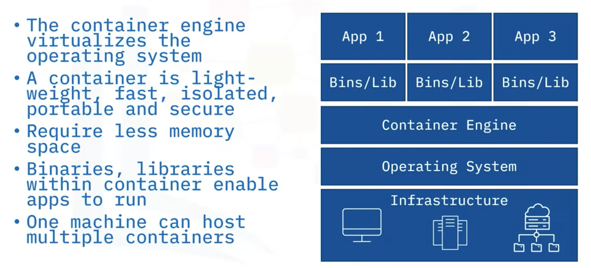
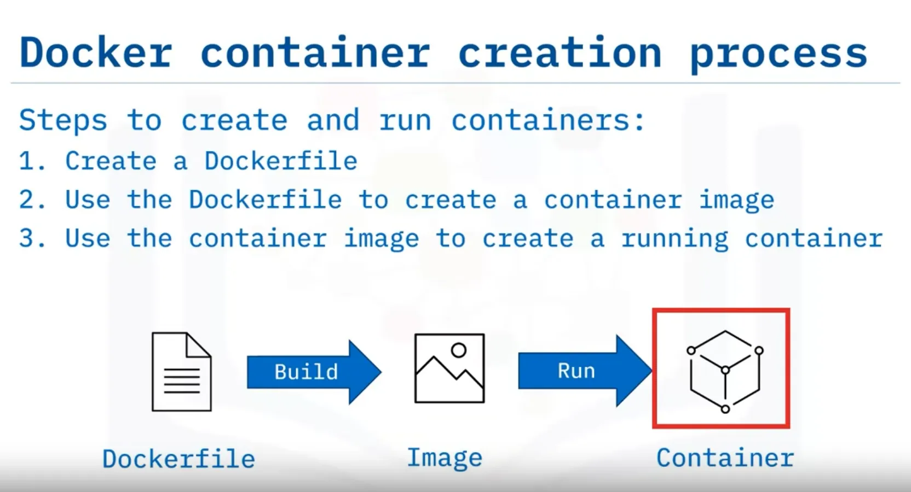
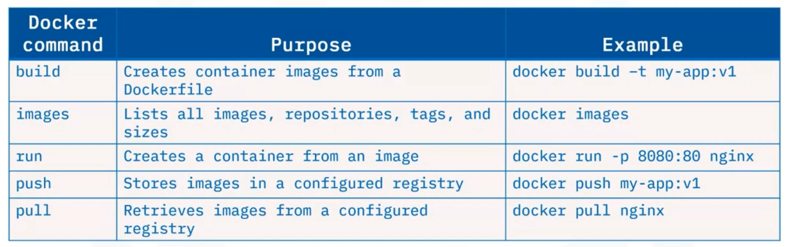
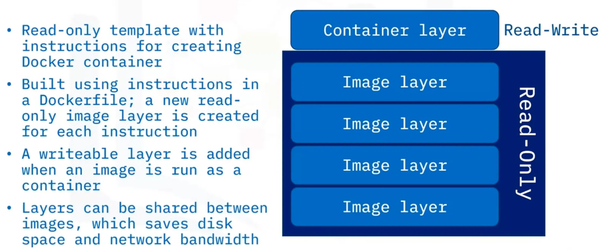
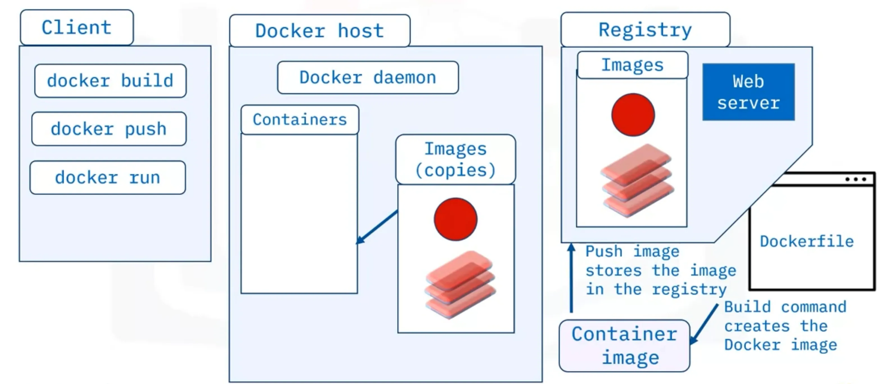
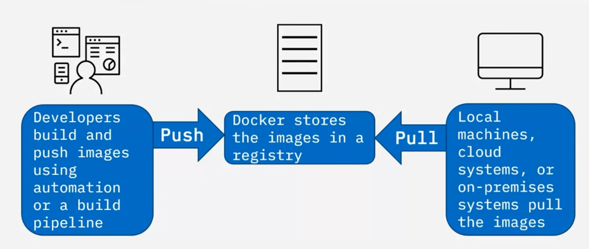

## What and Why

A container, powered by the containerization engine, is a standard unit of software that encapsulates the application code, runtime, system tools, system libraries, and settings necessary for programmers to build, ship, and run applications efficiently.

| Features                 | Description                                                                      |
| ------------------------ | -------------------------------------------------------------------------------- |
| Isolation and Allocation | No way to define resources boundaries for apps in a physical server              |
| Server Utilization       | Not optimal because server tend to be either over-utilized or under-utilized     |
| Provisioning and Cost    | Requires long periods for provisioning resources and expensive maintenance costs |
| Performance              | Constrained during peak workloads                                                |
| Portability              | Applications are not portable across multiple environments and operating systems |
| Resiliency               | Complex, time-consuming and expensive                                            |
| Scalability              | Limited scalability and resiliency                                               |
| Automation               | Difficult to implement for multiple platforms                                    |

## Characteristics



## Challenges

- Security impacted if operating system affected
- Difficult to manage thousands of containers
- Complex to migrate legacy projects to container technology
- Difficult to right-size containers for specific scenarios

## Vendors

- **Docker** - Robust and most popular container platform today
- **Podman** - Daemon-less architecture providing more security than Docker containers
- **LXC** - Preferred for data-intensive apps and ops
- **Vagrant** - Offers highest levels of isolation on the running physical machine

## Docker

Docker is an open platform, or engine, written in Go programming language, uses Linux kernel's features and namespaces technology to provide isolated workspace, where programmers can **Develop -> Ship -> Run -> Containers**. Docker became popular because:

- Simple architecture
- Scalability
- Easy portability



## Docker Commands



## Docker Objects

### Dockerfile

is a text file that contains instructions needed to create an image.

- FROM - Defines base image, always begin from this instructions.
- RUN - Executes arbitrary commands
- CMD - Defines default command for container execution

> CMD should always have one command instructions. If multiple CMD instructions then only the last command instruction will take effect.

### Image

> layers can be shared between images, which saves disk space and network bandwidth.



#### Naming

```bash
      hostname/repository:tag
        ^         ^        ^
      /           |          \
  Image       Container    Version
 Registry      Images   or Variant of Image


e.g. docker.io/ubuntu:18.04
```

> The host name can be excluded using Docker CLI.

### Container

- is runnable instance of an image
- can be created, stopped, started or deleted using the Docker API or CLI
- can connect to multiple networks, attach storage, or create a new image based on its current state
- is well isolated from other containers and its host machine

### Network

- Networks are used for the isolated containers communication

### Storage

- Docker uses volumes and bind mounts to persist data even after a container stops

### Plugins

- Storage plugins provide the ability to connect to external storage platforms

## Docker Architecture

consists of a Docker client, a Docker host, and a registry.



- based on client-server architecture
- provides a complete application environment
- includes the client, the host, and the registry components
- Docker host server include Docker daemon known as dockerd

```bash
Docker CLI or REST APIs -------> Docker host server
                  sends instructions

Daemon <----- Docker API requests or "docker run" commands
       listens

The daemon ----------------> to the registry
    builds, runs, and distributes containers

Registry ----------> images (either public or private)
          stores
```

### Registry

- stores and distributed images, public (Docker Hub), private (implemented for security).
- registry locations are either hosted or self-hosted.



## Commands

| Command                     | Description                                                     |
| --------------------------- | --------------------------------------------------------------- |
| curl localhost              | Pings the application.                                          |
| docker build                | Builds an image from a Dockerfile.                              |
| docker build . -t           | Builds the image and tags the image id.                         |
| docker CLI                  | Start the Docker command line interface.                        |
| docker container rm         | Removes a container.                                            |
| docker images               | Lists the images.                                               |
| docker ps                   | Lists the containers.                                           |
| docker ps -a                | Lists the containers that ran and exited successfully.          |
| docker pull                 | Pulls the latest image or repository from a registry.           |
| docker push                 | Pushes an image or a repository to a registry.                  |
| docker run                  | Runs a command in a new container.                              |
| docker run -p               | Runs the container by publishing the ports.                     |
| docker stop                 | Stops one or more running containers.                           |
| docker stop $(docker ps -q) | Stops all running containers.                                   |
| docker tag                  | Creates a tag for a target image that refers to a source image. |
| docker –version             | Displays the version of the Docker CLI.                         |
| exit                        | Closes the terminal session.                                    |
| export MY_NAMESPACE         | Exports a namespace as an environment variable.                 |
| git clone                   | Clones the git repository that contains the artifacts needed.   |

## IBM Specific Commands

| Command                | Description                                                                  |
| ---------------------- | ---------------------------------------------------------------------------- |
| ibmcloud cr images     | Lists images in the IBM Cloud Container Registry.                            |
| ibmcloud cr login      | Logs your local Docker daemon into IBM Cloud Container Registry.             |
| ibmcloud cr namespaces | Views the namespaces you have access to.                                     |
| ibmcloud cr region-set | Ensures that you are targeting the region appropriate to your cloud account. |
| ibmcloud target        | Provides information about the account you’re targeting.                     |
| ibmcloud version       | Displays the version of the IBM Cloud CLI.                                   |
