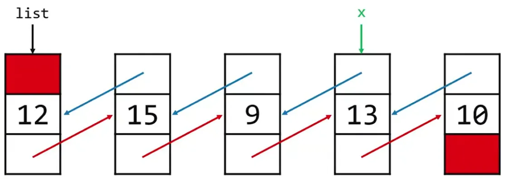
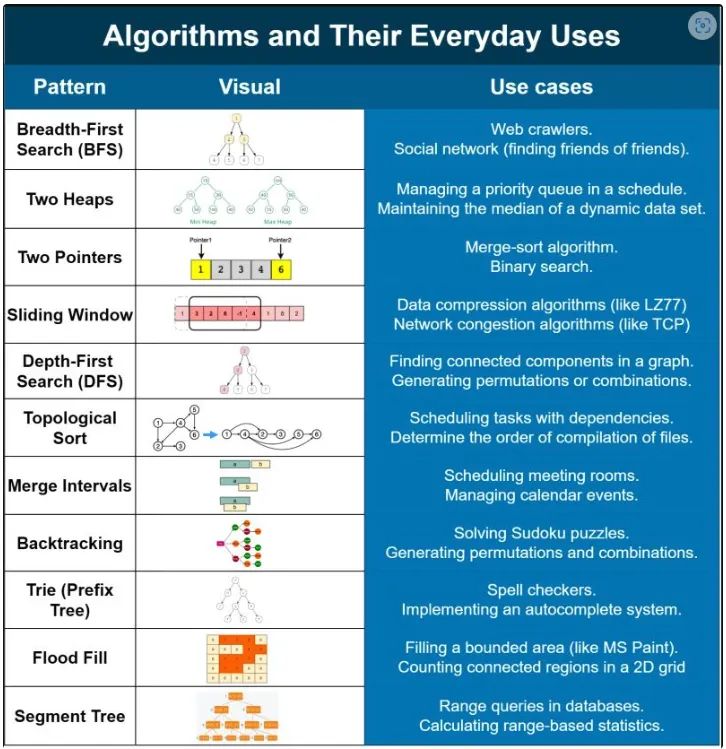

## Asymptotic Notation

- considering asymptotic run-times.
- how does runtime `scale` with input size.

### Big O

- clarifies growth rate.
- cleans up notation.
- can ignore complicated details.
- Big-O is only asymptotic and loses important information about constant multiples.

$$
O(n^2) \approx 3n^2 + 5n + 2
$$

$$
O(n) \approx n + log_2(n) + sin(n)
$$

$$
O(n  \medspace log(n)) \approx 4n \medspace log_2(n) + 7
$$

#### Common Rules


#### Notation Graph


| Notation   | Name             | Description                                                        | Example                                      |
| ---------- | ---------------- | ------------------------------------------------------------------ | -------------------------------------------- |
| O(1)       | Constant Time    | Remains unchanged irrespective of input data                       | Checking if a stack is empty                 |
| O(log n)   | Logarithmic Time | Complexity increases by one unit for each doubling of input data   | Finding an item in a balanced search tree    |
| O(n)       | Linear Time      | Increases linearly with the size of the input data                 | Linear traversal of a list                   |
| O(n log n) | Log-Linear Time  | Complexity grows as a combination of linear and logarithmic        | Merge sort on a collection of items          |
| O(n^2)     | Quadratic Time   | Time taken is proportional to the square of the number of elements | Checking all possible pairs in an array      |
| O(n^3)     | Polynomial Time  | Computation is proportional to the cube of the number of elements  | Matrix multiplication of `n x n` matrices    |
| O(2^n)     | Exponential Time | Time doubles for every new element added                           | Generating all subsets of a given set        |
| O(n!)      | Factorial Time   | Complexity grows factorially based on the size of the dataset      | Determining all permutations of a given list |

#### Logarithms Rules

$$
log_a(n^k) = k\space log_a\space n
$$

$$
log_a(nm) = log_an + log_an
$$

$$
n^{log_ab} = b^{log_an}
$$

$$
log_a\space n\cdot log_b\space a = log_b\space n
$$

Example:

$$
log_3 \medspace 81 == 3^x = 81, x = 4
$$

$$
log_k n == k^x = n, x\space and\space k\space are\space constants
$$

### Time Complexity

- time is a sum of the times required.
- is a mathematical notation to describe the algorithm's performance or complexity of an algorithm.
- specifically how long an algorithm takes to run as the input size grows.
- it allows to analyze and compare the efficiency of different algorithms
- also make informed decisions about which one to use in a given situation.

### Space Complexity

- memory is a measure of maximal heap and stack utilization.
- primitive variables (booleans, numbers, undefined, null) are constant space `O(1)`
- strings require `O(n)` space (where `n` is the string length)
- reference types are generally `O(n)`, where `n` is the length (for arrays) or the number or keys (for objects)

## Data Structures

- are collections of values
- the relationships among them
- the functions or operations that can be applied to the data
- commonly used data structures in JavaScript: `array` and `object`

### Arrays

- contiguous and indexed in order
- insertion and deletion can be expensive
- lookup is great - can quickly be accessed at a specific index
- easy to sort
- small size-wise
- stuck with fixed size, no flexibility

### Linked List

- insertion/deletion is easy.
- lookup is bad - have to rely on linear search
- relatively difficult to sort, instead sort as you construct
- relatively small size wise (not as small as arrays)

> Note: Searching a value could be expensive while using linked list, however if you need to perform insertion and deletion in a large data set then it could be the better option than an array

#### Singly-Linked List

```bash
node1(value | next) --> node2(value | next) --> node3(value | next) --> NULL
```



- do not have indexes
- connected via nodes with a next pointer
- random access is not allowed
- not applicable for binary searching.
- can only move in one direction.
- Time Complexity:
  - Insertion:
    - **O(1)** if unsorted (beginning)
    - **O(n)** if in sorted.
  - Deletion: Depends **O(1)** or **O(n)**
  - Search: **O(n)**
  - Access: **O(n)**

#### Doubly-Linked List



- has one more pointer previous than singly linked list.
- takes up more memory but has more flexibility than singly linked list.
- allows to move forward and backward through the list.
- Time Complexity:
  - Insertion: **O(1)**
  - Deletion: **O(1)**
  - Search: **O(n)**
  - Access: **O(n)**

#### Stack

- implementation using as an array or Linked List (LIFO).
- insert at the beginning and remove at the beginning.
- two operation: push and pop.
- Time Complexity:
  - Insertion: O(1)
  - Deletion: O(1)
  - Searching: O(n)
  - Access: O(n)

#### Queue

- implementation using as an array or a Linked List (FIFO).
- insert at the end and remove at the beginning.
- two operations: enqueue and dequeue.
- Time Complexity:
  - Insertion: O(1)
  - Deletion: O(1)
  - Searching: O(n)
  - Access: O(n)

### Dictionary

- stores in a form of key (word) and value (definition).
- data structures like: arrays, hash tables.

### Trees [DRAFT]

#### Binary Search Trees

- Time Complexity
  - Searching - O(log n)

#### Tries

- tree of an arrays.
- combines structures and pointers together to store data.
- data can be searched through roadmap.
- no collisions
- not widely used because huge NULL pointers (trade-off)
- insertion is complex - lot of dynamic memory allocations
- deletion is easy - just free a node
- lookup is fast - not fast as an array (but almost)
- already sorted
- rapidly becomes huge, even very little data present.
- not great if space is at a premium
- Time Complexity
  - Searching - O(k) -> constant value k -> O(1)

### Hashing

- function in math or code that takes any number of inputs and maps them to a finite number of outputs (range).
- a good hash function
  - always give the same value for the same input (be deterministic)
  - use only and all (buckets) the data being hashed
  - an even (uniform) distribution of data across buckets
  - generate very different hash codes for very similar data
- analogy: separating different patterns in a cards. shuffled card to -> spade, heart, diamond, club

```c
HASH_MAX = 100;

unsigned int hash(char & str)
{
    int sum = 0;

    for (int j = 0; star[j] != "\0"; j++)
    {
        sum += str[j];
    }

    return sum % HASH_MAX;
}
```

#### Hash Tables

- array of linked lists.
- allows random access ability of an array.
- widely used.
- insertion is two step process - hash and add
- deletion is easy - once found
- lookup is on average better than linked lists (we have constant factor)
- not an ideal data structure for sorting. (trade off)
- also called hash map.
- example: maps and sets
- Time Complexity
  - Searching - **O(n)** or **~O(1)**
  - Insertion - **~O(1)**
  - Deletion - **~O(1)**

#### Collision

- occurs when two pieces of data, when run through the hash function, yield the same hash code.
- shouldn't simply overwrite it.

##### Linear probing

- we try to place the data in the next consecutive element in the array.
- such that, if not find directly, can be find nearby.
- subject to a problem called clustering.

##### Chaining

- every element of the array hold multiple pieces of data.
- each element of the array is a pointer to the head of a linked list.
- multiple pieces of data can yield the same hash code.

### Binary Heap

### Priority Queue

### Graph

## Searching Algorithms

| Algorithms    | Time Complexity (Worst) | Time Complexity (Average) | Time Complexity (Best) | Space Complexity |
| ------------- | ----------------------- | ------------------------- | ---------------------- | ---------------- |
| Linear Search | O(n)                    | Θ(n)                      | Ω(1)                   | O(1)             |
| Binary Search | O(log n)                | Θ(log n)                  | Ω(1)                   | O(1)             |

### Linear Search

- algorithm iterate across the array from left to right, searching for a specified element.
- **O(n)** - look through entire array of n elements.
- **Ω(1)** - target is the first element, can stop immediately.

### Binary Search

- should be sorted.
- algorithm divide and conquer, reducing the search area by half each time, trying to find a target number.
- **O(log n)** - split array of n element in half repeatedly to find target, either element exist or doesn't exist.
- **Ω(1)** - target element is at the midpoint of the full array, and so we can stop looking immediately after we start.

## Sorting Algorithms

| Algorithms     | Time Complexity (Worst) | Time Complexity (Average) | Time Complexity (Best) | Space Complexity |
| -------------- | ----------------------- | ------------------------- | ---------------------- | ---------------- |
| Bubble Sort    | O(n<sup>2</sup>)        | Θ(n<sup>2</sup>)          | Ω(n)                   | O(1)             |
| Selection Sort | O(n<sup>2</sup>)        | Θ(n<sup>2</sup>)          | Ω(n<sup>2</sup>)       | O(1)             |
| Insertion Sort | O(n<sup>2</sup>)        | Θ(n<sup>2</sup>)          | Ω(n)                   | O(1)             |
| Merge Sort     | O(n log n)              | Θ(n log n)                | Ω(n log n)             | O(n)             |

### Bubble sort

- algorithm to move higher valued elements generally towards the right and lower value elements generally towards the left.
- **O(n<sup>2</sup>)** - array in reverse order, bubble "n" elements n times.
- **Ω(n)** - array is already perfectly sorted, we make no swaps on the first pass.

### Selection sort

- algorithm is to find the smallest unsorted element and add it to the end of the sorted list
- **O(n<sup>2</sup>)** - iterate over each of the n element of array, repeating this process n times. only one element sorted at each pash
- **Ω(n<sup>2</sup>)** - no guarantee the array is sorted until we go through this process.

### Merge sort

- algorithm is to sort smaller arrays and then combine those arrays together (merge them) in sorted order
- **O(n log n)** - split n elements up and then recombine them, doubling the sorted sub-arrays as we build them up.
- **Ω(n log n)** - array is perfectly sorted, still have to split and recombine them back together with algorithm.



### Radix sort

### Insertion sort

## Algorithms and it's Applications



## Inheritance

## Recursion

- the function that calls itself as part of execution, elegant because no other function, no loops.
- search recursion in Google.

### Fibonacci Series

- developed to study rabbit populations.
- after n generation, it gives number of rabbits it has.

$$
F_n {\geq} 2^{n/2} for, n {\geq} 6
$$



```bash
# Output
Fibonacci Slow - O(2^n)
1 1 2 3 5 8 13 21 34 55
Fibonacci Memoized - O(n)
1 1 2 3 5 8 13 21 34 55
Fibonacci Bottom-up - O(n)
1 1 2 3 5 8 13 21 34 55
Fibonacci Dynamic - O(n)
[0, 1, 1, 2, 3, 5, 8, 13, 21, 34, 55]
```

### Collatz Conjecture



```bash
# Output
1
2 -> 1
3 -> 10 -> 5 -> 16 -> 8 -> 4 -> 2 -> 1
4 -> 2 -> 1
5 -> 16 -> 8 -> 4 -> 2 -> 1
6 -> 3 -> 10 -> 5 -> 16 -> 8 -> 4 -> 2 -> 1
...
```

## DSA against Problem

1. If we are dealing with **top/maximum/minimum/closest** 'K' elements among 'N' elements, we will be using a **Heap**.
2. If the given input is a **sorted array or a list**, we will either be using **Binary Search** or the **Two Pointers** strategy.
3. If we need to try all **combinations (or permutations)** of the input, we can either use **Backtracking** or **Breadth First Search**.
4. Most of the questions related to **Trees** or **Graphs** can be solved either through **Breadth First Search** or **Depth First Search**.
5. Every **recursive** solution can be converted to an **iterative** solution using **Stack**.
6. For a problem involving arrays, if there exists a solution in **O(n^2)** time and **O(1)** space, there must exist two other solutions:

   - Using a **HashMap or a Set** for **O(n)** time and **O(n)** space,
   - Using **sorting** for **O(n log n)** time and **O(1)** space.

7. If a problem is asking for **optimization** (e.g., maximization or minimization), we will be using **Dynamic Programming**.
8. If we need to find some common **substring** among a set of strings, we will be using a **HashMap** or a **Trie**.
9. If we need to **search/manipulate** a bunch of strings, **Trie** will be the best data structures.
10. If the problem is related to a **LinkedList** and we can't use extra space, then use the **Fast & Slow Pointer** approach.

## Reference

- <https://dev.to/arslan_ah/20-essential-coding-patterns-to-ace-your-next-coding-interview-32a3>
- <https://pll.harvard.edu/course/cs50-introduction-computer-science>
- <https://www.toptal.com/developers/sorting-algorithms>
- <https://www.linkedin.com/pulse/time-complexity-vs-space-sumaiya-rimu/>
