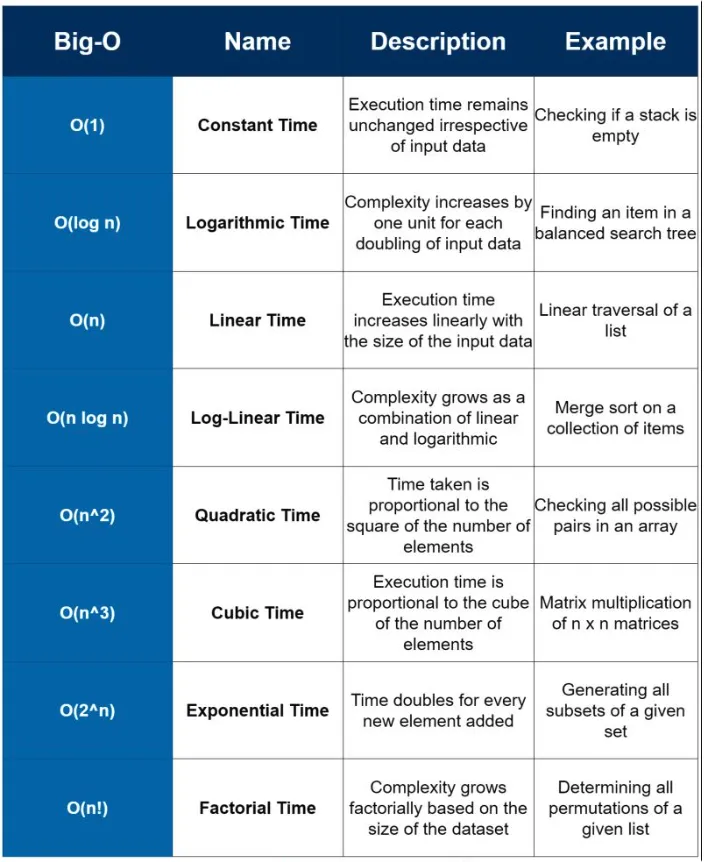
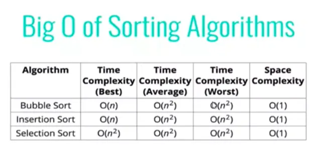
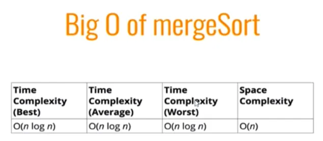

## Solving a Coding Question in an Interview

1. If we are dealing with **top/maximum/minimum/closest** 'K' elements among 'N' elements, we will be using a **Heap**.
2. If the given input is a **sorted array or a list**, we will either be using **Binary Search** or the **Two Pointers** strategy.
3. If we need to try all **combinations (or permutations)** of the input, we can either use **Backtracking** or **Breadth First Search**.
4. Most of the questions related to **Trees** or **Graphs** can be solved either through **Breadth First Search** or **Depth First Search**.
5. Every **recursive** solution can be converted to an **iterative** solution using **Stack**.
6. For a problem involving arrays, if there exists a solution in **O(n^2)** time and **O(1)** space, there must exist two other solutions:

   - Using a **HashMap or a Set** for **O(n)** time and **O(n)** space,
   - Using **sorting** for **O(n log n)** time and **O(1)** space.

7. If a problem is asking for **optimization** (e.g., maximization or minimization), we will be using **Dynamic Programming**.
8. If we need to find some common **substring** among a set of strings, we will be using a **HashMap** or a **Trie**.
9. If we need to **search/manipulate** a bunch of strings, **Trie** will be the best data structures.
10. If the problem is related to a **LinkedList** and we can't use extra space, then use the **Fast & Slow Pointer** approach.

## Big O - Time Complexity

Big-O notation is a mathematical notation that is used to describe the performance or complexity of an algorithm, specifically how long an algorithm takes to run as the input size grows.

Understanding Big-O notation is essential for software engineers, as it allows them to analyze and compare the efficiency of different algorithms and make informed decisions about which one to use in a given situation.

## Space Complexity

- Primitive variables (booleans, numbers, undefined, null) are constant space O(1)
- Strings require O(n) space (where n is the string length)
- Reference types are generally O(n), where n is the length (for arrays) or the number or keys (for objects)

## Searching Algorithms

### Linear Search

### Binary Search

## Sorting Algorithms

### Bubble sort

### Selection sort

### Insertion sort

### Merge sort

### Quick sort

### Radix sort

## Data Structures

Data structures are collections of values, the relationships among them, and the functions or
operations that can be applied to the data. Commonly used data structures in javascript: array and object

### Singly Linked List

#### Linked List

- Do not have indexes
- Connected via nodes with a next pointer
- Random access is not allowed

#### Arrays

- Indexed in order
- Insertion and deletion can be expensive
- Can quickly be accessed at a specific index
- Searching a value could be expensive while using linked list, however if you need to
  perform insertion and deletion in a large data set then it could be the better option
  than an array

#### Time complexity

- Insertion: O(1)
- Removal: Depends O(1) or O(n)
- Search: O(n)
- Access: O(n)

### Doubly Linked List

- Has one more pointer previous than singly link list
- Takes up more memory but has more flexibility than singly link list

Time complexity:

- Insertion: O(1)
- Removal: O(1)
- Search: O(n)
- Access: O(n)

### Stack & Queues

#### Stack

- Implementation using Singly Link list
- Insert at the beginning and remove at the beginning (shift and unShift)

Time complexity:

- Insertion: O(1)
- Removal: O(1)
- Searching: O(n)
- Access: O(n)

#### Queue

- Implementation using Singly Link list
- Insert at the end and remove at the beginning (push and shift)

Time complexity:

- Insertion: O(1)
- Removal: O(1)
- Searching: O(n)
- Access: O(n)

### Trees

### Binary Heap

### Priority Queue

### Hash Tables

### Graph

## Algorithms and it's Applications

## Reference

- https://dev.to/arslan_ah/20-essential-coding-patterns-to-ace-your-next-coding-interview-32a3
