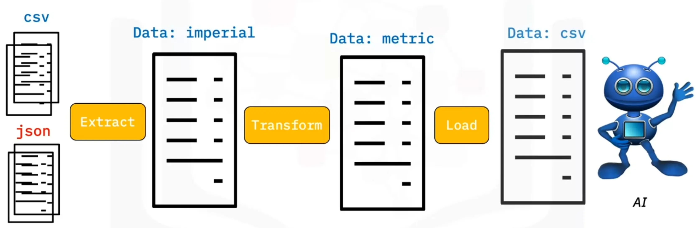

## Concepts


- **Batch processing** collection of data from multiple sources and combined to become a single source of information.
- a type of batch processing called **Extract, Transform and Load (ETL)**
- the process of extracting large amounts of data from multiple sources and formats and transforming it into **one specific format** before loading it into a database or target file.

## Block Diagram of ETL



### Extraction

#### Python Composite Functions

```py
import glob
import pandas as pd

list_csv = glob.glob("*.csv")
list_json = glob.glob("*.json")

df_csv = pd.read_csv("source.csv")
df_json = pd.read_json("source.json", lines=True)
```

#### Extract Function

```py
def extract():
    extracted_data = pd.DataFrame(columns=['name', 'height', 'weight'])

    for csvfile in glob.glob('*.csv'):
        extracted_data = extracted_data.append(
            pd.read_csv((csvfile),
            ignore_index=True
        )

    for jsonfile in glob.glb("*.json"):
        extracted_data = extracted_data.append(
            pd.read_json(jsonfile, lines=True),
            ignore_index=True
        )

    return extracted_data
```

> If we did not set the parameter “ignore_index” to true, then the index of the data frame “extracted_data” would be the same as the row Number of the original file.

> If we “ignore index” to true, then the order of each row would be the same as the order the row was appended to the data frame.

### Transform

```py
def transform(data):
    data['height'] = round(data.height * 0.0254, 2)
    data['weight'] = round(data.weight * 0.45359237, 2)

    return data
```

### Load

```py
def load(targetfile, data_to_laod):
    data_to_load.to_csv(targetfile)
    targetfile = 'transformed_data.csv'
    load(targetfile, transformed_data)
```

### Logging Entries

```py
from datatime from datetime

def log(message):
    timestamp_format = "%Y-%h-%d-%H:%M:%S"
    now = datetime.now()
    timestamp = now.strftime(timestamp_format)

    with open("logfile.txt", "a") as f:
        f.write (timestamp + ',' + message + '\n')
```

## Hands-on Project

The complex Extract, Transform, and Loading operations involves following steps:

- Extract relevant information from websites using Webscraping and requests API.
- Transform the data to a required format.
- Load the processed data to a local file or as a database table.
- Query the database table using Python.
- Create detailed logs of all operations conducted.

### Solutions

#### [Top Countries GDP - ETL Process](https://github.com/cham11ng/misc/tree/main/python/course/data-engineering/gdp)



#### [World top Banks - ETL Process](https://github.com/cham11ng/misc/tree/main/python/course/data-engineering/bank)


