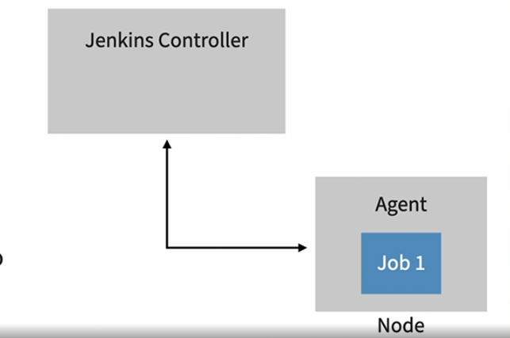

## why?

- ease of use
  - intuitive web interface
  - easy to navigate
  - documentation and examples included
- open source and free
  - free to install and use
  - open source
- extensibility
  - plugins add functionality
  - new features can be developed

## terminologies

### project or job

- a user-configured description of the work that Jenkins will manage.
- is an outlines for what we want Jenkins to do.
- job and project used interchangeably.

- build - one run of a project, a verb or a noun.
- build step - a task inside a project.
- build trigger - criteria for starting a build, manual or automatic.

### plugins

- a software package that extends jenkins' core functionality.

## pipelines

### scripted pipeline

- Groovy-based DSL

```bash
node {}
```

### declarative pipeline

- specifically designed for configuring Jenkins projects as code.

```bash
pipeline {
    agent any

    options {
        buildDiscarder(logRotator(daysToKeepStr: '10', numToKeepStr: '10'))
        timeout(time: 12, unit: 'HOURS')
        timestamps()
    }
    triggers {
          cron '@midnight'
    }
    stages {
        stage('Initialize') {
            steps {
                echo 'Initializing..'
            }
        }
        stage('Build') {
            steps {
                echo 'Building..'
            }
        }
        stage('Test') {
            steps {
                echo 'Testing..'
            }
        }
        stage('Deploy') {
            steps {
                echo 'Deploying....'
            }
        }
    }
}
```

### agent

- specifies where pipeline steps will be running
  - `any` - run on first available system.
  - `label` - `{ label 'linux' }` - run on a system with this label.
  - `docker` - `{ docker { image 'maven' } }` - run pipeline inside a docker container using the specified image.
  - `none` - defer agent selection to stages. allows to use different agent for each state in the pipeline.

### stages and steps

- specific parts of the process being automated.
- use stages name: Build, Test, and Deploy
- steps:
  - `echo` - print message
  - `git` - check out code from a Git repo
  - `sh` - run a shell script or local command
  - `archiveArtifacts` - archive artifacts.

### environment variables

- named with all capital letters.
- can be set globally (inside pipeline) or locally (inside stage).

```bash
echo env.MAX_SIZE
echo "$env.MAX_SIZE"
echo "${env.MAX_SIZE}"
```

### currentBuild variables

- refers to the currently running build.
- properties of variable named currentBuild:
  - `currentBuild.startTimeInMillis`
  - `currentBuild.duration`
  - `currentBuild.currentResult`

### parameter variables

- must include a name, default value, and description.
- use all capital letters in the name for easy identification.
- parameter types: string, text,boolean, choice and password

```bash
-> params.PARAMETER_NAME
-> "${params.PARAMETER_NAME}"

pipeline {
  agent any
  parameters {
    ...
  }
  ...
}
```

### conditional expressions

- conditions for when:
  - branch
  - environment
  - expression

```bash
when {
  expression {
    params.ENVIRONMENT == 'PRODUCTION'
  }
}
```

### manual approvals

```bash
pipeline {
  agent any
  stages {
    state('XYZ') {
      steps {
        input message: 'Confirm deployment to production...', ok 'Deploy'
      }
    }
  }
}
```

## pipeline as code

- captures project configuration as code.
- Jenkinsfile (Pipeline script from SCM)
- supports GitOps approach by using the repo as the single source of truth.
- Changes are reviewed before being merged and applied using automation.

```bash
pipeline {
  tools {...}
  options {...}
  triggers {...}
  stages {...}
  post {...}
}
```

### external scripts

```bash
sh('./scripts/build.sh')

bat('..\scripts\build.bat')

dir("${env.WORKSPACE}/environments/test") {
  sh('
    terraform init
    terraform plan
  ')
}
```

## distribute builds with agents

- Jenkins controller provides a web interface to manage configuration.
- best practice is to limit jobs that are run on the controller to free up resources.
- Node: a server or system connected to a Jenkins controller.
- Agent: a process running on a node that manages jobs and reports status to the Jenkins controller.



### ssh nodes

- connect to servers using SSH keys
- system must accept SSH connections
- a user and key must be in place for Jenkins to use
- Java must be installed.

### docker nodes

- run jobs in new containers on every build

### tips for using nodes and agents

- agent configuration, start using label instead of `any`:

```bash
agent {
  label 'linux'
}

agent {
  docker ...
}
```

- tool configuration, allowing more control over the version of specific tool:

```bash
tools {
  maven 'Maven-3.8.4'
}
```

- checking out code when a job is associated with a repository:

```bash
git branch: 'master',
  url: 'https://github.com/<org>/<repo>.git'
```

## securing Jenkins

- out-of-the-box security
  - locked by default
  - initial admin password
- user accounts for individuals with usernames and passwords.

### security realms

- controls how a person is authenticated to access resources.
- provides an interface to manage identities and their authorization to use a resource.
- Jenkins built-in user database is the default security realm.
- Jenkins can delegate authorization to other realms.
  - LDAP
  - Unix/Linux users and groups.

### matrix-based security

- enable with matrix authorization strategy plugin.
- permissions are assigned per user.
- permissions are assigned per action.
- review "Disable Access Control" if you get locked out.

> Note: Be sure to assign admin permissions to key accounts when implementing matrix-based security. Failing to assign permission correctly may lock out admin users.

### project-based permissions

- permissions are applied globally with matrix-based authorization.
- project-based authorization can be used to limit permissions to specific jobs and folders.
- enabled the same as matrix-based permissions.
- additional permissions can be configured for individual projects.

### secrets and credentials

- Jenkins can store and manage sensitive information.
- Sensitive information is referred to as a credential.
- Types of credentials:
  - Usernames and passwords
  - SSH keys
  - Files
  - Text strings (API keys or security tokens.)

#### accessing credentials

- `credentials()` - assigns values to one or more environment variables.

```bash
environment {
  STRING = credentials('secret-value') # string type
  LOGIN = credentials('login') # login type
}

env.STRING
env.LOGIN - username:password
env.LOGIN_USR - username
env.LOGIN_PSW - password
```

- `withCredentials() {}`

```bash
steps {
  withCredentials([string(credentialsId:'apiKey', variable: 'API_KEY')]) {
    sh "./build_script.sh ${env.API_KEY}"
  }
}
```

## reference

- <https://www.linkedin.com/learning/jenkins-essential-training-17420152/challenge-configure-users-and-permissions>
