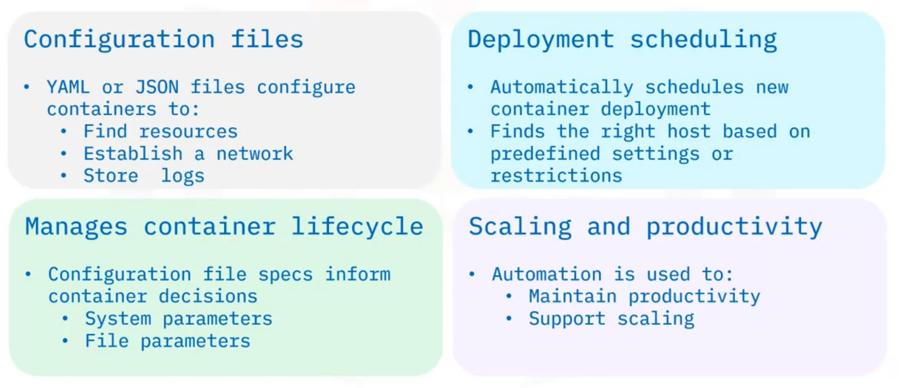
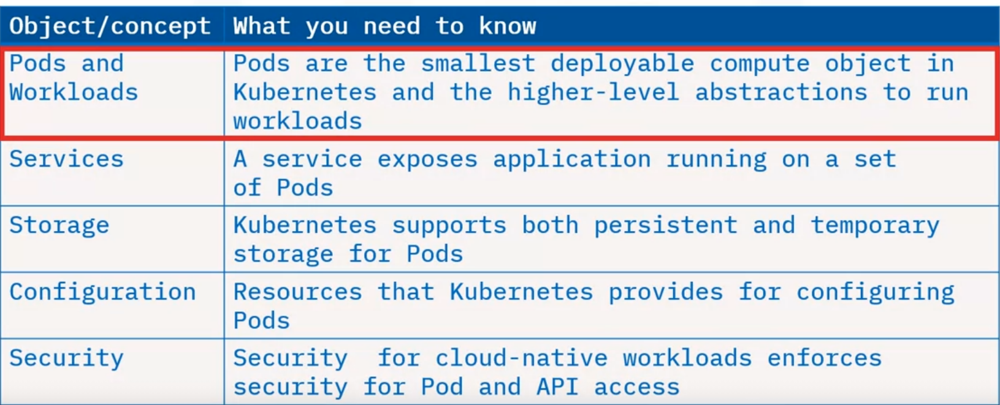
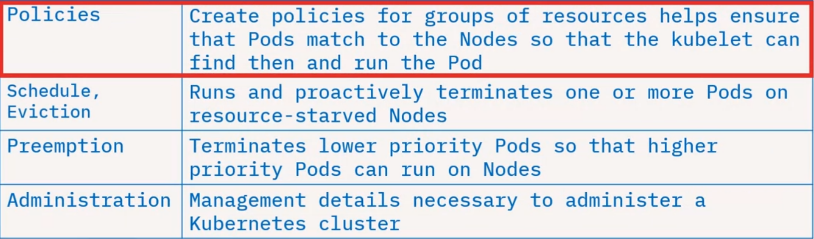
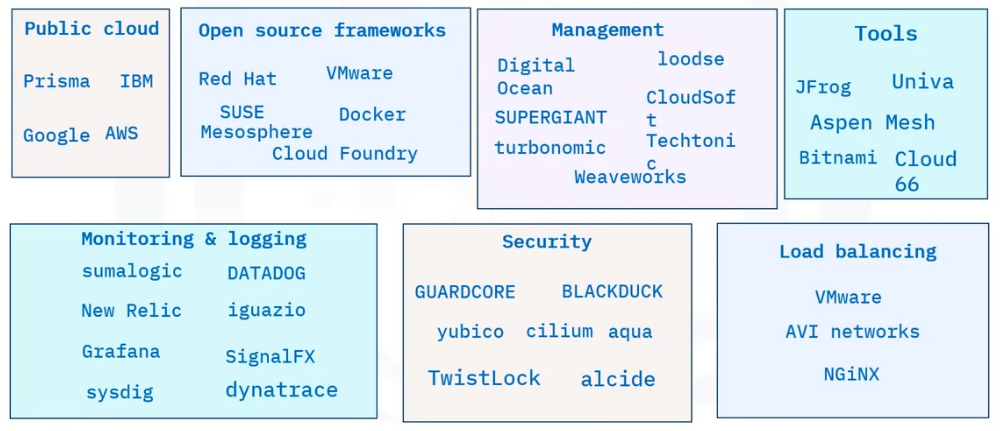
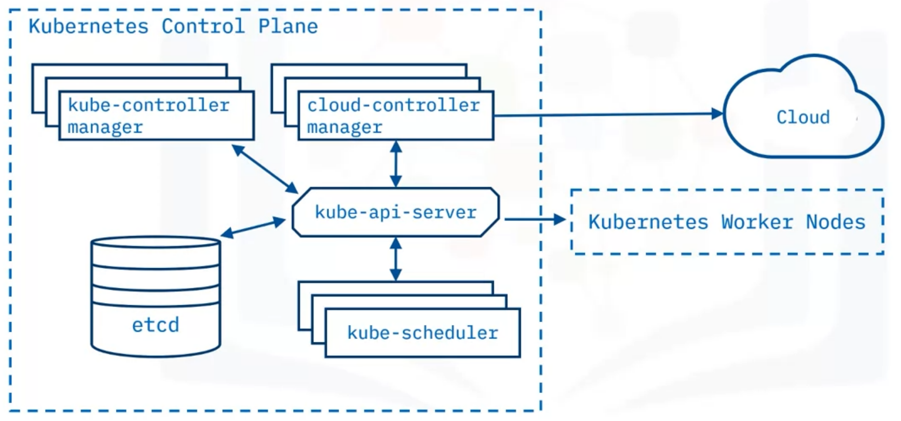

## Orchestration

Container orchestration automates the container lifecycle of containerized applications resulting in faster deployments, reduced errors, higher availability, and more robust security. The **container lifecycle include**:

- Deployment
- Management
- Scaling
- Networking
- Availability

Container orchestration is a critical part of an organization's orchestration, automation, and response (SOAR) requirements. **Some features**:

- Defines container images and registry
- Improves provisioning and deployment
- Secure network connectivity
- Ensures availability and performance
- Manages scalability and load balancing
- Resource allocation and scheduling
- Rolling updates and roll backs
- Conducting health checks and automated error handling

**Benefits** of Container Orchestration:

- Increased Productivity
- Faster Deployment
- Reduced Costs
- Stronger Security
- Easier Scaling
- Faster Error Recovery

### How it works?

- uses **configuration files** written in YAML or JSON uses to find resources, establish a network and store logs
- automatically **schedules the deployment** of new container to a cluster, finds the right host based on predefined settings or restrictions
- **manages the container's lifecycle** based on specifications in the configuration file includes system parameters (like CPU and memory), and file parameters (like proximity and file metadata)
- **supports scaling and enhances productivity**, through automation

### Tools

- Apache Mesos's **Marathon** framework - open-source cluster manager, scales container infrastructure by automating the bulk of management and monitoring tasks
- HashiCorp's **Nomad** - free, open-source cluster management and scheduling tools, supports various app types on all major operating systems
- **Docker Swarm** - open-source container orchestration platform, automates deployment of containerized apps, specifically to work with Docker Engine and other Docker tools
- zGoogle's **Kubernetes** - standard for open-source container orchestration platforms, robust feature set, broadly supported, maintained by Cloud Native Computing Foundation (CNCF)

## Kubernetes

- referred as (k8s), is system for automating deployment,scaling, and management of containerized applications.
- automates a host of container management tasks including
  - deployment,
  - storage provisioning,
  - load balancing and scaling,
  - service discovery, and
  - “self-healing”— the ability to restart, replace or remove a failed container.

### Is Not

- traditional, all-inclusive as a service (PaaS)
- rigid or opinionated but a flexible model that supports a diverse variety of workloads and containerized applications.
- does not provide CI/CD pipelines to deploy source code or build applications
- does not prescribe logging, monitoring, or alerting solutions
- does not provide built-in middleware, databases, or other services

### Capabilities

- **Automated rollouts** of changes to application or configuration, health monitoring, ensures instances are running, and **rolling back** changes
- **Storage orchestration** that mounts a chosen storage system including local storage, network storage, or public cloud
- **Horizontal scaling** of workloads based on metrics, or via commands
- **Automated bin packing** that increases utilization and cost savings using a mix of critical and best-effort workloads. Automated bin packing performs container auto-placement based on resource requirements and conditions without sacrificing high availability (HA)
- **Secret and configuration management** of sensitive information including passwords, OAuth tokens, and SSH keys, and handles deployments and updates to secrets and configuration without rebuilding images
- assigns both **dual-stack IPv4 and IPv6 addresses** to Pods and Services
- manages **batch execution** and continuous integration workloads and automatically replaces failed containers
- **self-heals** failing or unresponsive containers, exposes containers to clients only if healthy and running
- **discovers** Pods using IP addresses or a DNS name, and **load balances** traffic for better performance and high availability
- easily **extensible** by adding or providing additional features to Kubernetes cluster without modifying source code

### Concepts

### Ecosystem

### Architecture

- A deployment of Kubernetes is called a Kubernetes cluster, is a cluster of nodes that runs containerized applications
- Each cluster has **one master node** (the Kubernetes Control Plane) and **one or more worker nodes**

#### Control Plane

- The control plane maintains the intended cluster state by **making decisions** about the cluster and detecting and responding to events in the cluster

> An example of a decision made by the control plane is the **scheduling of workloads**. An example of responding to an event is **creating new resources** when an application is deployed.

##### kube-api-server

- the **Kubernetes API server** exposes the Kubernetes API. The **API server serves as the front-end** for the control plane
- all **communication** in the cluster utilizes this API, **kube-apiserver** which is designed to scale horizontally—by deploying more instances and balance traffic between them

> An example the Kubernetes API server accepts commands to view or change the state of the cluster.

##### etcd

- highly available, distributed key value store that contains all the cluster data
- stores deployment configuration data, desired state, and meta data in a way that can be accessed in a common location
- defines the state in a Kubernetes cluster, and the system works to bring the actual state to match the desired state

##### kube-scheduler

- assigns newly created Pods to nodes, means it determines where workloads should run within the cluster
- selects the most optimal node according to Kubernetes scheduling principles, configuration options, and available resources

##### kube-controller manager

- runs all the controller processes that monitor the cluster state
- ensure the actual state of a cluster matches the desired state

##### cloud-controller manager

- runs controllers that interact with the underlying cloud providers
- effectively link clusters into a cloud provider’s API
- allows both Kubernetes and the cloud providers to evolve freely without introducing dependencies on the other

#### Worker Nodes

- are the worker machines in a Kubernetes cluster, user applications are run on nodes, can be virtual or physical machines
- are not created by Kubernetes itself, but rather by the cloud provider, allowing Kubernetes to run on a variety of infrastructures
- are then managed by the control plane and contain the services necessary to run applications
- include pods, which are the smallest deployment entity in Kubernetes; pods include one or more containers
- containers share all the resources of the node and can communicate among themselves

##### kubelet

- is the most important component of a worker node, this controller communicates with the kube-apiserver to receive new and modified pod specifications
- ensure that the pods and their associated containers are running as desired
- reports to the control plane on the pods’ health and status
- to start a pod, the kubelet uses the container runtime

##### Container runtime

- is responsible for downloading images and running containers
- rather than providing a single container runtime, Kubernetes implements a Container Runtime Interface that permits pluggability of the container runtime
- Docker is likely the best-known runtime, Podman and Cri-o are two other commonly used container runtimes

##### kube-proxy

- is a network proxy that runs on each node in a cluster
- maintains network rules that allow communication to Pods running on nodes — in other words, communication to workloads running on your cluster
- This communication can come from within or outside of the cluster
