## Orchestration

Container orchestration automates the container lifecycle of containerized applications resulting in faster deployments, reduced errors, higher availability, and more robust security. The **container lifecycle include**:

- Deployment
- Management
- Scaling
- Networking
- Availability

Container orchestration is a critical part of an organization's orchestration, automation, and response (SOAR) requirements. **Some features**:

- Defines container images and registry
- Improves provisioning and deployment
- Secure network connectivity
- Ensures availability and performance
- Manages scalability and load balancing
- Resource allocation and scheduling
- Rolling updates and roll backs
- Conducting health checks and automated error handling

**Benefits** of Container Orchestration:

- Increased Productivity
- Faster Deployment
- Reduced Costs
- Stronger Security
- Easier Scaling
- Faster Error Recovery

### How it works?

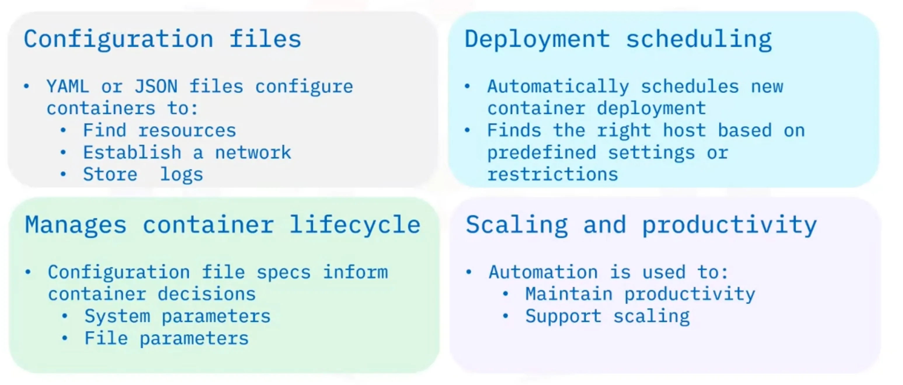

- uses **configuration files** written in YAML or JSON uses to find resources, establish a network and store logs
- automatically **schedules the deployment** of new container to a cluster, finds the right host based on predefined settings or restrictions
- **manages the container's lifecycle** based on specifications in the configuration file includes system parameters (like CPU and memory), and file parameters (like proximity and file metadata)
- **supports scaling and enhances productivity**, through automation

### Tools

- Apache Mesos's **Marathon** framework - open-source cluster manager, scales container infrastructure by automating the bulk of management and monitoring tasks
- HashiCorp's **Nomad** - free, open-source cluster management and scheduling tools, supports various app types on all major operating systems
- **Docker Swarm** - open-source container orchestration platform, automates deployment of containerized apps, specifically to work with Docker Engine and other Docker tools
- zGoogle's **Kubernetes** - standard for open-source container orchestration platforms, robust feature set, broadly supported, maintained by Cloud Native Computing Foundation (CNCF)

## Kubernetes

- referred as (k8s), is system for automating deployment,scaling, and management of containerized applications.
- automates a host of container management tasks including
  - deployment,
  - storage provisioning,
  - load balancing and scaling,
  - service discovery, and
  - “self-healing”— the ability to restart, replace or remove a failed container.

### Is Not

- traditional, all-inclusive as a service (PaaS)
- rigid or opinionated but a flexible model that supports a diverse variety of workloads and containerized applications.
- does not provide CI/CD pipelines to deploy source code or build applications
- does not prescribe logging, monitoring, or alerting solutions
- does not provide built-in middleware, databases, or other services

### Capabilities

- **Automated rollouts** of changes to application or configuration, health monitoring, ensures instances are running, and **rolling back** changes
- **Storage orchestration** that mounts a chosen storage system including local storage, network storage, or public cloud
- **Horizontal scaling** of workloads based on metrics, or via commands
- **Automated bin packing** that increases utilization and cost savings using a mix of critical and best-effort workloads. Automated bin packing performs container auto-placement based on resource requirements and conditions without sacrificing high availability (HA)
- **Secret and configuration management** of sensitive information including passwords, OAuth tokens, and SSH keys, and handles deployments and updates to secrets and configuration without rebuilding images
- assigns both **dual-stack IPv4 and IPv6 addresses** to Pods and Services
- manages **batch execution** and continuous integration workloads and automatically replaces failed containers
- **self-heals** failing or unresponsive containers, exposes containers to clients only if healthy and running
- **discovers** Pods using IP addresses or a DNS name, and **load balances** traffic for better performance and high availability
- easily **extensible** by adding or providing additional features to Kubernetes cluster without modifying source code

### Concepts

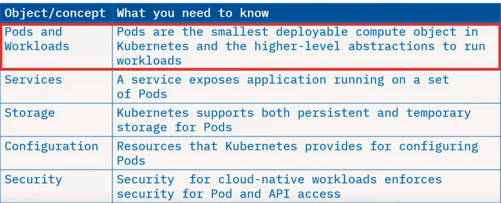
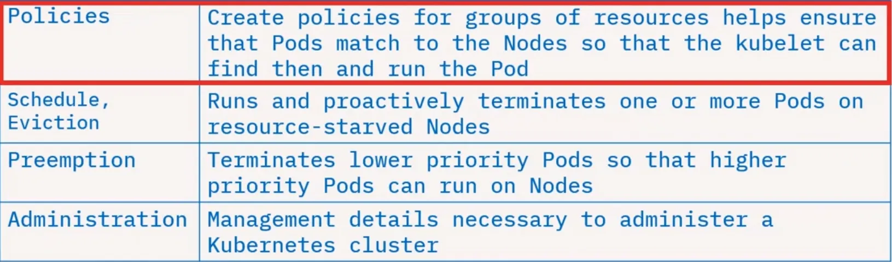

### Ecosystem

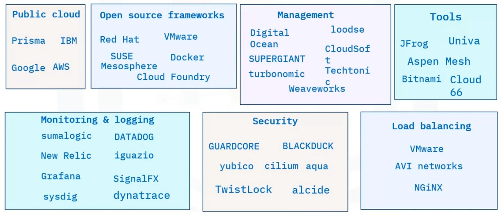

### Architecture

- A deployment of Kubernetes is called a Kubernetes cluster, is a cluster of nodes that runs containerized applications
- Each cluster has **one master node** (the Kubernetes Control Plane) and **one or more worker nodes**

#### Control Plane

- The control plane maintains the intended cluster state by **making decisions** about the cluster and detecting and responding to events in the cluster

> An example of a decision made by the control plane is the **scheduling of workloads**. An example of responding to an event is **creating new resources** when an application is deployed.


##### kube-api-server

- the **Kubernetes API server** exposes the Kubernetes API. The **API server serves as the front-end** for the control plane
- all **communication** in the cluster utilizes this API, **kube-apiserver** which is designed to scale horizontally—by deploying more instances and balance traffic between them

> An example the Kubernetes API server accepts commands to view or change the state of the cluster.

##### etcd

- highly available, distributed key value store that contains all the cluster data
- stores deployment configuration data, desired state, and meta data in a way that can be accessed in a common location
- defines the state in a Kubernetes cluster, and the system works to bring the actual state to match the desired state

##### kube-scheduler

- assigns newly created Pods to nodes, means it determines where workloads should run within the cluster
- selects the most optimal node according to Kubernetes scheduling principles, configuration options, and available resources

##### kube-controller manager

- runs all the controller processes that monitor the cluster state
- ensure the actual state of a cluster matches the desired state

##### cloud-controller manager

- runs controllers that interact with the underlying cloud providers
- effectively link clusters into a cloud provider’s API
- allows both Kubernetes and the cloud providers to evolve freely without introducing dependencies on the other

#### Worker Nodes

- are the worker machines in a Kubernetes cluster, user applications are run on nodes, can be virtual or physical machines
- are not created by Kubernetes itself, but rather by the cloud provider, allowing Kubernetes to run on a variety of infrastructures
- are then managed by the control plane and contain the services necessary to run applications
- include pods, which are the smallest deployment entity in Kubernetes; pods include one or more containers
- containers share all the resources of the node and can communicate among themselves

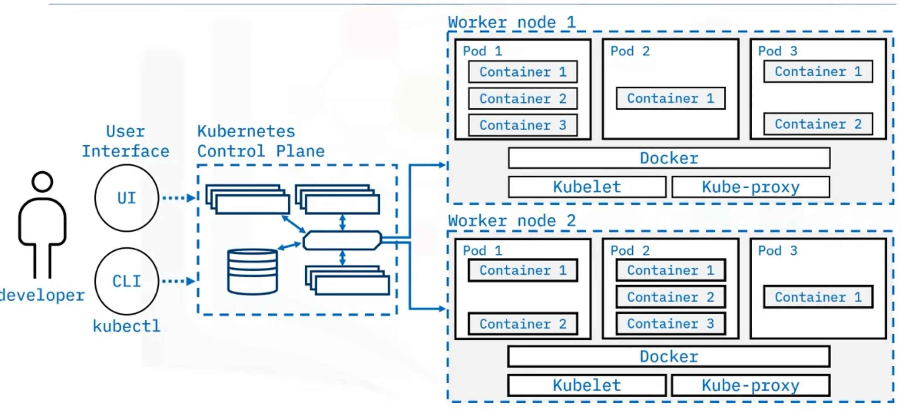

##### kubelet

- is the most important component of a worker node, this controller communicates with the kube-apiserver to receive new and modified pod specifications
- ensure that the pods and their associated containers are running as desired
- reports to the control plane on the pods’ health and status
- to start a pod, the kubelet uses the container runtime

##### Container runtime

- is responsible for downloading images and running containers
- rather than providing a single container runtime, Kubernetes implements a Container Runtime Interface that permits pluggability of the container runtime
- Docker is likely the best-known runtime, Podman and Cri-o are two other commonly used container runtimes

##### kube-proxy

- is a network proxy that runs on each node in a cluster
- maintains network rules that allow communication to Pods running on nodes — in other words, communication to workloads running on your cluster
- This communication can come from within or outside of the cluster

### Objects Terms

- **software object** - a bundle of data that has an identity, a state, and a behavior.
  - Example include variables, data structures, and specific functions.
- **entity** - a person, place, or thing with an identity and associated data.
  - Example in banking, a customer account is an entity.
- **persistent** - that lasts even if there is a server failure or network attack.
  - Example is persistent storage.

### Kubernetes Objects

- Kubernetes objects are persistent entities. Example: **Pods**, **Namespaces**, **ReplicaSets**, **Deployments**, and more.
- Kubernetes objects consist of two main fields:
  - **object spec** - provided by user and defines desired state
  - **status** - provided by Kubernetes and defines current state
- Kubernetes works towards matching the current state to the desired state.
- To work with these objects, use the Kubernetes API directly with the client libraries, and the kubectl command-line interface, or both

#### Labels and selectors

- Labels are key/value pairs attached to objects.
  - Intended for identification of objects.
  - Not unique. Many objects can have the same labels.
  - Helps to organize and group objects.
- Label selectors are the core grouping method in Kubernetes.
  - Identify and group a set of objects.

#### Namespaces and names

- Namespaces provide a mechanism for isolating groups of resources within a single cluster.
- This is useful when teams share a cluster for cost-saving purposes or for maintaining multiple projects in isolation.
- There are different patterns of working with namespaces.
  - There may be only one namespace for a user who works with one team which only has one project that is deployed into a cluster.
  - Alternatively, there may be many teams or projects, or users with different needs, where additional namespaces may be created.
- Namespaces provide a scope for the names of objects
  - Each object must have a unique name
  - Names are uniques for that resource type within that namespace

#### Pods

- is the simplest unit in Kubernetes
- represents a process or a single instance of an application running in the cluster.
- encapsulates one or more containers
- replicating a pod serves to scale applications horizontally
- YAML files are used to define the objects that you want to create.
- The YAML files shown defines a simple pod.
- A PodSpec must contain at least one container.

```yaml
apiVersion: v1
kind: Pod # kind of object to be created
metadata:
  name: nginx
spec: # provides the appropriate fields for the object
  containers: # container and will run in this Pod
    - name: nginx # name of container
      image: nginx:1.7.9 # image that will run in Pod
      ports: # port that container exposes
        - containerPort: 80
```

#### ReplicaSet

- is a set of identical running replicas of a Pod that are horizontally scale
- the configuration files for a ReplicaSet and a Pod are different from each other
- the replicas field specifies the number of replicas that should be running at any given time.

```yaml
apiVersion: v1
kind: ReplicaSet
metadata:
  name: nginx-replicaset
  labels:
    app: nginx
spec:
  replica: 3 # creates/deletes Pods to meet the desired number of replicas
  selector: # selector to identify which pods it can acquire
    matchLabels:
      app: nginx # same as template labels below
    template: # defines the Pods that should be created by the ReplicaSet
      metadata:
        labels:
          app: nginx # same as matchLabels above
      spec:
        containers:
          - name: nginx
            image: nginx:1.7.9
            ports:
              - containerPort: 80
```

> _Note_: Creating ReplicaSets directly is not recommended. Instead, create a Deployment, which is a higher-level concept that manages ReplicaSets and offers more features and better control.

#### Deployment

- is a higher-level object that provides updates for both Pods and ReplicaSets.
  - run multiple replicas of an application using ReplicaSets
  - are suitable for stateless applications
- for stateful applications, Stateful Sets are used
- One key feature provided by Deployments but not by ReplicaSets is rolling updates
- A rolling update scales up a new version to the appropriate number of replicas and scales down the old version to zero replicas
- The ReplicaSet ensures that the appropriate number of Pods exist, while the Deployment orchestrates the roll out of a new version

```yaml
apiVersion: apps/v1
kind: Deployment
metadata:
  name: nginx-deployment
  labels:
    app: nginx
spec:
  replicas: 3
  selector:
    matchLabels:
      app: nginx
  template:
    metadata:
      labels:
        app: nginx
    spec:
      containers:
        - name: nginx
          image: nginx:1.7.9
          ports:
            - containerPort: 80
```

#### Service

- is a REST object, like Pods
- are a logical abstraction for a set of Pods in a cluster
- provide policies for accessing the Pods and cluster
- act as a load balancer across the Pods
- is assigned a unique IP address for accessing applications deployed on Pods
- eliminates the need for a separate service discovery process.

**Service Properties**:

- supports multiple protocols such as TCP, which is the default protocol, UDP, and others
- supports multiple port definitions
  - The port number with the same name can vary in each backend Pod
- can have an optional selector and can optionally map incoming ports to a targetPort

**Why a Service is needed**:

- is needed because Pods in a cluster are volatile, can be destroyed and new Pods can be created at any time
- this volatility leads to discoverability issues because of changing IP addresses
- it keeps track of Pod changes and exposes a single IP address or a DNS name
- utilizes selectors to target a set of Pods

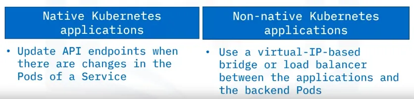

##### Service types

###### ClusterIP

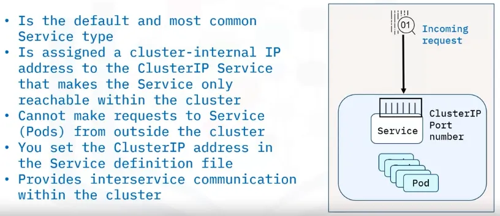

- is the default and most common service type
- assigns a cluster-internal IP address to the ClusterIP Service that makes the Service only reachable within the cluster.
- cannot make requests to Service from outside the cluster.
- You can set the ClusterIP address in the Service definition file
- provides Inter-service communication within the cluster

###### NodePort

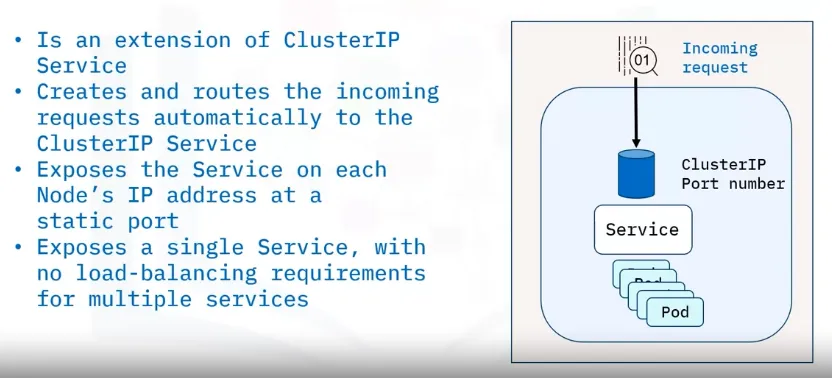

- an extension of ClusterIP Service
- creates and routes the incoming requests automatically to the ClusterIP Service
- exposes the Service on each Node’s IP address at a static port
- exposes a single Service with no load-balancing requirements for multiple services.

> _Note_ that for security purposes, production use is not recommended.

###### External Load Balancer (ELB)

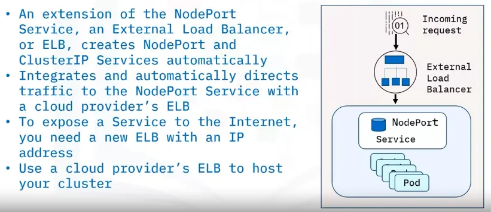

- an extension of the NodePort Service
- creates NodePort and ClusterIP Services automatically
- integrates and automatically directs traffic to the NodePort Service with a cloud provider's ELB
- To expose a Service to the Internet, you need a new ELB with an IP address
- You can use a cloud provider’s ELB to host your cluster.

###### External Name

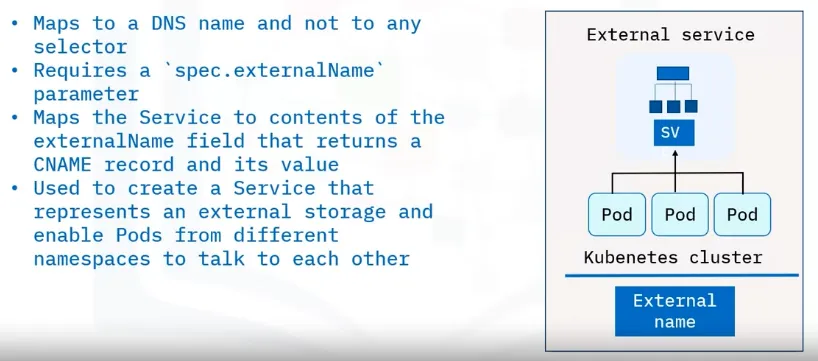

- maps to a DNS name and not to any selector
- requires a `spec.externalName` parameter
- maps the Service to the contents of the externalName field that returns a CNAME record and its value
- can use an External name to create a Service that represents external storage and enable Pods from different namespaces to talk to each other

#### Ingress

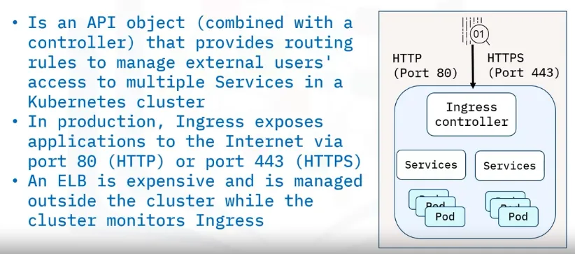

- is an API object that, when combined with a controller, provides routing rules to manage external users’ access to multiple services in a Kubernetes cluster
- in production, Ingress exposes applications to the Internet via port 80 (for HTTP) or port 443 (for HTTPS)
- while the cluster monitors Ingress, an external Load Balancer is expensive and is managed outside the cluster
- acts as a supervisor for external access, exposing routes from outside the cluster to internal services
- adheres to rules defined on the Ingress resource to regulate traffic routing.

| Feature              | Ingress Objects                                 | Ingress Controllers                                      |
| -------------------- | ----------------------------------------------- | -------------------------------------------------------- |
| Definition           | API object managing external access to services | Cluster resource implementing rules specified by Ingress |
| Primary Function     | Regulates external access routing               | Implements rules, fulfilling the Ingress                 |
| Configuration Source | Rules defined on the Ingress resource           | Reads and processes information from the Ingress object  |
| Traffic Handling     | Manages HTTP and HTTPS routes                   | Utilizes load balancer, configures frontends for traffic |
| Activation           | Active upon configuration with Ingress resource | Must be explicitly running for Ingress to function       |
| Handling Protocols   | Focused on HTTP and HTTPS                       | Implements rules for various protocols and ports         |
| Automatic Startup    | Activated with configuration                    | Requires explicit activation in the cluster              |
| Analogy              | Traffic rule set for the cluster                | Executor, similar to Nginx instance handling rules       |

#### DaemonSet

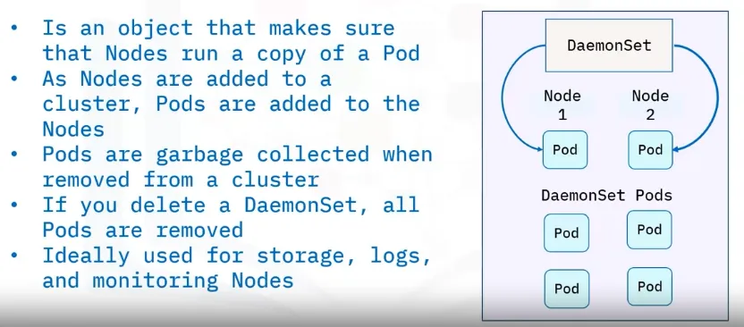

- is an object that makes sure that Nodes run a copy of a Pod
- As nodes are added to a cluster, Pods are added to the nodes
- Pods are garbage collected when removed from a cluster
- If you delete a DaemonSet, all Pods are removed
- are ideally used for storage, logs, and monitoring nodes

#### StatefulSet

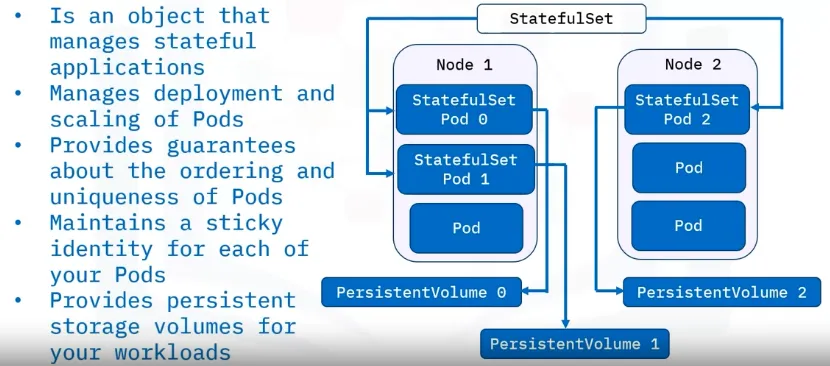

- is an object that manages stateful applications
- manages deployment and scaling of Pods
- provides guarantees about the ordering and uniqueness of Pods
- maintains a sticky identity for each Pod request
- provides persistent storage volumes for your workloads

#### Job

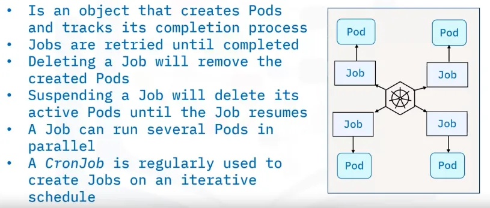

- job creates Pods and tracks the Pod completion process
- are retried until completed
- Deleting a job will remove the created Pods
- Suspending a Job will delete its active Pods until the job resumes
- can run several Pods in parallel
- a CronJob is regularly used to create Jobs on an iterative schedule

### Kubernetes Anti-patterns

#### Avoid baking configuration in container images

Containers offer the advantage of using a consistent image throughout the production process. To achieve adaptability across different environments, building images without embedding configuration directly into containers is essential.

**Issue:** Problems arise when images contain environment-specific artifacts that deviate from the tested version, necessitating image rebuilds and risking inadequately tested versions in production. Identification of environment-dependent container images involves spotting features like hardcoded IP addresses, passwords, and environment-specific prefixes.

**Best practice:** Create generic images independent of specific runtime settings. Containers enable the consistent use of a single image throughout the software lifecycle, promoting simplicity and efficiency.

#### Separate application and infrastructure deployment

Infrastructure as Code (IaC) allows defining and deploying infrastructure like writing code. While deploying infrastructure through a pipeline is advantageous, separating infrastructure and application deployment is crucial.

**Issue:** Using a single pipeline for both infrastructure and application deployment leads to resource and time wastage, especially when changes in application code outpace infrastructure changes.

**Best practice:** Split infrastructure and application deployment into separate pipelines to optimize efficiency and resource utilization.

#### Eliminate specific order in deployment

Maintaining application stability despite delays in dependencies is crucial in container orchestration. Unlike traditional fixed startup orders, Kubernetes and containers initiate components simultaneously.

**Issue:** Challenges arise when poor network latency disrupts communication, potentially causing pod crashes or temporary service unavailability.

**Best practice:** Proactively anticipate failures, establish frameworks to minimize downtime, and adopt strategies for simultaneous component initiation to enhance application resilience.

#### Set memory and CPU limits for pods problem

The default Kubernetes setting without specified resource limits allows an application to potentially monopolize the entire cluster, causing disruptions.

**Best practice:** Establish resource limits for all applications, conduct a thorough examination of each application's behavior under various conditions, and strike the right balance to optimize cluster performance.

#### Avoid pulling the latest tag in production problem

Using the "latest" tag in production leads to unintended pod crashes as images are pulled down sporadically, lacking specificity.

**Best practice:** Use specific and meaningful image tags, maintain the immutability of container images, store data outside containers in persistent storage, and avoid modifying containers post-deployment for safer and more repeatable deployments.

#### Segregate production and non-production workloads problem

Relying on a single cluster for all operational needs poses challenges. Security concerns arise from default permissions and complications with non-namespaced Kubernetes resources.

**Best practice:** Establish a second cluster exclusively for production purposes, avoiding complexities associated with multi-tenancy. Maintain at least two clusters—one for production and one for non-production.

#### Refrain from ad-hoc deployments with kubectl edit/patch problem

Configuration drift occurs when multiple environments deviate due to unplanned deployments or changes, leading to failed deployments.

**Best practice:** Conduct all deployments through Git commits for comprehensive history, precise knowledge of cluster contents, and easy recreation or rollback of environments.

#### Implement health checks with liveness and readiness probes problem

Neglecting health checks can lead to various issues. Overly complex health checks with unpredictable timings can cause internal denial-of-service attacks within the cluster.

**Best practice:** Configure health probes for each container, use liveness and readiness probes, and prioritize robust health checks for reliable application responsiveness.

#### Prioritize secret handling and use vault problem

Embedding secrets directly into containers is poor practice. Using multiple secret handling methods or complex injection mechanisms can complicate local development and testing.

**Best practice:** Use a consistent secret handling strategy, consider HashiCorp Vault, handle secrets uniformly across environments, and pass them to containers during runtime for enhanced resilience and security.

#### Use controllers and avoid running multiple processes per container problem

Directly using pods in production poses limitations. Pods lack durability, automatic rescheduling, and data retention guarantees. Running multiple processes in a single container without controllers can lead to issues.

**Best practice:** Utilize Deployment with a replication factor, define one process per container, use multiple containers per pod if necessary, and leverage workload resources like Deployment, Job, or StatefulSet for reliability and scalability.
