## ReplicaSet

- ensures the right number of pods are always up and running
- provide high availability through redundancy
- adds or deletes pods for scaling
- always tries to match the actual state of the replicas to the desired state
- replaces failing pods or deletes additional pods to maintain the desired state
- supersedes ReplicaControllers
- Deployments manage ReplicaSets, send pods declarative updates

### Create ReplicaSet from scratch

```yaml
# replicaset.yaml
apiVersion: apps/v1
kind: ReplicaSet
metadata:
  name: hello-kubernetes
spec:
  replicas: 1
  selector:
    matchLabels:
      app: hello-kubernetes
    template:
      metadata:
        labels:
          app: hello-kubernetes
      spec:
        containers:
          - name: hello-kubernetes
            image: paulbouwer/hello-kubernets:1.5
            ports:
              -containerPort: 8080
```

```bash
# Outputs ReplicaSet was created
kubectl create -f replicaset.yaml
# Confirm by using "get pods"
kubectl get pods
# Output shows details about ReplicaSet and pod created
kubectl get rs
```

> Note: Creating a Deployment that includes a ReplicaSet is recommended over creating a standalone ReplicaSet.

```bash
# Create deployment
kubectl create -f deployment.yaml
kubectl get pods
kubectl get deploy

# Scale deployment
kubectl scale deploy hello-kubernetes --replicas=3

# Should shows 3 pods running
kubectl get pods

# Delete pod
kubectl delete pod hello-kubernetes-2324343-5mflw
# Here desired state (--replicas=3) does not
# match the actual state [running pods=2]
# and deleted pod replaced by new one

# Create pod extra pod
kubectl create pod hello-kubernetes-122323
# Here desired state (--replicas=3) does not
# match the actual state [running pods=4]
# and new pod is marked for deletion and removed automatically
```

## Autoscaling

- ReplicaSets provide a good start for scaling, but you don’t always want 10 instances of your resource running.
- Kubernetes autoscaling helps optimize resource usage and costs by automatically scaling a cluster in line with demand as needed.
- Kubernetes enables autoscaling at two different layers:
  - the cluster or node level
  - the pod level.
- Three types of autoscalers are available in Kubernetes:
  - The Horizontal Pod Autoscaler (or HPA)
  - Vertical Pod Autoscaler (or VPA)
  - Cluster Autoscaler (or CA)

To create autoscaling:

```bash
kubectl get pods
kubectl get rs

kubectl autoscale deploy hello-kubernetes --min=2 --max=5 --cpu-percent=50

kubectl describe rs hello-kubernetes-<hash>
```

- List the current number or state of pods.
- A ReplicaSet is automatically created when you create a deployment. In order to autoscale, you simply use the autoscale command with the requisite attributes.
- Min is the number of minimum pods – notice that we have changed the value of “Min” to 2.
- Max is the number of maximum pods.
- CPU-percent acts as a trigger that tells the system to create a new pod when the CPU usage reaches 50% across the cluster.
- In the background, the deployment still uses the ReplicaSet to scale up and down.
- The describe command shows the number of replicas in the "autoscaled" ReplicaSet.

### The Horizontal Pod Autoscaler (or HPA)

- **adjusts** the number of replicas of an application by increasing or decreasing the number of pods.
- automatically updates a workload resource (like a deployment) by horizontally scaling the workload to match the demand
- Horizontal scaling, or “scaling out,” automatically increases or decreases the number of running pods as application usage changes.
- uses a cluster operator that sets targets for metrics like CPU or memory utilization and the maximum and minimum desired number of replicas
- even though you can create an HPA autoscaler from scratch, you should use the autoscale command instead.

```bash
kubectl get hpa
```

For example,

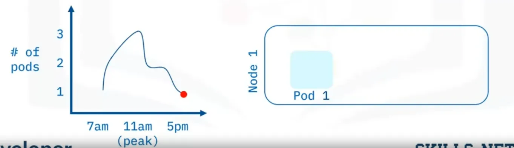

- the system load is low early in the morning, so one pod is sufficient. The HPA autoscales the workload resource to meet usage demand.
- By 11am, peak load drives a need for three pods, so the HPA autoscales the workload resource to meet usage demand.
- Usage drops in the afternoon, so the third pod is marked for deletion and removed.
- And usage drops even lower by 5pm, so another pod is marked for deletion and removed.

```yaml
# another way to enable autoscaling is to manually
# create the HPA object from a YAML file.
apiVersion: autoscaling/v1
kind: HorizontalPodAutoScaler
metadata:
  name: hello-kubernetes
  namespace: default
spec: # can set the minimum and maximum number of pods.
  maxReplicas: 5
  minReplicas: 2
  scaleTargetRef:
    apiVersion: apps/v1
    kind: Deployment
    name: hello-kubernetes
  # The CPU-percent flag shows up as “targetCPUUtilizationPercentage”.
  targetCPUUtilizationPercentage: 10
```

### Vertical Pod Autoscaler (or VPA)

- **adjusts** the resource requests and limits of a container by increasing or decreasing the resource size or speed of the pods.
- A best practice is to scale horizontally, but there are some services you may want to run in a cluster where horizontal scaling is impossible or not ideal.
- Vertical scaling, or “scaling up,” refers to adding more resources to an existing machine.
- lets you scale a service vertically within a cluster.
- uses a cluster operator sets targets for metrics like CPU or memory utilization, similar to an HPA.
- The cluster then reconciles the size of the service’s pod or pods based on their current usage and the desired target.

For example,

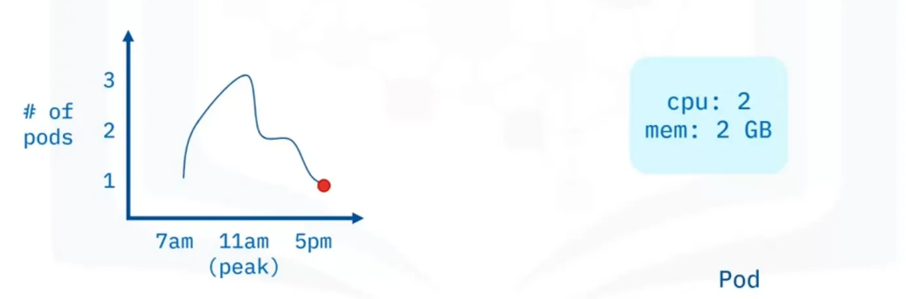

- the system load is low early in the morning, so system resources used by the pod are low.
- By 11am, peak load drives a need for more capacity.
- The VPA autoscales the pod by adding more system resources (CPU and memory) to meet the demand.
- Usage drops in the afternoon, so the pod is autoscaled to use fewer system resources.
- And usage drops even lower by 5pm, so the pod is autoscaled further to match the 7am levels.

> **Note:** You should not use VPAs with HPAs on resource metrics like CPU or memory. However, you can use them together on custom or external metrics.

### Cluster Autoscaler (or CA)

- **adjusts** the number of nodes in the cluster when pods fail to schedule, or demand increases or decreases in relation to the existing nodes’ capacity
- autoscales the cluster itself, increasing and decreasing the number of available nodes that pods can run on.
- Pods are autoscaled using HPA or VPA, but when the nodes themselves are overloaded with pods.
- can use a CA to autoscale the nodes so that the pods can rebalance themselves across the cluster.

For example,

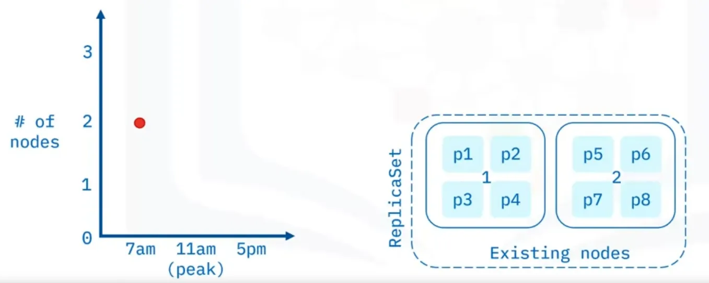

- the system load is low early in the morning, so existing nodes can handle the load.
- When demand increases, new pod requests come in, and the CA autoscales the cluster by adding a new node and pods to meet the demand.
- By 11 am, peak load brings the new node to full capacity.
- When usage drops in the afternoon, unused pods are marked for deletion and removed.
- And when usage drops even lower by 5 pm, all pods in the new node are marked for deletion and removed.
- And then the node itself is marked and removed.

- cluster autoscaler ensures there is always enough compute power to run your tasks, and that you aren’t paying extra for unused nodes.
- clusters may have periods where all batch processing jobs are complete, and the new batch doesn’t start until later in the day.
- Each autoscaler type is suitable in specific scenarios, so you should analyze the pros and cons of each to find the best choice.
- Using a combination of all three types ensures that
  - services run stably at peak load times, and
  - costs are minimized in times of lower demand.

## Deployment Strategies

- defines an application’s lifecycle that achieves and maintains the configured state for objects and applications in an automated manner. Effective deployment strategies minimize risk.

Kubernetes deployment strategies are used to:

- Deploy, update, or rollback ReplicaSets, Pods, Services, and Applications
- Pause/Resume Deployments
- Scale Deployments manually or automatically

There are are six types of deployment strategies:

### Recreate

- is simplest deployment strategy
- has short downtime between the shutdown of existing and deployment and the new deployment
- Pods running the live version of the application are **all shut down simultaneously**, and a new version of the application is deployed on newly created Pods.
- The rollback process is completed in reverse order.

| Pros                                    | Cons                                                      |
| --------------------------------------- | --------------------------------------------------------- |
| Simple setup                            | Short downtime occurs between shutdown and new deployment |
| Application version completely replaced | -                                                         |

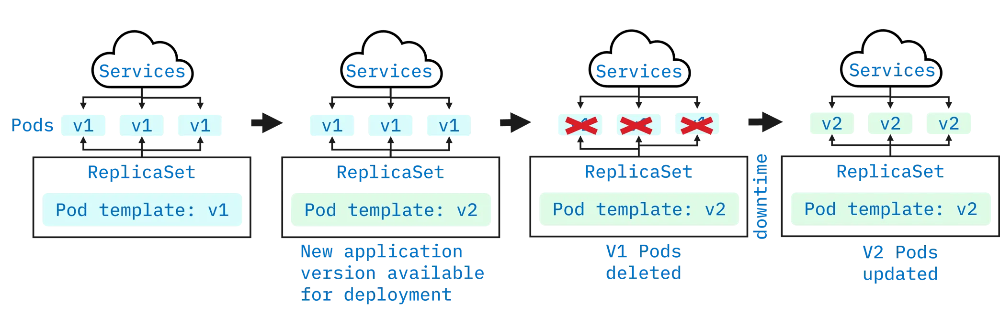

### Rolling (ramped)

- each Pod is updated one at a time, single v1 Pod is replaced and is updated in this way until all Pods are v2.
- During rollback process, there is hardly any downtime since users are directed to either version.

| Pros                                                                           | Cons                                   |
| ------------------------------------------------------------------------------ | -------------------------------------- |
| Simple setup                                                                   | Can't control the traffic distribution |
| Suitable for stateful applications that need to handle rebalancing of the data | Rollout/rollback takes time            |

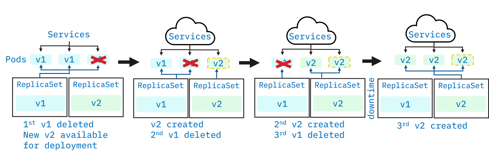

### Blue/green

- the blue environment is the live version of the application.
- the green environment is an exact copy that contains the deployment of the new version of the application.
- the green environment is created identical to the current production environment and is thoroughly tested.
- once all changes, bugs, and issues are addressed, user traffic is switched from the blue environment to the green environment.
- to perform a rollback, switch the environment back.

| Pros                                              | Cons                                                     |
| ------------------------------------------------- | -------------------------------------------------------- |
| Instance rollout/rollback (no downtime)           | Expensive(requires double resources)                     |
| New version is available immediately to all users | Rigorous testing required before releasing to production |
|                                                   | Handling stateful applications is difficult              |

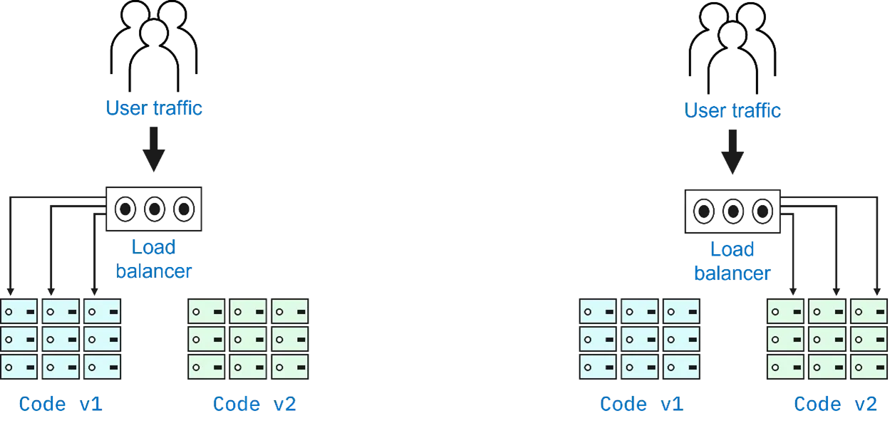

### Canary

- the new version of the application is tested using a small set of random users alongside the current live version of the application.
- once the version of the application is successfully tested, it is then rolled out to all users.
- rollback has no downtime since few users are exposed to the new version.

| Pros                                                          | Cons                              |
| ------------------------------------------------------------- | --------------------------------- |
| Convenient for reliability, error, and performance monitoring | Slow rollout, gradual user access |
| Fast rollback                                                 |                                   |

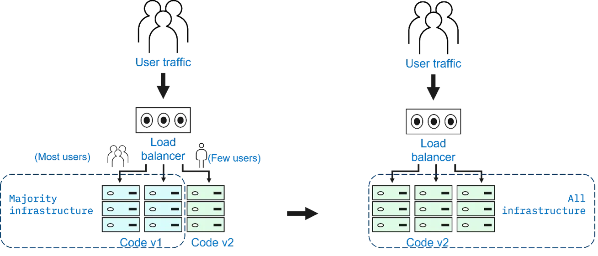

### A/B testing

- known as split testing, evaluates two versions of an application (version A and version B).
- each version has features that cater to different sets of users.
- can select which version is best for global deployment based on user interaction and feedback.

| Pros                                   | Cons                                                                                        |
| -------------------------------------- | ------------------------------------------------------------------------------------------- |
| Multiple versions can run in parallel  | Requires intelligent load balancer                                                          |
| Full control over traffic distribution | Difficult to troubleshoot errors for a given session, distributed tracing becomes mandatory |

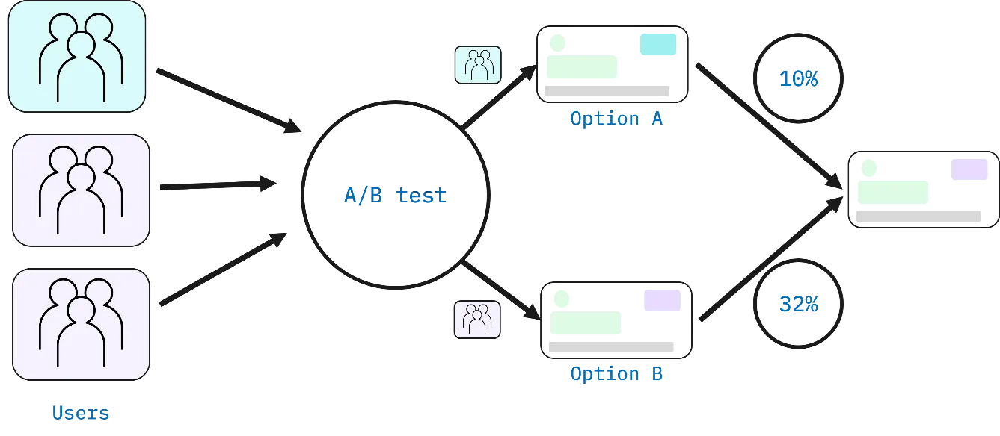

### Shadow

- a "shadow version" of the application is deployed alongside the live version.
- user requests are sent to both versions, and both handle all requests, but the shadow version does not forward responses back to the users.
- lets developers see how the shadow version performs using real-world data without interrupting user experience.

| Pros                                        | Cons                                                     |
| ------------------------------------------- | -------------------------------------------------------- |
| Performance testing with production traffic | Expensive (double resources)                             |
| No user impact                              | Not a true user test, can lead to misinterpreted results |
| No downtime                                 | Complex setup                                            |
| -                                           | Require monitoring for two environments                  |

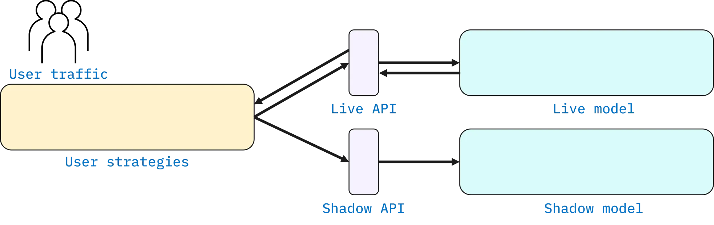

## Comparison

| Strategy    | Zero Downtime | Real Traffic Testing | Targeted Users | Cloud Cost | Rollback Duration | Negative User Impact | Complexity of Setup |
| ----------- | ------------- | -------------------- | -------------- | ---------- | ----------------- | -------------------- | ------------------- |
| Recreate    | X             | X                    | X              | •--        | •••               | •••                  | - - -               |
| Ramped      | ✓             | X                    | X              | •--        | •••               | •--                  | •--                 |
| Blue/Green  | ✓             | X                    | X              | •••        | - - -             | ••-                  | ••-                 |
| Canary      | ✓             | ✓                    | X              | •--        | •--               | •--                  | ••-                 |
| A/B Testing | ✓             | ✓                    | ✓              | •--        | •--               | •--                  | •••                 |
| Shadow      | ✓             | ✓                    | X              | •••        | - - -             | - - -                | •••                 |

To create a good strategy:

- Consider the product type and the target audience
- Shadow and canary strategies use live user requests, as opposed to using a sample of users.
- The A/B testing strategy is useful if the version of the application requires minor tweaks or UI feature changes.
- The blue/green strategy is useful if your version of the application is complex or critical and needs proper monitoring with no downtime during deployment.
- The canary strategy is a good choice if you want zero downtime and are comfortable exposing your version of the application to the public.
- A rolling strategy gradually deploys the new version of the application. There is no downtime, and it is easy to roll back.
- The recreate strategy is a good choice if the application is not critical and users aren’t impacted by a short downtime.

## Rolling updates

- are automated updates that occur on a scheduled basis.
  - They roll out automated and controlled app changes across pods,
  - Work with pod templates like deployments, and
  - allow for rollback as needed.

To prepare your application to enable rolling updates,

- Step 1: Add liveness probes and readiness probes to deployments. That way deployments are appropriately marked as ‘ready.’

```bash
livenessProbe:
  httpGet:
    path: /
    port: 9080
  initialDelaySeconds: 300
  periodSeconds: 15
readinessProbe:
  httpGet:
    path: /
    port: 9080
  initialDelaySeconds: 45
  periodSeconds: 5
```

- Step 2: add a rolling update strategy to the YAML file.

```bash
apiVersion: apps/v1
kind: Deployment
metadata:
  name: nginx-test
spec:
  replicas: 10 # creating a deployment with 10 pods.
  selector:
    matchLabels:
      service: http-server
  # to wait a few seconds before moving to the next pod in the rollout stage
  minReadySeconds: 5
  progressDeadlineSeconds: 600
  strategy:
    type: RollingUpdate
    rollingUpdate:
      # strategy is to have at-least 50% of the pods always available
      # for a zero-downtime system, set the maxUnavailable to 0.
      # Setting the maxSurge to 100% would double the number of pods
      # and create a complete replica before taking the original set down
      # after the rollout is complete.
      maxUnavailable: 50%
      # there can only be 2 pods added to the 10 you defined earlier
      maxSurge: 2
```

### Rolling out an application update

- Assume, You have a deployment with three pods in your ReplicaSet.
- Your application displays the message, “Hello world!”
- Your client has submitted a new request, and you have a new image for your application with a different message, “Hello world v2!’ to your users.

```js
// Older
let port = process.env.PORT || 8080;
let message = process.env.MESSAGE || 'Hello world!';
// Newer
let port = process.env.PORT || 8080;
let message = process.env.MESSAGE || 'Hello world v2!';
```

- But you cannot have any downtime in your application.
- First, you need to build, tag, and upload this new image to Docker Hub.

```bash
docker build -t hello-kubernetes .
docker tag hello-kubernetes cham11ng/hello-kubernetes:2.0
docker push cham11ng/hello-kubernetes:2.0
# Your new software has been dockerized
# and then updated to Docker Hub with the name
# and tag cham11ng/hello-kubernetes:2.0”.
```

- Second, apply the new image to your deployment.

```bash
kubectl get deployments
# sets the image flag to the updated tag image on Docker Hub
kubectl set image deployments/hello-kubernetes \
  hello-kubernetes=cham11ng/hello-kubernetes:2.0

  deployment.extensions/hello-kubernetes image updated

# observe that version 2 deployment has been rollout
kubectl rollout status deployments/hello-kubernetes
  deployment "hello-kubernetes" successfully rolled out.
```

- Third, you can roll back your changes using the "rollout undo" command if there are errors in a deployment or the clients can change their minds.

```bash
kubectl rollout undo deployments/hello-kubernetes
  deployment.extensions/hello-kubernetes rolled back

kubectl get pods
# we see three new pods that were created as port of the rollback
# and can see some pods in terminating status
```

### How rolling works

#### All-at-once

In an **all-at-once rollout**, all v1 objects must be removed before v2 objects can become active.

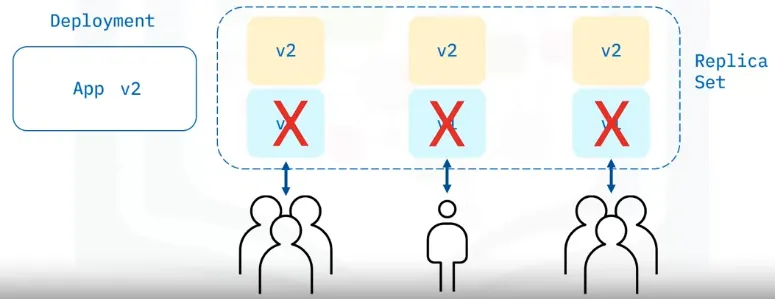

- Here you see version 1 of an app with three pods running that users can access.
- When version 2 is deployed, new pods are created.
- The version 1 pods are marked for deletion and removed and user access is blocked.
- Once the version 1 pods are removed, the version 2 pods become active and user access is restored.
- Notice the time lag between deployment and pod updates.

In an **all-at-once rollback**, all v2 objects must be removed before v1 objects can become active.

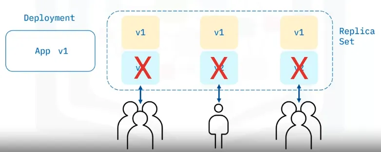

- Here you see version 2 of an app with three pods running that users can access.
- When version 1 of the app is deployed, new pods are created.
- The version 2 pods are marked for deletion and removed and user access is blocked.
- Once the version 2 pods are removed, the version 1 pods become active and user access is restored.

#### One-at-a-time

In a **one-at-a-time rollout**, the update is staggered so user access is not interrupted.

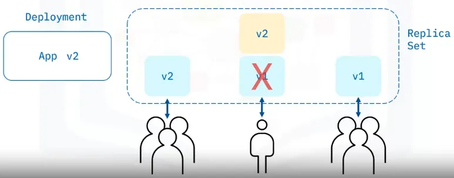

- Here you see version 1 of an app with three running pods that users can access.
- When version 2 is deployed, a new pod is created.
- The first version 1 pod is marked for deletion and removed, and the v2 pod becomes active.
- Now, a second v2 pod is created, and the second version 1 pod is marked for deletion and removed, and the second v2 pod becomes active.
- Then, a third v2 pod is created, and the third version 1 pod is marked for deletion and removed. And now the third v2 pod becomes active.

In a **one-at-a-time rollback**, the update rollback is staggered so user access is not interrupted.

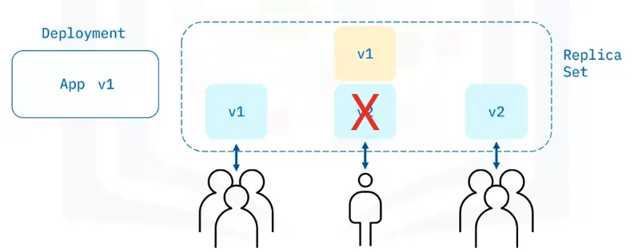

- Here you see version 2 of an app with three running pods that users can access.
- When version 1 of the app is deployed, a new pod is created.
- The first version 2 pod is marked for deletion and removed, and the v1 pod becomes active.
- Now, a second v1 pod is created. The second version 2 pod is marked for deletion and removed, and the second v1 pod becomes active.
- Then, a third v1 pod is created, and the third version 2 pod is marked for deletion and removed. And the third v1 pod becomes active.

## ConfigMaps

- helps developers avoid hard coding configuration variables in application code by keeping the configuration variables separate so that any changes in configuration settings do not require code changes.
- is an API object that stores non-confidential data in key-value pairs.
- provides configuration data to pods and deployments so that the configuration data is not hard coded inside the application code
- is meant for non-sensitive information as they do not provide secrecy or encryption.
- The data stored in a ConfigMap is limited and cannot exceed 1 megabyte
  - For larger amounts of data, consider mounting a volume or use a separate database or file service
- has optional data and binaryData fields and no “spec" field in the template
- the Config name must be a valid DNS subdomain name
- A ConfigMap is reusable for multiple deployments, thus decoupling the environment from the deployments themselves!
- Multiple ways to create
  - a ConfigMap by using string literals,
  - by using an existing “properties” or ”key” = “value” file,
  - or by providing a ConfigMap YAML descriptor file. You can use the first and second ways to help create such a YAML file.
- Multiple ways to reference from pod/deployment to consume a ConfigMap
  - reference by using environment variables with the configMapKeyRef attribute
  - by mounting a file using the volumes plugin. (mount as volume)
- Kubernetes applies the ConfigMap to the pod or the deployment just before running the pod or deployment.

### Configuration: Environment Variable

- You’ll use the environment variable directly in the YAML file.
- Apply this deployment descriptor to our deployment.
- Here, the message is hard-coded in the descriptor file.

```yaml
---
spec:
  containers:
    - name: hello-kubernetes
      image: cham11ng/myapp:latest
      ports:
        - containerPort: 8080
      env:
        # is used in the JavaScript file as process.env.MESSAGE
        - name: MESSAGE
          value: 'Hello from config file!'
```

### Configuration: ConfigMap string literal

```bash
# provide a ConfigMap is to provide a key-value pair
# in the create ConfigMap command.
kubectl create ConfigMap my-config \
  --from-literal=MESSAGE="hello from first configmap"
```

After this first step, the second step is to tell our deployment about the new MESSAGE variable and specify its location for pickup.

```yaml
env:
  - name: MESSAGE
    valueFrom: # to point to the ConfigMap created in the first step
      configMapKeyRef:
        # the deployment will look for a key named
        # MESSAGE in the ConfigMap named “my-config.”
        name: my-config
        key: MESSAGE
```

### Configuration: ConfigMap properties file

- Another way to add the MESSAGE variable in the ConfigMap is to use a file that contains all environment variables in the “key=value” format.
- Such a file is useful for adding many variables instead of listing those variables one by one on the command line.
- Here is a file with just one MESSAGE key and a value “hello from the my.properties file.”
- If you specify a directory to the “--from-file” flag, the entire directory is loaded into the ConfigMap.
- You can also load a specific file with a key by using the “--from-file=key=filename” format.

```bash
kubectl create cm my-config --from-file=my.properties

cat my.properties
  1 MESSAGE=hello from my.properties file

# to get the YAML output
kubectl describe ConfigMap my-config
```

```yaml
env:
  - name: MESSAGE
    valueFrom:
      configMapKeyRef:
        name: my-config
        key: my.properties
```

### Configuration: ConfigMap YAML

```yaml
apiVersion: v1
data:
  my.properties: MESSAGE=hello from the my.properties file
kind: ConfigMap
metadata:
  name: my-config
  namespace: default
```

```bash
kubectl get ConfigMap

kubectl apply -f my-config.yaml

kubectl describe cm my-config
```

- In our case, we have saved the output from ”kubectl get ConfigMap” as a YAML file called “my-config.yaml.”
- The first command indicates that there is no ConfigMap to begin with. Here you are creating the ConfigMap.yaml file.
- You’ll now apply the YAML file to your cluster which creates the ConfigMap.
- Note the MESSAGE in the ConfigMap file description.

## Secrets

- working with a Secret is like working with a ConfigMap

### Secret: Use with string literals

```bash
# First, create a secret using a string literal.
kubectl create secret generic api-creds \
  --from-literal=key=mysupersecretapikey
# the get command verifies that the secret was created
kubectl get secret
# use the DESCRIBE command to verify our secret is indeed a secret
# and check that you don’t see any secret, written using displayed text
kubectl describe secret api-creds

kubectl get secret api-creds -o YAML
```

### Secret: use with environment variables

```yaml
env:
  - name: API_CREDS # process.env.API_CREDS
    valueFrom:
      secretKeyRef:
        name: api-creds
        key: key
```

### Secret: use with volume mounts

- Each container in the descriptor file has its own volumeMount but shares the volume

```bash
kubectl create secret generic api-creds \
  --from-literal=key=mysupersecretapikey
```

```yaml
spec:
  containers:
    - name: hello-kubernetes
      image: cham11ng/myapp:latest
      ports:
        - containerPort: 8080

      # use a volume for the secret with a corresponding volumeMount
      volumeMounts:
        - name: api-creds
          # The api-creds secret is mounted as a file at /etc/api/api-creds
          mountPath: "/etc/api"
          readOnly: true
      volumes:
        - name: api-creds
        secrets:
          secretName: api-creds
```

## Service Binding

- is the process needed to consume external Services or backing Services, including REST APIs, databases, and event buses in our applications.
- manages configuration and credentials for back-end Services while protecting sensitive data.
- In addition, Service binding makes Service credentials available to you automatically as a Secret.
- consumes the external Service by binding the application to a deployment.
- Then, the application code uses the credentials from the binding and calls the corresponding Service.
- Here you can see an architectural diagram that illustrates the binding of a Kubernetes Cluster to an external Service.
- Next, let's learn the steps required to bind the Service to your application.

### Architecture

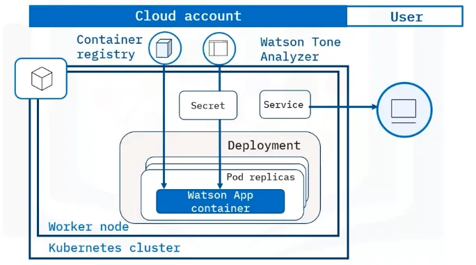

### IBM Service binding

- Service binding quickly creates Service credentials for an IBM Cloud Service.
- You create the Service credentials using IBM’s public cloud Service endpoint and then store or “bind” your Service credentials in a Kubernetes Secret in your Cluster.
- Here’s how to bind an IBM Cloud Service to your Cluster:
  1. Provision an instance of the Service
  2. Bind the Service to your Cluster to create Service credentials for your Service that use the public cloud Service endpoint
  3. Store and retrieve the Service credentials in a Kubernetes Secret
  4. Configure your app to access the Service credentials in the Kubernetes Secret

## Commands

| Command                         | Description                                           |
| ------------------------------- | ----------------------------------------------------- |
| kubectl autoscale deployment    | Autoscales a Kubernetes Deployment.                   |
| kubectl create configmap        | Creates a ConfigMap resource.                         |
| kubectl get deployments -o wide | Lists deployments with details.                       |
| kubectl get hpa                 | Lists Horizontal Pod Autoscalers (hpa)                |
| kubectl scale deployment        | Scales a deployment.                                  |
| kubectl set image deployment    | Updates the current deployment.                       |
| kubectl rollout                 | Manages the rollout of a resource.                    |
| kubectl rollout restart         | Restarts the resource so that the containers restart. |
| kubectl rollout undo            | Rollbacks the resource.                               |
