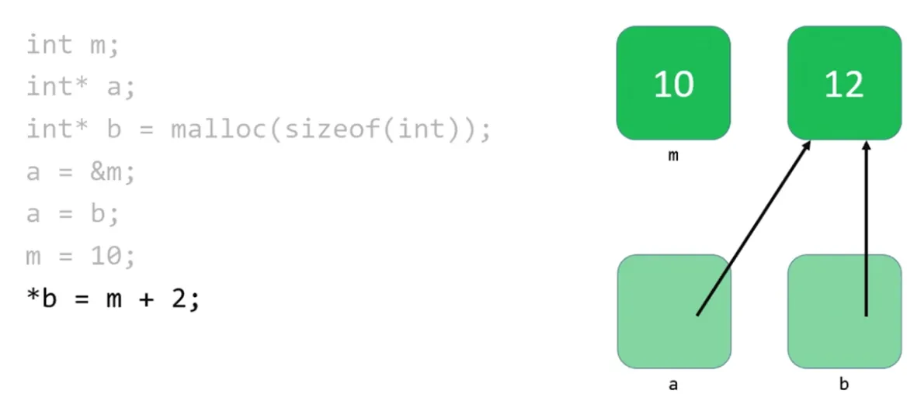
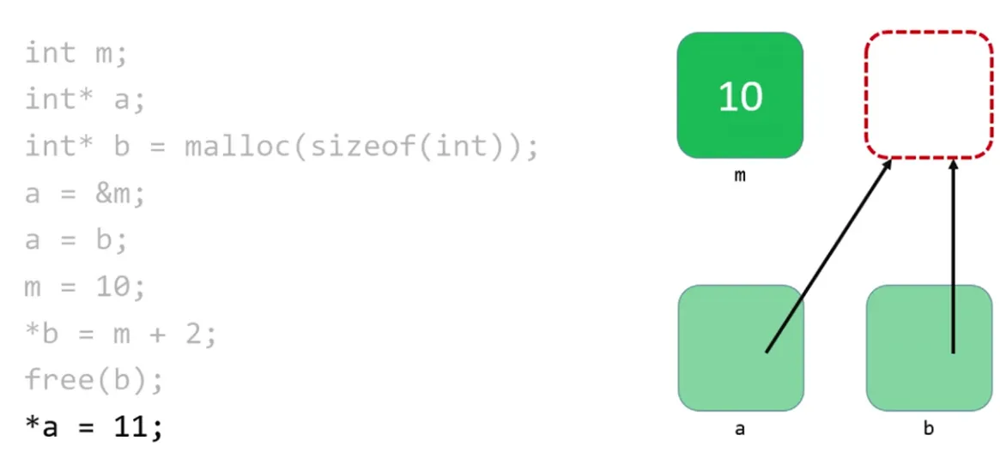

## C Programming

```c
include<stdio.h>

int main(int argc, char *argv[])
{
  //
  return 0
}
```

### Array

- Contiguous
- Analogy closed locker

### Memory

```bash
                  |         Machine Code            |
                  | ------------------------------- |
                  |           Globals               |
                  | ------------------------------- |
                  |             Heap                |
                  |       (more downwards) ↓        |
                  | ------------------------------- |
                  |       (more upwards) ↑          |
                  |             Stack               |
```

#### passing by value vs passing by reference (pointer)

- passing by value never solve swapping the value problem.

```c
void swap(int *a, int *b)
{
    int tmp = *a;
    *a = *b;
    *b = tmp;
}
```

#### Pointers

- **&** - reference the address of variable.
- **\*** - dereference operator - allows to take an address and go to it.
- pointer are stored in different memory address and tend to be 8 bytes.
- integer are 4 bytes.

#### String

- string has `\0` represent the NULL character (ASCII value 0) or NULL terminator (end of string).
  - double quotes do it for us.
- string `%p` reference to the first character address of string.
- `typedef char *string;` define custom data type.
- compiler is doing this `s[0] -> *s`
- `==` compares the address not the value.
- `=` assignment operator will just copy the address of string.

#### Stack

- is where the very first function goes in computer's memory.
- `main` function goes button of the memory.
- too many functions calls increases stack.
- stack overflow -> occurs if the call stack pointer exceeds the stack bound.

#### Heap

- too many malloc increases heaps.
- buffer is chunk of memory, buffer overflow overflow mean using too much of memory
- heap overflow condition is a buffer overflow, where the buffer that can be **overwritten** is allocated in the heap portion of memory. writes more data than heap-allocated memory.
- youtube , spinning / pause - bad connection means no more bytes or video footage in computer's buffer
  - if it downloads too many bytes at a time, they could overflow a buffer and crash it.

#### malloc and free

- `malloc()` is a library function that allows C to allocate memory dynamically from the heap.
- `free` should be called after using the variable created by `malloc()` to prevent leak.
- `memory leak` occors when a process allocates memory but doesn't free the memory.
- `valgrant` can be handy, finding memory access errors to heap memory.
- `scanf` is dangerous to use it for strings.

#### Dynamic Memory Allocation

- dynamically-allocated memory is not automatically returned to the system for later.
- failing to return memory back to the system after finished with it, results in a memory leak.
- memory leak compromise system's performance.
- must `free()` it once finished working.
- three golden rules:
  - every block of memory that you `malloc()` must subsequently be `free()`d.
  - only memory that you `malloc()` should be `free()`d.
  - do not `free()` a block of memory more than once.

```c
// get an integer from user
int x = GetInt();
// array of floats on the stack
float stack_array[x];
// array of floats on the heap
float* heap_array = malloc(x * sizeof(float));
```



> Once memory is freed, we can access again occurs segmentation fault.



#### garbage

- when we create variable, we don't give them values, in some case value will be initialized to all zeros else it contains garbage value.
- if we touch memory we were not supposed to then the computer crashes.

```c
int main(void)
{
    int *x;
    int *y;
    x = malloc(sizeof(int));
    *x = 42

    // not allocated might contain garbage address
->  *y = 13; // might crash modifying unknown address value

    // do instead
    y = x
    *y = 13
}
```

#### Hands-on Understanding



```bash
# Output
$ ./memory
Getting address: 0x7ff7b3c07a48
Getting value: 50

String value: HI!
String address: 0x10c2fae8a
String value first character: H
String value NULL character:
String address first: 0x10c2fae8a
String address second: 0x10c2fae8b
String address third: 0x10c2fae8c
HI!
0
12
Enter the value of I: hi!
Value of I: Hi!
Value of C: Hi!
Value of I: Hi!
Value of M: hi!
```

## Reference

- <https://pll.harvard.edu/course/cs50-introduction-computer-science>
