## Internet Primer

### IP Address

- 32-bit address, unique identifier of computer on a network.
- addressing scheme used by computers is known as IP addressing.
- four cluster of 8-bits using decimal notation.

### DHCP

- to assign IP addresses to computers

### DNS

- help us translate IP addresses to human-comprehensible names.
- analogy: yellow pages directory (business names into phone numbers).
- there's no really a DNS record of the entire internet.
- DNS server like (Google) act like aggregators, collecting smaller sets of DNS information and pooling them together, updating frequently.
- DNS record sets are thus fairly decentralized.
- port 53.

### Access Points

- router behaves as a traffic cop (NAT) that allows data requests from all of the devices on your local network to be processed through a single IP address.
- soho networks consist of access points that combines a router, a modem, a switch, and other technologies together into a single device.

### TCP/IP

- **Internet Protocol (IP)**: connection-less protocol for getting information from a sending machine to a receiving machine.
- **Transmission Control Protocol (TCP)** - directing the transmitted packet to the correct program on the receiving machine.

- dictate how information is communicated from machine to machine and application to application (IP and TCP, respectively).
- it is important to be able to identify _where_ the receiver is and _what_ the packet is for.
- TCP and IP are inseparable pair (TCP/IP).
- each program/utility/service on a machine is assigned a port number, coupled with IP address allows to uniquely identify a specific program on a specific machine.
- TCP is crucial for _guaranteeing delivery_ of packets.
- TCP does by including:
  - information about how many packets the receiver should expect to get and in what order,
  - transmitting that information alongside the data.

#### TCP/IP Steps

when data is sent:

- TCP breaks it into smaller chunks and communicates those packets to the computer's network software, adding a TCP layer onto the packet.
- IP routes the individual packages from sender to receiver; this info is part of the IP layer surrounding the packet.
- on receiving end, TCP looks at the header to see which program it belongs to and present those packets to destination program into proper order.

### HTTP

- Hypertext Transfer Protocol
- protocol for how to interpret the data that was sent.
- application layer protocol which specifically:
  - dictates the format by which client _request_ web pages from server and
  - the format via which server _return_ information to clients.

```bash
method request-target http-version

--

GET / HTTP/1.1    ------------------------>   HTTP/1.1 200 OK
Host: cats.com                                Content-Type: text/html
```

## RGB Representation

- Why in Hexadecimal? convenient representation, makes easier to understand.
  - Hexadecimal -> `#FF FF FF`
  - Binary -> `#11111111 11111111 11111111`
  - Decimal -> `#255 255 255`
- FF -> represents 255

```bash
# Deep Understanding
  16^1 = 16   16^0 = 1
      *          *
      F          F
  = 16 * 15 + 1 * 15 = 255
```

## Big O vs Omega

- Big O - upper bound (O)
- Omega - lower bound (Ω)
- Theta -> both same
- space and time complexity are converse
- bubble sort sometimes can win if already sorted.

## Data Structure

- orphaned memory leads memory leaks. (linked list)

## Algorithms

### Weird Algorithm

```bash
sleep_sort() {
  while [ -n "$1" ]
  do
    (sleep $1; echo $1) &
    shift
  done
  wait
}
```

## DevOps

- CI - Build/Test
- CD - Release/Deploy

## Mastering Kubernetes On-Premise & Cloud for Admins, Developers, DevOps & Architects

### Kubernetes: Container Orchestration

Cloud native application

- Cloud native is the software approach of building, deploying.

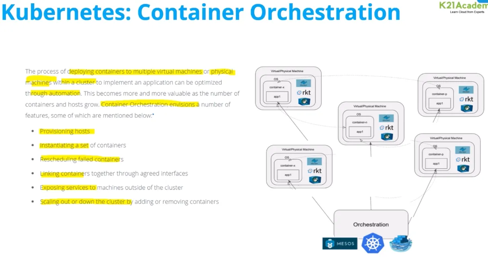

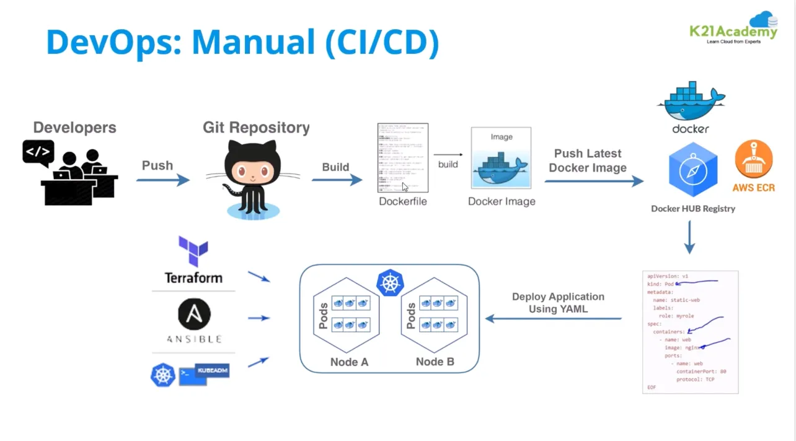

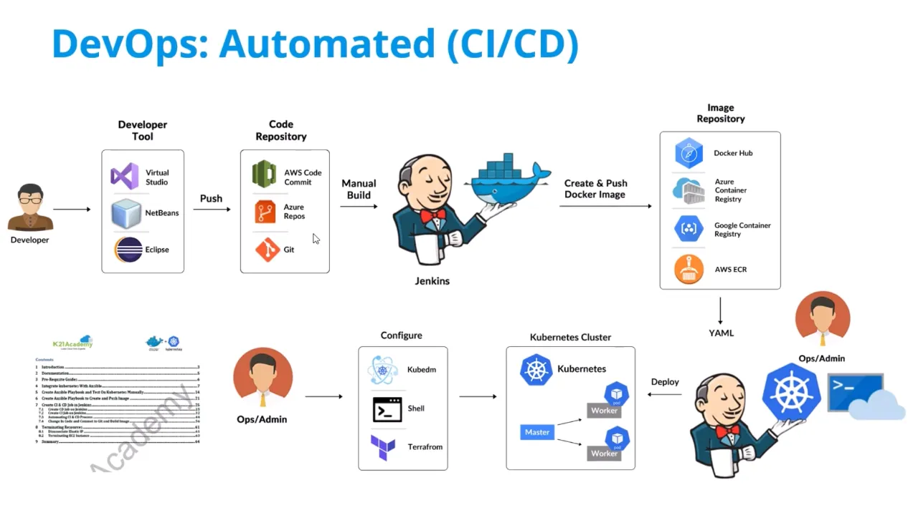

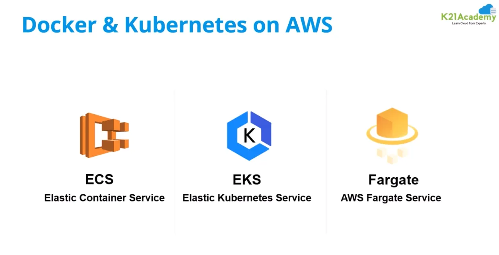

- Fargate is serverless

- add relevant description only.
- argo cd

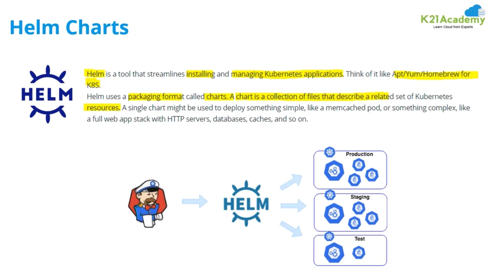

- pre deployment charts

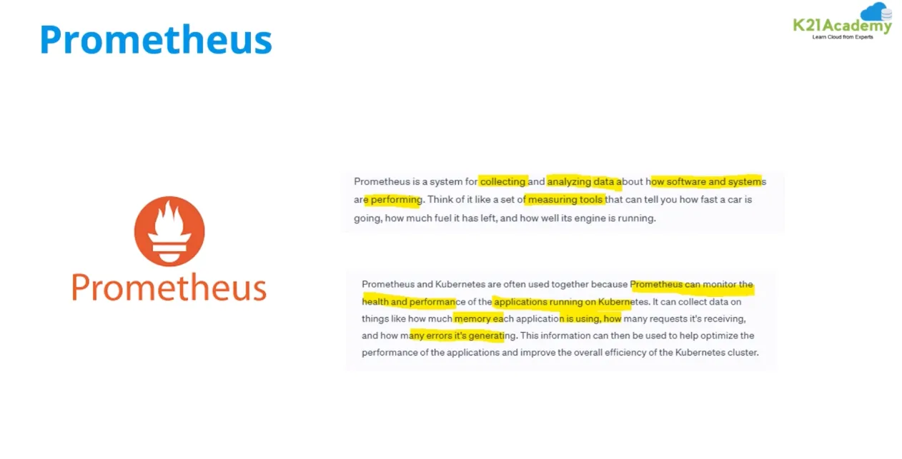

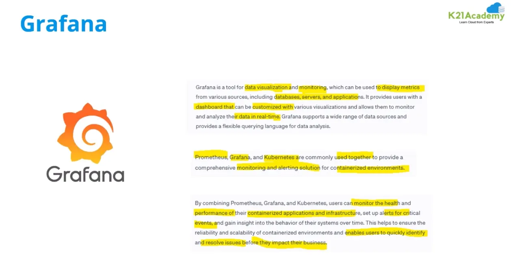

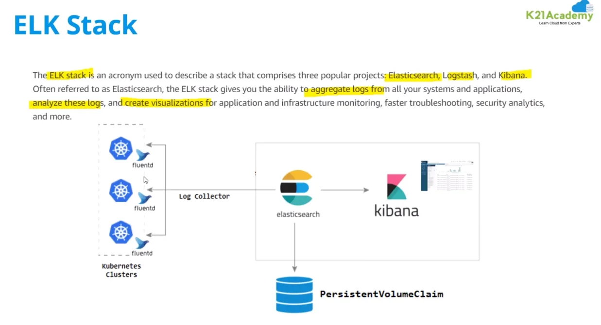

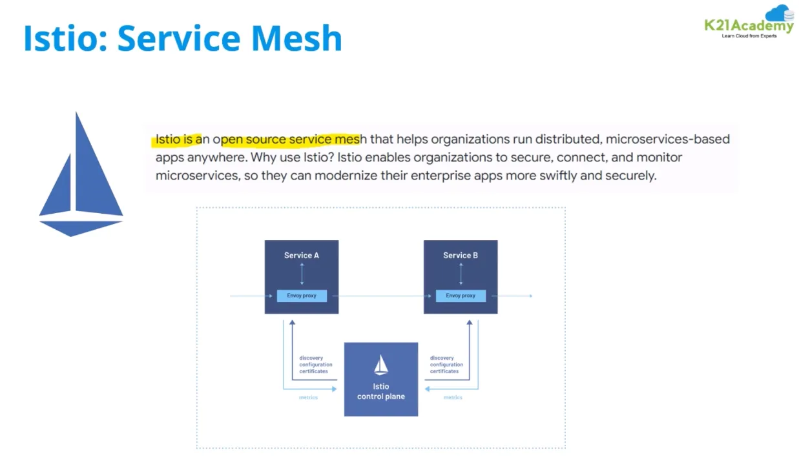

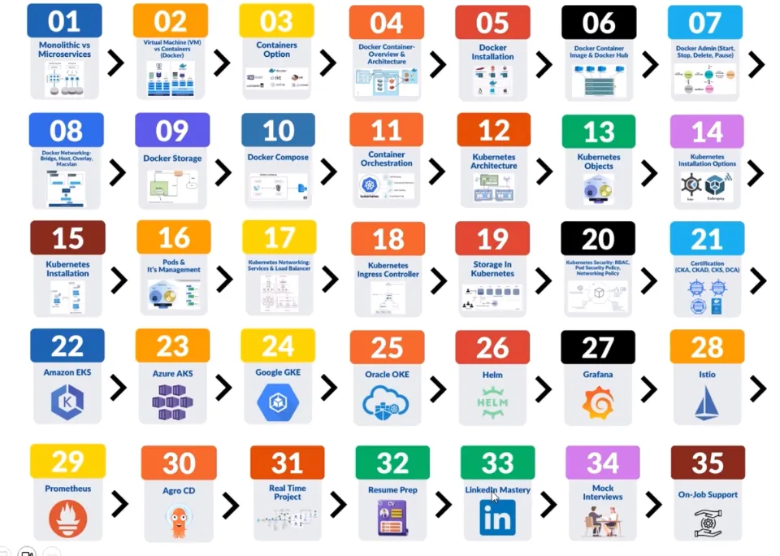

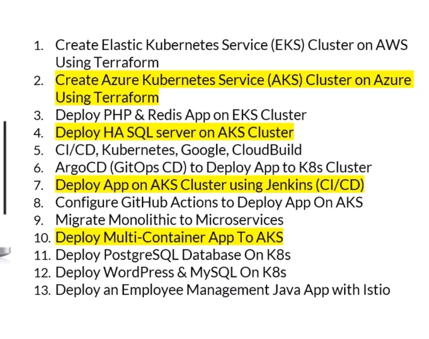

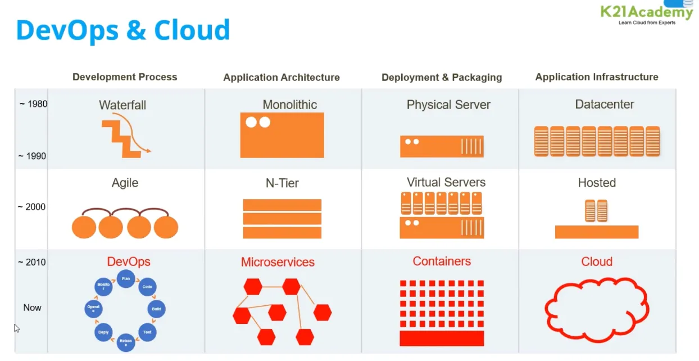

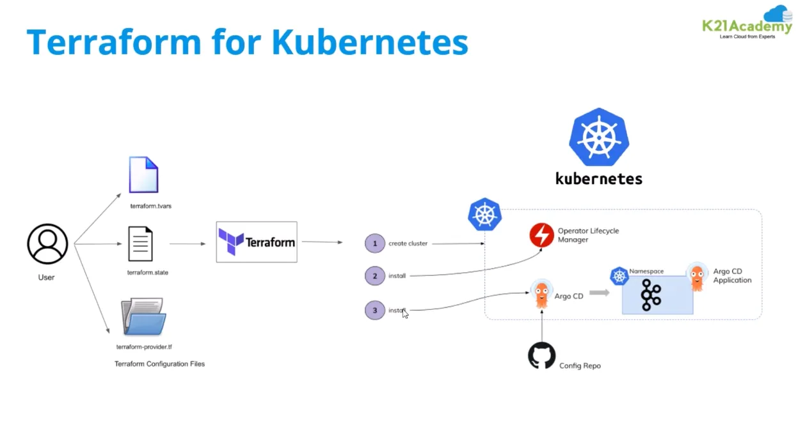

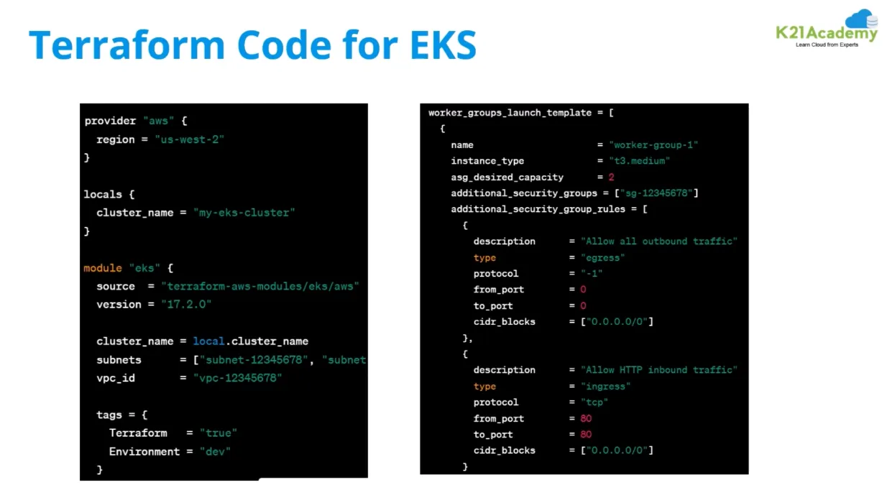


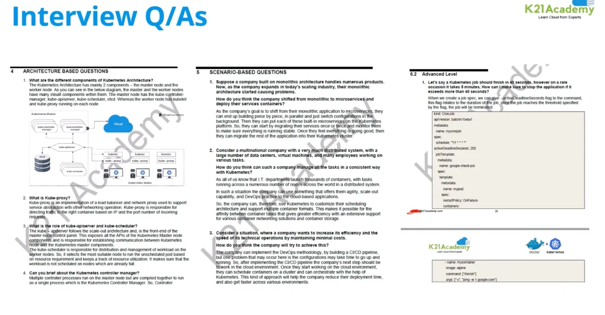


