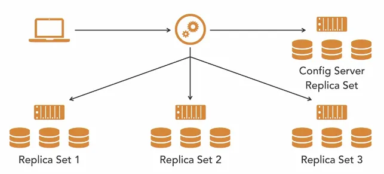

## collection

- help keep documents organized.

> cap collections to store a maximum amount of documents at any one time

```bash
# Basics
$ db.getName();
$ db.recipes.insertOne({});
$ db.recipes.find({"title": { $regex: /taco/i }}, {title: 1, _id: 0});

# show
#
$ show collections;

# sub-collection -> using dot
$ db.cool.mid.insertOne({}) # same but can be helpful for query purpose

```

## sort, skip, limit

```bash
# searching
$ db.recipes.find().count()

$ db.recipes.find({}, {title: 1}).limit(3)

# sorting
$ db.recipes.find({}, {title: 1}).sort({title: -1}) # asc
$ db.recipes.find({}, {title: 1}).sort({title: -1}) # desc

# skip
$ db.recipes.find({}, {title: 1}).skip(2).limit(1)
```

## operators

```bash
$gt   -> >
$lt   -> <
$lte  -> <=

$ db.recipes.find({cook_time: {$lte:30 }, prep_time:{$lte: 10}}, {title: 1})

# and
$ db.recipes.find({ tags: { $all: ["easy", "quick"]}}, {title: 1, tags: 1})

# or
$ db.recipes.find({ tags: { $in: ["easy", "quick"]}}, {title: 1, tags: 1})

# nested
$ db.recipes.find({ "ingredients.name": "egg" }, { title: 1})

```

## updating

```bash
$set
$unset
$inc

$ db.examples.updateOne({title: "Pizza"}, {$set: {title: "Crust pizza"}})

# upsert -> update or insert depending upon already exists or not.
$ db.examples.updateOne({title: "Crust pizza"}, {$set: {vegan: false}})

# remove key
$ db.examples.updateOne({title: "Crust pizza"}, {$unset: {vegan: 1}})

# increment
$ db.examples.updateOne({title: "Tacos"}, {$inc: {"likes_count": 1}})

# check
$ db.examples.find({title: "Tacos"}).pretty()
```

> eventual consistency (atomic operation => multiple user setting value)
> no locks or transactions.

### update arrays

```bash
$push -> into array end
$pull <- take out

$ db.examples.updateOne({"title": "Tacos"}, { $push: {"likes": 60}})

$ db.examples.updateOne({"title": "Tacos"}, { $pull: {"likes": 60}})
```

## delete documents

```bash
# delete
$ db.examples.deleteOne({ title: "Delete me" })
```

## challenge queries

```bash
# top rated recipes
$ db.recipes.find({}, {title: 1}).sort({ 'rating_avg': -1 }).limit(4)

# top mexican recipes
$ db.recipes.find({ tags: "mexican" }, {title: 1})
  .sort({ 'rating_avg': -1 })
  .limit(4)

# recipes liked by other
$ db.recipes.find({}, {title: 1, likes: 1}).sort({ title: 1 })

# recipes liked by user 1 and 35
$ db.recipes.find({likes: {$in: [1, 35]}}, {title: 1}).sort({title: 1})
```

## schema modeling

- embed other document using a sub-document if the data is always going to read and modify it.
- simplify and reduce queries.

### references

- data rarely read at the same time.
- do we need this data on load?
- consider unique indexing in both documents.
- e.g. create comments in separate document, create another top-comments in separate document.
- **gotchas**: will your data change? or user ever want to see all comments they've ever made so no need to store with users.

## indexing

- indexes help queries zoom
- easily look up a matching document
- without scanning every document in your collection

```bash
# checking query execution plan for 7 documents.
$ db.recipes.find({cook_time: 10}, {title: 1}).explain('executionStats')
{
  ...
   executionStats: {
    ...
    totalDocsExamined: 7,
  }
}

# creating cook_time index in descending order.
$ db.recipes.createIndex({"cook_time": -1});

# fetching indexes.
$ db.recipes.getIndexes()
[
  { v: 2, key: { _id: 1 }, name: '_id_' },
  { v: 2, key: { cook_time: -1 }, name: 'cook_time_-1' }
]

# checking query execution plan after indexing.
$ db.recipes.find({cook_time: 10}, {title: 1}).explain('executionStats')
{
  ...
   executionStats: {
    ...
    totalDocsExamined: 1,
  }
}

# dropping indexes
$ db.recipes.dropIndex("cook_time_-1")
```

## GridFS

- break files into chunks.
- chunks stored in separate documents.
- a parent document keeps track of file data.
- the chunks are streamed back via a MongoDB client.
- e.g. kind of sensor data, maybe a really smart smoker pellet grill.

### capped collections

- cap the amount of data or documents
- guaranteed insertion order
- limited
  - by disk size or document count.
- automatic deletion
  - first in, first out
  - based off guaranteed order.
  - always deletes when max size is reached
  - no need to worry
- e.g. log data, saving images.

```bash
$ db.createCollection("error_log", { capped: true, size: 10000, max: 10000})

# convert existing collection.
db.runComment({
  "convertToCapped": "error_log2",
  size: 10000
})
```

#### limitations

- no index by default (note if needed to update documents often).
- can't shard a capped collection.

### time series collections

- new in MongoDB 5.0
- data that changes over time, but also has a key that doesn't change, focus on unchanging parameters.
- keeps metadata ata points in time.
- store data at a given time and keep measuring and tracking that.
- e.g. stock data -> stock symbol doesn't change and metadata track every 30 seconds.
- building out chart to do analysis, data is already optimized for those queries later.

## server administration

### MongoDB config file

```bash
mongod --config=advanced.cfg
```

```yaml
# mongod.conf
systemLog:
  destination: file
  path: /usr/local/var/log/mongodb/mongo.log
  logAppend: true
storage:
  dbPath: /usr/local/var/mongodb
net:
  bindIp: 127.0.0.1
  port: 27017
```

```yaml
# advanced.cfg
systemLog:
  destination: file
  path: /var/log/mongodb/mongo.log
  logAppend: true
storage:
  dbPath: /store/db
  directoryPerDB: true
net:
  bindIp: 127.0.0.1
  port: 27017
  maxIncomingConnections: 65536
processManagement:
  fork: true # default false
security:
  authorization: enabled # role-based
  javascriptEnabled: true
replication:
  replSetName: cookerSet
```

### replication

```bash
$ mongod --replSet cookingSet --dbpath=/store/data/rs1 --port 27017 \
  --smallfiles --oplogSize 200

$ mongod --replSet cookingSet --dbpath=/store/data/rs2 --port 27018 \
  --smallfiles --oplogSize 200

$ mongo --port 28018
```

```bash
> config = {
  _id: 'cookingSet',
  members: [
    {_id: 0, host: 'localhost:27017'},
    {_id: 1: host: 'localhost:27018'}
  ]
}

> rs.initiate(config)

cookingSet:PRIMARY> rs.status()
```

```bash
# connection string
$ mongo "mongodb://localhost:27017,localhost:27018/?replicaSet=cookingSet"
```

### sharding

- takes data and breaks it up/partitioning data amongst multiple servers.
- with MongoDB, data auto shard is possible.
- not that hard, but it is more complicated
- don't do it if you don't need to.
- scale-out as your data grows using sharding.



### authentication and authorization

- logging in and limiting access

```bash
# change user
> use admin;

# create user
> db.createUser(
  {
    user: "foo",
    pwd: passwordPrompt(),
    roles: [
      {
        role: "userAdminAnyDatabase",
        db: "admin"
      },
      "readWriteAnyDatabase"
    ]
  }
);

> db.adminCommand({ shutdown: 1 });
> mongo --authenticationDatabase "admin" -u "foo" -p
or
> use admin;
> db.auth("foo", passwordPrompt());
Enter password:
1 # Successful logged in.
```

### backup

```bash
# lock against writes.
> db.fsyncLock();

cp -R /data/db/* ../path/to/backup

> db.fsyncUnlock();

# downside => expected downtime.
```

```bash
> mongodump
> mongorestore
```
