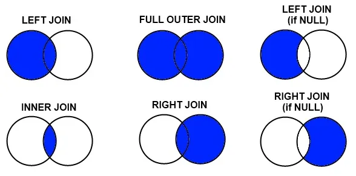

## Views

- is an alternative way of representing data that exists in one or more tables or views.
- can include all or some of the columns from one or more base tables or existing views.
- a view creates a named specification of a results table, which can be queried in the same way as a table.
- can also change the data in the base table by running insert, update, and delete queries against the view.
- the data that the view represents is stored in the base tables, not by the view itself.

### Uses

- Show a selection of data for a given table, so you can omit sensitive data like tax information, birth dates, or salaries.
- Combine two or more tables in meaningful ways.
- Simplify access to data by granting access to a view without granting access to the underlying tables.
- Show only the portions of data relevant to the process that uses the view.

```sql
CREATE VIEW <view_name>
  (<column_alias1>, <column_alias2>, ...<column_aliasN>) AS
  SELECT
    <column1>,
    <column2>
    ...
    <columnN>
  FROM <table_name>
  WHERE <predicate>;
```

- use the CREATE VIEW statement
- assign a name (up to 128 characters in length) to the view
- list the columns that you want to include, can use an alias to name the columns if you wish
- use the `AS SELECT` clause to specify the columns in the view
- the FROM clause to specify the base table name
- can also add an optional WHERE clause to refine the rows in the view

```sql
CREATE VIEW employee_info (
  employee_id,
  first_name,
  last_name,
  address,
  department_id
) AS
  SELECT
    employee_id,
    first_name,
    last_name,
    address,
    department_id
  FROM employees;
```

- views are dynamic; they consist of the data that would be returned from the SELECT statement used to create them
- the SELECT statement that you use to create the view can name other views and tables, and
- it can use the WHERE, GROUP BY, and HAVING clauses.
- it cannot use the ORDER BY clause or name a host variable.

```sql
DROP VIEW employee_info;
```

## Stored Procedures

- a stored procedure is a set of SQL statements that are stored and executed on the database server.
- Instead of sending multiple SQL statements from the client to server, you encapsulate them in a stored procedure on the server and send one statement from the client to execute them.
  - can write stored procedures in many different languages.
    - for Db2 on cloud and Db2, can write in SQL, PL, PL/SQL, Java, C, or other languages.
  - can accept information as parameters, perform, create, read, update, and delete (CRUD) operations
  - return results to the client application

### Benefits of stored procedures

- reduction in network traffic because only one call is needed to execute multiple statements.
- improvement in performance because the processing happens on the server where the data is stored with just the final result being passed back to the client.
- reuse of code because multiple applications can use the same stored procedure for the same job.
- increase in security because
  - you do not need to expose all of your table and column information to client-side developers
  - you can use server-side logic to validate data before accepting it into the system

> Note: that SQL is not a fully fledged programming language, so should not try to write all of your business logic in your stored procedures.

```sql
DELIMITER $$
CREATE PROCEDURE update_salary (IN employee_id CHAR(6), IN rating SMALLINT)
BEGIN
  UPDATE employees
  SET salary = salary * 1.10
  WHERE employee_id = employee_id
    AND rating = 1;

  UPDATE employees
  SET salary = salary * 1.05
  WHERE employee_id = employee_id
    AND rating <> 1;
END
$$
DELIMITER ;
```

### Example

```sql
DELIMITER @
CREATE PROCEDURE UPDATE_SALEPRICE (
  IN Animal_ID INTEGER,
  IN Animal_Health VARCHAR(5)
)
BEGIN
    IF Animal_Health = 'BAD' THEN
        UPDATE PETSALE
        SET SALEPRICE = SALEPRICE - (SALEPRICE * 0.25)
        WHERE ID = Animal_ID;
    ELSEIF Animal_Health = 'WORSE' THEN
        UPDATE PETSALE
        SET SALEPRICE = SALEPRICE - (SALEPRICE * 0.5)
        WHERE ID = Animal_ID;
    ELSE
        UPDATE PETSALE
        SET SALEPRICE = SALEPRICE
        WHERE ID = Animal_ID;
    END IF;
END @
DELIMITER ;
```

Can call stored procedures from

- external applications
- dynamic SQL statements.

```sql
CALL update_salary ('E201', 1)
```

## Transactions

- a transaction is an indivisible unit of work.
- can consist of one or more SQL statements,
- to be considered successful,
  - either all of those SQL statements must complete successfully, leaving the database in a new stable state
  - or none must complete, leaving the database as it was before the transaction began
- ACID stands for
  - **Atomic** - All changes must be performed successfully or not at all.
  - **Consistent** - Data must be in a consistent state before and after the transaction.
  - **Isolated** - No other process can change the data while the transaction is running.
  - **Durable** - The changes made by the transaction must persist.

### ACID Commands

```sql
BEGIN
  UPDATE bank_accounts
  SET balance = balance - 200
  WHERE account_name = 'Rose';

  UPDATE shoe_shop
  SET stock = stock -1
  WHERE product = 'Boot';
COMMIT
```

## Join



- combines the rows from two or more tables based on a relationship between certain columns in these tables.
- Primary key: uniquely identifies each row in a table.
- Foreign key: refers to primary key of another table.

### Inner Join

- displays only the rows from two tables that have matching value in a common column
- usually the primary key of one table that exists as a foreign key in the second table

```sql
SELECT e.id AS employee_id, s.salary
FROM employees e
INNER JOIN salaries s
  ON e.id = s.employee_id
```

### Outer Join

- outer joins also return the rows that do not have a match between the tables

#### Left Outer Join

- all the rows from the first table (on the left side of the join predicate) are included, and only the matching rows from the second table (on the right side of the join predicate)

#### Right Outer Join

- all the rows from the right table and combines the information with rows from the left table that match the criteria specified in the query

#### Full Outer Join

- all matching rows from both tables and all the rows from both tables that don’t have a match.

### Cross Join

- returns the Cartesian product of rows from the tables in the join


