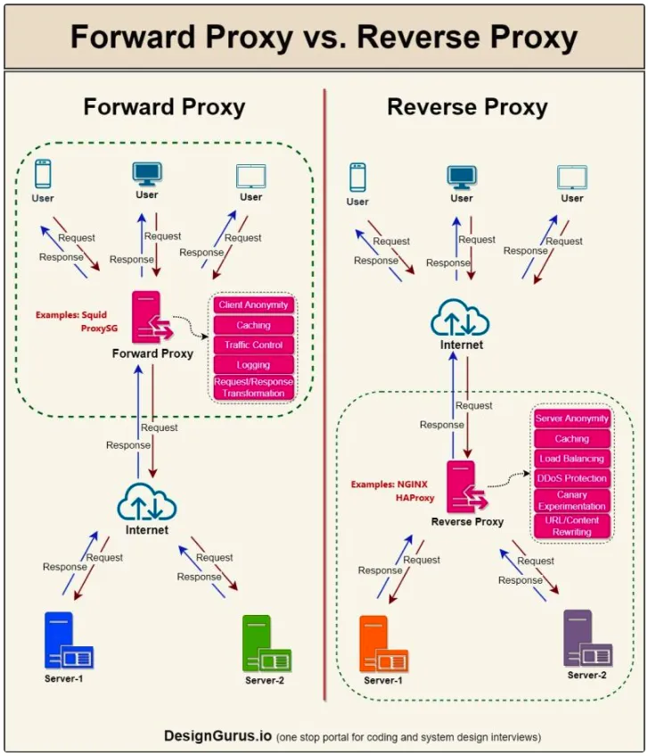

## System Design Solution

| System                                                          | Design Solution                                                             |
| --------------------------------------------------------------- | --------------------------------------------------------------------------- |
| For a Read-Heavy System                                         | Consider using a Cache.                                                     |
| For a Write-Heavy System                                        | Use Message Queues for async processing                                     |
| For a Low Latency Requirement                                   | Consider using a Cache and CDN.                                             |
| Need 𝐀tomicity, 𝐂onsistency, 𝐈solation, 𝐃urability Compliant DB | Go for RDBMS/SQL Database.                                                  |
| Have unstructured data                                          | Go for NoSQL Database.                                                      |
| Have Complex Data (Videos, Images, Files)                       | Go for Blob/Object storage.                                                 |
| Complex Pre-computation                                         | Use Message Queue & Cache.                                                  |
| High-Volume Data Search                                         | Consider search index, tries or search engine.                              |
| Scaling SQL Database                                            | Implement Database Sharding.                                                |
| High Availability, Performance, & Throughput                    | Use a Load Balancer.                                                        |
| Global Data Delivery                                            | Consider using a CDN.                                                       |
| Graph Data (data with nodes, edges, and relationships)          | Utilize Graph Database.                                                     |
| Scaling Various Components                                      | Implement Horizontal Scaling.                                               |
| High-Performing Database Queries                                | Use Database Indexes.                                                       |
| Bulk Job Processing                                             | Consider Batch Processing & Message Queues.                                 |
| Server Load Management & Preventing DOS Attacks                 | Use a Rate Limiter.                                                         |
| Microservices Architecture                                      | Use an API Gateway.                                                         |
| For Single Point of Failure                                     | Implement Redundancy.                                                       |
| For Fault-Tolerance and Durability                              | Implement Data Replication.                                                 |
| For User-to-User fast communication                             | Use Websockets.                                                             |
| Failure Detection in Distributed Systems                        | Implement a Heartbeat.                                                      |
| Data Integrity                                                  | Use Checksum Algorithm.                                                     |
| Efficient Server Scaling                                        | Implement Consistent Hashing.                                               |
| Decentralized Data Transfer                                     | Consider Gossip Protocol.                                                   |
| Location-Based Functionality                                    | Use Quadtree, Geohash, etc.                                                 |
| Avoid Specific Technology Names                                 | Use generic terms.                                                          |
| High Availability and Consistency Trade-Off                     | Eventual Consistency.                                                       |
| For IP resolution & Domain Name Query                           | Mention DNS.                                                                |
| Handling Large Data in Network Requests                         | Implement Pagination.                                                       |
| Cache Eviction Policy                                           | Preferred is LRU (Least Recently Used) Cache.                               |
| To handle traffic spikes                                        | Implement Autoscaling to manage resources dynamically                       |
| Need analytics and audit trails                                 | Consider using data lakes or append-only databases                          |
| Handling Large-Scale Simultaneous Connections                   | Use Connection Pooling and consider using Protobuf to minimize data payload |
| To prevent overloading systems                                  | Use Token Bucket and Leaky bucket Algorithms                                |
| Minimize deployment downtime                                    | Implement Blue-Green deployment to minimize downtime and reduce risks       |

## Forward Proxy vs. Reverse Proxy

## References

- https://www.designgurus.io/course-play/grokking-the-system-design-interview/doc/638c0b5aac93e7ae59a1af63
- https://www.linkedin.com/feed/update/urn:li:activity:7153594539398594560/
